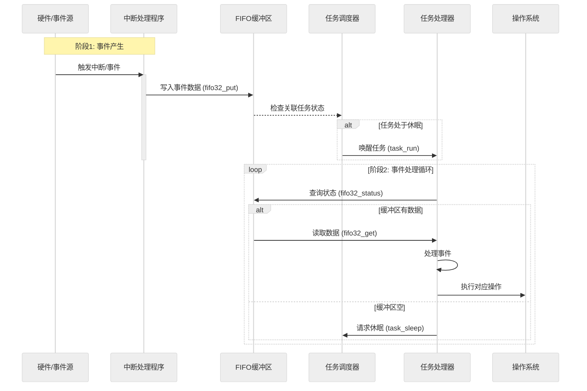

以下是 FIFO 缓冲区与操作系统其他功能互动的 **抽象流程总结**，使用时序图呈现核心交互逻辑：



---

### 🔄 核心抽象流程解析

#### 阶段 1：事件注入
1. **事件触发**  
   - 硬件设备（键盘/鼠标）或系统事件（定时器超时）触发中断
   - *抽象形式*：任何 **异步事件源** 产生信号

2. **中断处理**  
   - 中断处理程序将原始事件数据封装为统一格式
   - 调用 `fifo32_put()` 将数据写入 FIFO 缓冲区
   - *关键行为*：  
     ```c
     // 伪代码示例
     void interrupt_handler() {
         int event_data = get_raw_event(); 
         fifo32_put(&global_fifo, event_data);
     }
     ```

3. **任务唤醒**  
   - FIFO 在写入数据后检查关联任务状态
   - 如果任务处于休眠状态，触发任务调度器唤醒任务

---

#### 阶段 2：事件消费
1. **状态轮询**  
   - 任务处理器通过 `fifo32_status()` 持续检查缓冲区状态
   - *决策逻辑*：  
     ```c
     while (1) {
         if (fifo32_status(fifo) > 0) {
             process_event(fifo32_get(fifo));
         } else {
             task_sleep(); // 让出CPU
         }
     }
     ```

2. **数据读取**  
   - 使用 `fifo32_get()` 从缓冲区提取事件数据
   - *数据特征*：每个事件携带类型标识符（如 0x1XX 键盘事件）

3. **事件分发**  
   - 根据事件类型标识符路由到对应的处理模块
   - *抽象处理逻辑*：  
     ```c
     void process_event(int event) {
         int event_type = event & 0xFF00;
         switch (event_type) {
             case 0x1000: handle_input(event); break;
             case 0x2000: handle_timer(event); break;
             // 更多事件类型...
         }
     }
     ```

4. **资源回收**  
   - 处理完成后释放事件数据占用的缓冲区空间（通过读指针移动）

---

### 📊 架构角色映射
| 组件             | 职责       | 关键行为                               |
| ---------------- | ---------- | -------------------------------------- |
| **FIFO 缓冲区**  | 数据中转站 | - 缓存突发事件<br>- 提供原子化读写接口 |
| **中断处理程序** | 事件采集器 | - 快速响应硬件<br>- 数据标准化封装     |
| **任务调度器**   | 资源协调者 | - 任务状态管理<br>- CPU 时间片分配     |
| **任务处理器**   | 事件消费者 | - 业务逻辑执行<br>- 系统状态更新       |

---

### 🌟 设计优势
1. **流量削峰**：缓冲突发事件避免数据丢失
2. **解耦生产消费**：中断上下文与任务处理分离
3. **统一事件总线**：标准化接口支持多事件源
4. **节能调度**：无数据时任务休眠节省 CPU

---

这种模式本质上实现了 **观察者模式** 的变体，其中：
- FIFO 缓冲区充当 **Subject**（被观察对象）
- 任务处理器作为 **Observer**（观察者）订阅事件
- 中断处理程序是 **Event Publisher**（事件发布者）