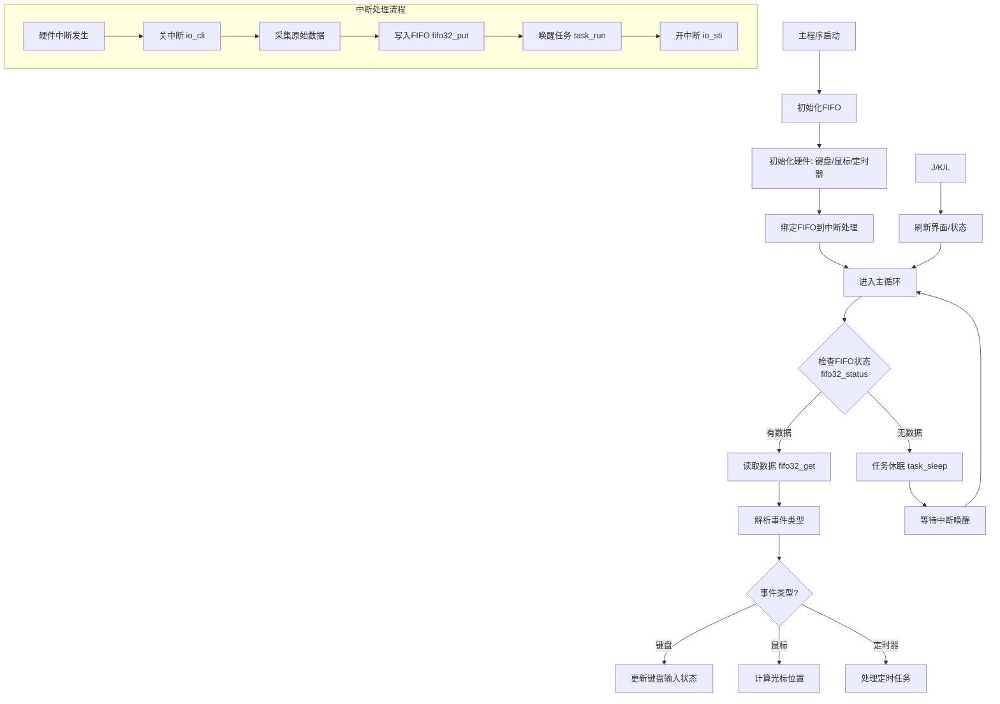

以下是主程序中关于 FIFO 缓冲区代码的核心流程：



---

### 📝 **关键流程说明**

1. **初始化阶段**：
   - 创建全局 FIFO 缓冲区 (`fifo32_init`)
   - 配置硬件设备并绑定中断处理函数
   - 示例代码段：
     ```c
     fifo32_init(&fifo, 128, fifobuf, task_a);
     init_keyboard(&fifo, 256);
     enable_mouse(&fifo, 512, &mdec);
     ```

2. **事件生产阶段** (中断上下文)：
   - 硬件中断触发 → 关中断保护临界区
   - 将原始数据转换为标准事件码（如：键盘数据 +0x100）
   - 写入 FIFO 并唤醒关联任务
   - 示例流程：
     ```c
     void inthandler21() {
         int data = io_in8(PORT_KEYDAT);
         fifo32_put(&fifo, data + 0x100); // 键盘事件范围 0x100-0x1FF
     }
     ```

3. **事件消费阶段** (任务上下文)：
   - 主循环持续检查 FIFO 状态
   - 数据存在时按优先级处理：
     ```c
     int data = fifo32_get(&fifo);
     if (256 <= data && data <= 511) {
         handle_key(data - 256); 
     } else if (...) {
         // 其他事件处理
     }
     ```
   - 无数据时通过 `task_sleep` 释放 CPU

4. **界面更新阶段**：
   - 根据处理结果刷新屏幕
   - 示例：更新光标位置、重绘窗口等
     ```c
     sheet_refresh(sht_mouse, mx, my, mx+16, my+16);
     ```

---

### ⏱️ **时序特征**
| 阶段     | 执行上下文 | 典型耗时 | 关键操作                |
| -------- | ---------- | -------- | ----------------------- |
| 中断处理 | 中断上下文 | 微秒级   | `fifo32_put` + 任务唤醒 |
| 事件处理 | 任务上下文 | 毫秒级   | 业务逻辑 + 界面更新     |
| 休眠等待 | 内核调度   | 可变     | `task_sleep` 释放 CPU   |

---

### 🛡️ **临界区保护机制**
```c
// 读取数据时的保护
io_cli();
if (fifo32_status(&fifo) == 0) {
    task_sleep(task_a);
    io_sti();
} else {
    data = fifo32_get(&fifo);
    io_sti();
    // 处理数据
}
```

---

此流程实现了：
- **中断与任务解耦**：硬件中断仅负责快速写入数据
- **事件驱动架构**：CPU 只在有数据处理时活跃
- **实时响应**：通过任务唤醒机制最小化延迟
