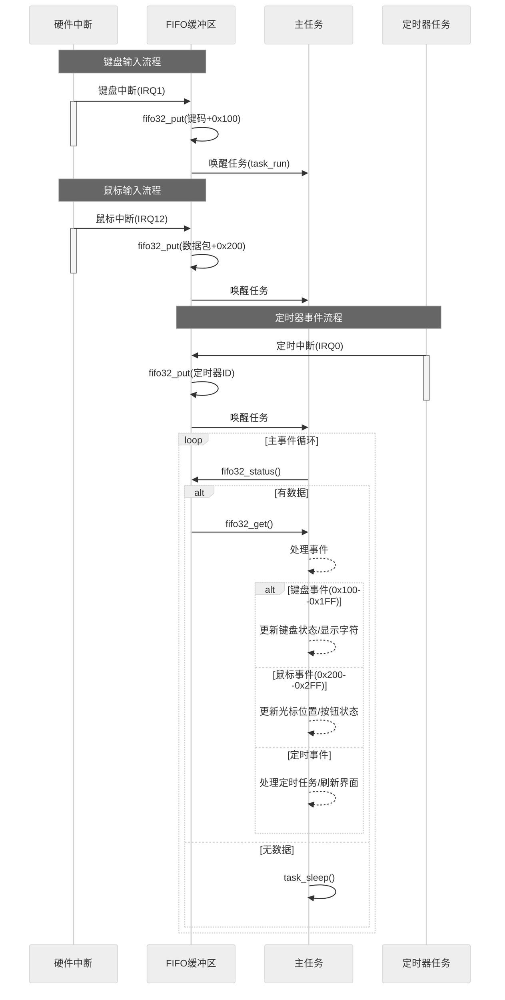
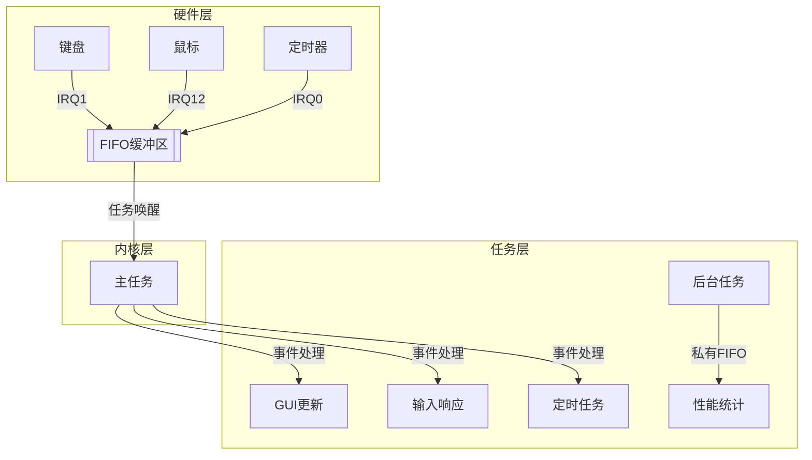

以下是 FIFO 缓冲区在操作系统各模块（鼠标、键盘、定时器、任务切换）中的协作机制：



---

### 🔄 核心流程说明

1. **输入设备驱动层**：
   - **键盘**：通过 IRQ1 中断 → 读取端口 0x60 → 写入 FIFO（范围 0x100-0x1FF）
   - **鼠标**：通过 IRQ12 中断 → 解析数据包 → 写入 FIFO（范围 0x200-0x2FF）
   - **定时器**：通过 IRQ0 中断 → 写入定时器事件标识符

2. **缓冲区管理层**：
   - 使用 `fifo32_put` 写入时：
     - 检查剩余空间 → 溢出时设置标志位
     - 更新写指针（环形缓冲区）
     - 唤醒关联任务（通过 `task_run`）

3. **任务处理层**：
   - **主任务** (`task_a`)：
     - 持续检查 `fifo32_status()`
     - 有数据时调用 `fifo32_get()` 读取
     - 根据数据范围分发处理：
       ```c
       if (256 <= data <= 511) 处理键盘 
       else if (512 <= data <= 767) 处理鼠标
       else 处理定时器等其他事件
       ```
   - **后台任务** (`task_b`)：
     - 通过私有 FIFO 接收定时统计信息
     - 示例：每秒刷新窗口计数器

---

### 🖥️ 可视化架构


---

### ⚡ 性能关键点
1. **中断上下文最小化**：
   - 中断处理仅做数据采集和 FIFO 写入
   - 复杂处理延迟到任务上下文

2. **零拷贝传递**：
   - 硬件数据直接写入 FIFO 缓冲区
   - 避免中间内存复制

3. **优先级调度**：
   - 高优先级任务可抢占处理（如实时输入响应）
   - 示例：鼠标移动优先于后台计算

---

这种设计实现了：
- **硬件中断与任务处理的解耦**
- **多输入源的统一事件队列**
- **高效的任务唤醒机制**
- **可扩展的事件处理架构**
