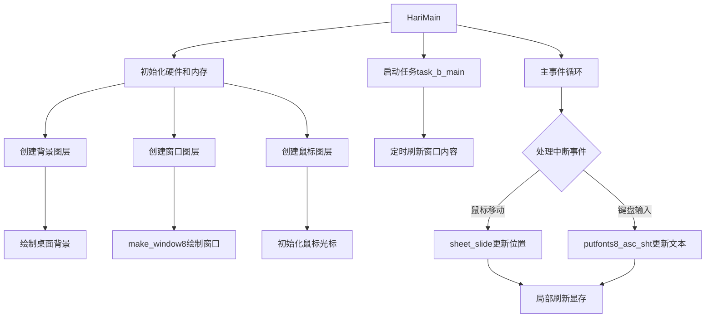

以下是 **`bootpack.c`** 中主要函数的功能和作用分析，结合代码逻辑和图层系统的协作关系，梳理其核心流程：

---

### **1. `HariMain`：主函数**
**功能**：程序入口，负责初始化操作系统核心模块、管理图层、处理输入事件和多任务调度。  
**核心步骤**：
1. **初始化硬件和基础模块**：
   - 初始化GDT/IDT（`init_gdtidt`）、PIC（`init_pic`）、PIT（`init_pit`）。
   - 开启中断（`io_sti`），初始化键盘和鼠标（`init_keyboard`、`enable_mouse`）。
2. **内存管理**：
   - 使用内存管理器（`memman`）分配显存和图层缓冲区。
3. **图层系统初始化**：
   - 创建图层控制器（`shtctl_init`）。
   - 分配背景图层、窗口图层、鼠标图层，并设置层级（`sheet_updown`）。
4. **多任务管理**：
   - 初始化任务控制器（`task_init`），创建主任务和子任务（`task_b_main`）。
5. **事件循环**：
   - 从FIFO队列读取键盘、鼠标、定时器事件，更新界面和任务状态。

**关键代码段**：
```c
void HariMain(void) {
    // 初始化硬件
    init_gdtidt(); 
    init_pic();
    io_sti();
    fifo32_init(&fifo, 128, fifobuf, 0);
    init_pit();
    init_keyboard(&fifo, 256);
    enable_mouse(&fifo, 512, &mdec);

    // 分配内存和图层
    struct SHTCTL *shtctl = shtctl_init(memman, binfo->vram, scrnx, scrny);
    struct SHEET *sht_back = sheet_alloc(shtctl);
    sheet_setbuf(sht_back, buf_back, scrnx, scrny, -1); // 背景无透明色
    init_screen8(buf_back, scrnx, scrny); // 绘制背景

    // 创建窗口和鼠标
    struct SHEET *sht_win = sheet_alloc(shtctl);
    make_window8(buf_win, 160, 52, "task_a", 1); // 窗口标题
    sheet_slide(sht_win, 8, 56); // 定位窗口

    // 主事件循环
    while (1) {
        // 处理中断事件，更新图层
        if (鼠标移动) sheet_slide(sht_mouse, mx, my);
        if (键盘输入) putfonts8_asc_sht(...);
    }
}
```

---

### **2. `make_window8`：绘制窗口界面**
**功能**：在缓冲区中绘制一个窗口的图形界面，包括边框、标题栏和关闭按钮。  
**参数**：
- `buf`：目标缓冲区地址。
- `xsize`, `ysize`：窗口尺寸。
- `title`：窗口标题。
- `act`：是否处于激活状态（决定标题栏颜色）。

**关键操作**：
- **绘制窗口边框**：使用不同颜色模拟立体效果（如高亮和阴影）。
- **标题栏处理**：根据激活状态设置颜色，显示标题文字。
- **关闭按钮**：绘制预设的关闭图标（像素图案）。

**代码逻辑**：
```c
void make_window8(unsigned char *buf, int xsize, int ysize, char *title, char act) {
    // 绘制边框和背景
    boxfill8(buf, xsize, COL8_C6C6C6, 0, 0, xsize-1, 0); // 顶部边框
    boxfill8(buf, xsize, COL8_FFFFFF, 1, 1, xsize-2, 1); // 高亮
    // ...（其他边框绘制）

    // 绘制标题栏
    if (act != 0) {
        tc = COL8_FFFFFF; // 激活状态为白字蓝底
        tbc = COL8_000084;
    } else {
        tc = COL8_C6C6C6; // 非激活状态为灰字灰底
        tbc = COL8_848484;
    }
    boxfill8(buf, xsize, tbc, 3, 3, xsize-4, 20); // 标题栏背景
    putfonts8_asc(buf, xsize, 24, 4, tc, title);  // 标题文字

    // 绘制关闭按钮
    for (y = 0; y < 14; y++) {
        for (x = 0; x < 16; x++) {
            c = closebtn[y][x];
            // 根据字符设置颜色（如'@'为黑色，'Q'为灰色）
            buf[(5+y)*xsize + (xsize-21+x)] = c;
        }
    }
}
```

---

### **3. `putfonts8_asc_sht`：在图层上绘制文本**
**功能**：在指定图层的特定位置绘制ASCII字符串，支持背景色填充。  
**参数**：
- `sht`：目标图层。
- `x`, `y`：绘制起始坐标。
- `c`：文本颜色。
- `b`：背景颜色。
- `s`：字符串。
- `l`：字符串长度。

**关键操作**：
1. **填充背景色**：在文本区域绘制背景矩形。
2. **渲染字符**：调用`putfonts8_asc`将字符写入图层缓冲区。
3. **局部刷新**：调用`sheet_refresh`更新显存。

**代码逻辑**：
```c
void putfonts8_asc_sht(struct SHEET *sht, int x, int y, int c, int b, char *s, int l) {
    boxfill8(sht->buf, sht->bxsize, b, x, y, x + l*8 -1, y + 15); // 背景填充
    putfonts8_asc(sht->buf, sht->bxsize, x, y, c, s); // 绘制文字
    sheet_refresh(sht, x, y, x + l*8, y + 16); // 刷新显存
}
```

---

### **4. `make_textbox8`：创建文本框**
**功能**：在图层上绘制一个文本框，模拟凹陷或凸起的3D效果。  
**参数**：
- `sht`：目标图层。
- `x0`, `y0`：文本框左上角坐标。
- `sx`, `sy`：文本框尺寸。
- `c`：内部填充颜色。

**关键操作**：
- **绘制边框**：使用深浅颜色模拟立体阴影（如`COL8_848484`为阴影，`COL8_FFFFFF`为高亮）。
- **填充内部**：用指定颜色填充文本框区域。

**代码逻辑**：
```c
void make_textbox8(struct SHEET *sht, int x0, int y0, int sx, int sy, int c) {
    // 绘制外边框（阴影）
    boxfill8(sht->buf, sht->bxsize, COL8_848484, x0-2, y0-3, x0+sx+1, y0-3);
    // 绘制内边框（高亮）
    boxfill8(sht->buf, sht->bxsize, COL8_FFFFFF, x0-3, y0-3, x0-3, y0+sy+1);
    // ...（其他边框）
    // 填充内部
    boxfill8(sht->buf, sht->bxsize, c, x0-1, y0-1, x0+sx, y0+sy);
}
```

---

### **5. `task_b_main`：后台任务函数**
**功能**：子任务的主函数，通常用于处理周期性任务（如显示计数器）。  
**参数**：
- `sht_win_b`：关联的窗口图层。

**关键操作**：
1. **初始化任务**：创建定时器（`timer_1s`），设置周期性触发。
2. **事件循环**：等待定时器事件，更新窗口内容（如显示秒数）。

**代码逻辑**：
```c
void task_b_main(struct SHEET *sht_win_b) {
    struct FIFO32 fifo;
    fifo32_init(&fifo, 128, fifobuf, 0);
    struct TIMER *timer_1s = timer_alloc();
    timer_init(timer_1s, &fifo, 100);
    timer_settime(timer_1s, 100); // 每秒触发

    while (1) {
        if (fifo32_status(&fifo) {
            int i = fifo32_get(&fifo);
            if (i == 100) { // 定时器事件
                sprintf(s, "%11d", count - count0);
                putfonts8_asc_sht(sht_win_b, 24, 28, COL8_000000, COL8_C6C6C6, s, 11);
                count0 = count;
                timer_settime(timer_1s, 100);
            }
        }
    }
}
```

---

### **6. 其他辅助函数**
#### **`init_screen8`：初始化背景**
- **功能**：绘制桌面背景，包括任务栏和装饰。
- **实现**：调用`boxfill8`填充颜色块，模拟经典操作系统界面。

#### **`task_exit`：任务退出**
- **功能**：释放任务资源，包括图层和内存。
- **关键操作**：调用`sheet_free`释放图层，通知任务控制器。

---

### **协作关系总结**
| **函数**            | **调用关系**               | **作用**                       |
| ------------------- | -------------------------- | ------------------------------ |
| `HariMain`          | 主入口，调用所有初始化函数 | 整合硬件、内存、图层、任务管理 |
| `make_window8`      | 被`HariMain`调用           | 创建窗口的图形界面             |
| `putfonts8_asc_sht` | 被事件循环和任务调用       | 在指定图层绘制文本             |
| `make_textbox8`     | 被`HariMain`调用           | 创建文本框控件                 |
| `task_b_main`       | 作为子任务启动             | 处理后台逻辑（如定时更新）     |
| `sheet_*` 系列函数  | 被主函数和任务调用         | 管理图层的分配、移动、刷新     |

---

### **流程图：主函数与图层协作**


通过这种设计，`bootpack.c` 实现了一个基础的多任务图形界面操作系统，涵盖图层管理、输入处理和后台任务调度。