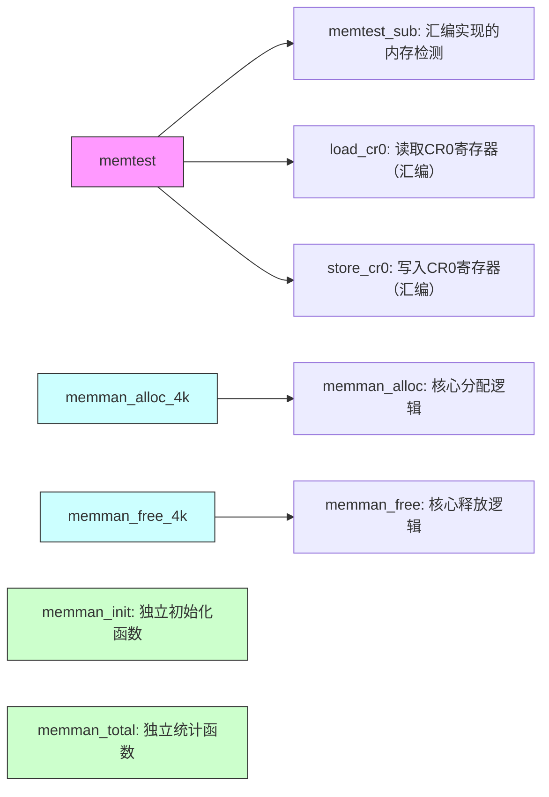

以下是 `memory.c` 内部函数的调用关系图，使用 **Mermaid 流程图** 表示：

---

### **详细说明**
1. **核心检测模块**：
   - `memtest`：
     - 调用 **`memtest_sub`**（汇编函数）执行内存模式测试。
     - 通过 **`load_cr0`/`store_cr0`** 控制缓存状态（仅在 486+ CPU 生效）。

2. **内存分配器**：
   - **上层接口**：
     - `memman_alloc_4k`：对 `memman_alloc` 的封装，处理 4K 对齐。
     - `memman_free_4k`：对 `memman_free` 的封装，处理 4K 对齐。
   - **底层实现**：
     - `memman_alloc`：首次适应算法，遍历空闲块数组分配内存。
     - `memman_free`：释放内存并合并相邻块，维护数组有序性。

3. **辅助函数**：
   - `memman_init`：独立初始化内存管理器结构体。
   - `memman_total`：独立计算总空闲内存，无外部依赖。

---

### **函数职责表**
| 函数名            | 职责                                   | 依赖关系                |
| ----------------- | -------------------------------------- | ----------------------- |
| `memtest`         | 检测物理内存范围，确保直接访问物理地址 | 依赖汇编函数和 CR0 操作 |
| `memman_alloc_4k` | 提供 4K 对齐的内存分配接口             | 调用 `memman_alloc`     |
| `memman_free_4k`  | 提供 4K 对齐的内存释放接口             | 调用 `memman_free`      |
| `memman_alloc`    | 实现首次适应算法，管理空闲块数组       | 无                      |
| `memman_free`     | 释放内存并合并相邻块，维护内存连续性   | 无                      |
| `memman_init`     | 初始化内存管理器的统计字段             | 无                      |
| `memman_total`    | 计算当前可用内存总量                   | 无                      |

---

### **关键设计特点**
1. **分层抽象**：
   - 高层函数（`memman_alloc_4k`）隐藏对齐细节，底层函数（`memman_alloc`）专注核心逻辑。
   
2. **硬件依赖隔离**：
   - 内存检测（`memtest`）通过汇编和寄存器操作直接控制硬件，其他函数纯软件实现。

3. **无递归操作**：
   - `memman_free` 仅合并直接相邻块，不递归处理更多块（简化实现，牺牲部分碎片优化）。

4. **无并发控制**：
   - 所有函数假设在单线程环境调用，无锁机制（适用于早期操作系统或内核非抢占式调度）。