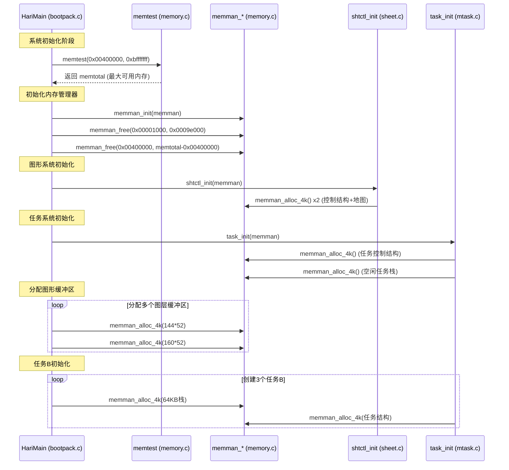
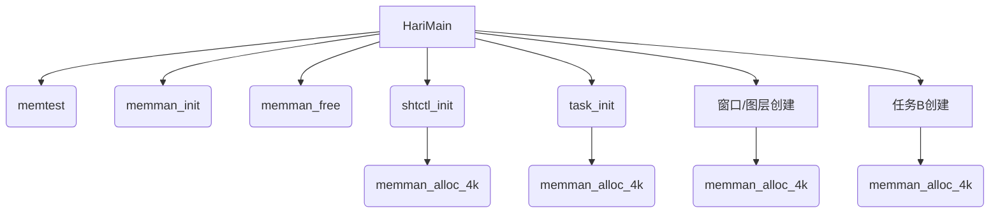

以下是 `bootpack.c` 主函数 (`HariMain`) 中内存管理相关函数的调用关系，使用 Mermaid 的 **时序图** 表示：

---

### **关键流程说明**
1. **内存检测阶段**：
   - 调用 `memtest` 确定物理内存范围 (`memtotal`)。

2. **内存管理器初始化**：
   - `memman_init` 清零管理器状态。
   - `memman_free` 释放 BIOS 和内核未使用的区域。

3. **图形系统内存分配**：
   - `shtctl_init` 通过 `memman_alloc_4k` 分配图层控制结构（约 8KB）和映射内存（屏幕分辨率大小）。

4. **任务系统内存分配**：
   - `task_init` 为任务管理器分配内存，并为空闲任务分配 64KB 栈空间。

5. **图形缓冲区分配**：
   - 为背景图层 (`sht_back`)、窗口 (`sht_win`) 等多次调用 `memman_alloc_4k`。

6. **任务B栈分配**：
   - 为每个任务B分配 64KB 栈空间（通过 `memman_alloc_4k` 对齐到4KB边界）。

---

### **函数依赖关系**

---

### **设计特点**
1. **分层分配**：
   - 先检测大块物理内存 → 初始化管理器 → 按需分配给图形/任务模块。

2. **4K对齐**：
   - 所有模块通过 `memman_alloc_4k` 分配，确保兼容分页机制。

3. **资源隔离**：
   - 图形缓冲区、任务栈等隔离在不同内存区域，避免冲突。