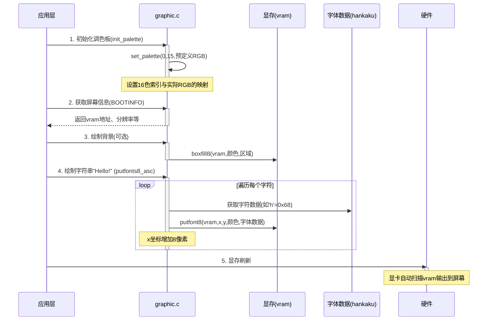
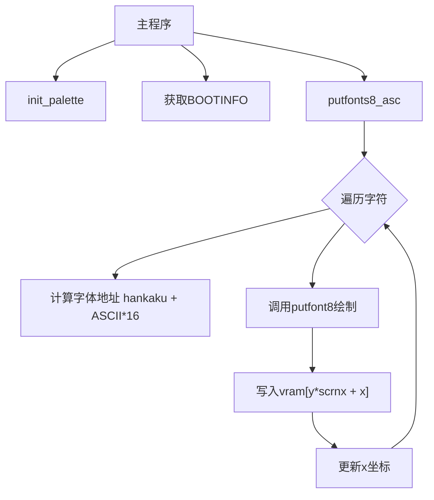

以下是在屏幕上绘制字符串 "Hello!" 的时序图，展示从初始化到最终显示的完整流程：

### 流程说明：
1. **调色板初始化**  
   - 调用 `init_palette()` 设置16色模式的颜色值，建立颜色索引（如 `COL8_FFFFFF`）与物理RGB值的映射关系。

2. **获取显存信息**  
   - 通过 `BOOTINFO` 结构体获取显存基地址 `vram` 和屏幕分辨率（`scrnx`, `scrny`）。

3. **背景绘制（可选）**  
   - 使用 `boxfill8(vram, color, x0, y0, x1, y1)` 填充背景色（如清屏操作）。

4. **字符串绘制**  
   - 调用 `putfonts8_asc(vram, xsize, x, y, color, "Hello!")`：
     1. **遍历字符**：依次处理 'H'、'e'、'l'、'l'、'o'、'!'。
     2. **字体数据定位**：  
        - 字符 'H' 的 ASCII 码为 `0x48`，字体数据地址为 `hankaku + 0x48 * 16`。
     3. **逐像素绘制**：  
        - `putfont8` 将每个字符的 8x16 位图写入显存对应位置。
     4. **位置更新**：每绘制一个字符，X 坐标增加8像素（字符宽度）。

5. **显存刷新**  
   - 显卡硬件自动周期性地从 `vram` 读取像素数据并输出到屏幕，无需软件主动刷新。

---

### 关键函数协作图

### 技术细节
- **显存计算**：像素位置 `(x,y)` 对应显存地址为 `vram[y * scrnx + x]`。
- **字体编码**：每个字符的字体数据为16字节，每字节表示一行8个像素（高位在左）。
- **颜色替换**：`putfont8` 将字体数据中的有效位（1）替换为指定颜色值，透明位（0）保留背景色。