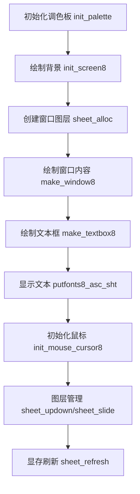

以下是主函数 `HariMain` 中与 **图形处理（graphic）** 相关的核心操作及其作用的详细梳理：

---

### **1. 初始化调色板**
```c
init_palette(); // 设置16色调色板
```
- **作用**：初始化显卡的调色板，定义颜色索引（如 `COL8_FFFFFF`）与实际RGB值的映射关系。
- **实现细节**：
  - 调用 `set_palette()`，将预定义的16种颜色（`table_rgb`）写入显卡调色板寄存器。
  - 颜色分量（R/G/B）被压缩到 `0-63` 范围（硬件要求），通过端口 `0x03c8` 和 `0x03c9` 配置。

---

### **2. 初始化屏幕背景**
```c
init_screen8(buf_back, binfo->scrnx, binfo->scrny);
```
- **作用**：绘制操作系统默认背景（如任务栏、窗口装饰）。
- **参数**：
  - `buf_back`：背景图层的像素缓冲区。
  - `binfo->scrnx` 和 `binfo->scrny`：屏幕分辨率（宽/高）。
- **实现细节**：
  - 多次调用 `boxfill8()` 绘制不同颜色的矩形区域，构建基础界面。
  - 示例：顶部背景色填充、任务栏分隔线、窗口关闭按钮区域。

---

### **3. 创建窗口图层**
```c
sht_win = sheet_alloc(shtctl); // 分配窗口图层
buf_win = memman_alloc_4k(memman, 160 * 52); // 分配窗口缓冲区
sheet_setbuf(sht_win, buf_win, 144, 52, -1); // 设置缓冲区属性
make_window8(buf_win, 144, 52, "task_a", 1); // 绘制窗口内容
```
- **作用**：创建应用程序窗口并初始化其外观。
- **步骤**：
  1. **分配图层**：`sheet_alloc` 从图层控制器（`shtctl`）中分配一个 `SHEET` 结构体。
  2. **分配缓冲区**：通过内存管理器（`memman`）申请一块内存作为窗口的像素缓冲区。
  3. **设置图层属性**：
     - `sheet_setbuf` 绑定缓冲区到图层，指定窗口大小（144x52）和透明色（`-1` 表示无透明色）。
  4. **绘制窗口**：
     - `make_window8` 在缓冲区中绘制窗口框架（标题栏、边框、关闭按钮）。

---

### **4. 绘制文本框**
```c
make_textbox8(sht_win, 8, 28, 128, 16, COL8_FFFFFF);
```
- **作用**：在窗口内创建一个文本框区域（用于输入或显示文本）。
- **参数**：
  - `sht_win`：目标窗口图层。
  - `(8, 28)`：文本框左上角坐标。
  - `128x16`：文本框尺寸。
  - `COL8_FFFFFF`：文本框背景色（白色）。
- **实现细节**：
  - 调用 `boxfill8` 和边框绘制函数，生成凹陷效果的文本框。

---

### **5. 显示初始文本**
```c
putfonts8_asc_sht(sht_back, 0, 0, COL8_FFFFFF, COL8_008484, s, 10);
putfonts8_asc_sht(sht_back, 0, 32, COL8_FFFFFF, COL8_008484, s, 40);
```
- **作用**：在背景图层上显示系统信息（如内存使用情况）。
- **参数**：
  - `sht_back`：背景图层。
  - `(0,0)` 和 `(0,32)`：文本起始坐标。
  - `COL8_FFFFFF`：文本颜色（白色）。
  - `COL8_008484`：背景色（蓝绿色）。
- **实现细节**：
  - `sprintf` 格式化字符串（如内存信息）。
  - `putfonts8_asc_sht` 在指定位置绘制文本，自动处理背景填充。

---

### **6. 鼠标光标初始化与显示**
```c
init_mouse_cursor8(buf_mouse, 99); // 生成鼠标图案
sheet_slide(sht_mouse, mx, my);    // 设置鼠标位置
sheet_updown(sht_mouse, 5);        // 置顶显示
```
- **作用**：创建并显示鼠标光标。
- **步骤**：
  1. **生成光标数据**：
     - `init_mouse_cursor8` 根据预定义图案生成16x16像素的光标位图，透明色为 `99`。
  2. **设置位置**：
     - `sheet_slide` 将鼠标图层移动到屏幕中心（`mx = (scrnx-16)/2`, `my = (scrny-28-16)/2`）。
  3. **置顶显示**：
     - `sheet_updown` 设置鼠标图层为最高层级（`height=5`），确保始终可见。

---

### **7. 图层管理与刷新**
```c
sheet_slide(sht_back, 0, 0);       // 背景图层位置
sheet_updown(sht_back, 0);         // 背景图层层级
sheet_refresh(sht_win, x1, y1, x2, y2); // 局部刷新
```
- **作用**：管理图层的叠放顺序和位置，控制显存合成。
- **关键操作**：
  - **图层叠放**：`sheet_updown` 调整图层的 `height` 值，决定覆盖关系（值越大越靠前）。
  - **位置移动**：`sheet_slide` 更新图层的 `vx0` 和 `vy0`（屏幕坐标），触发旧位置和新位置的刷新。
  - **局部刷新**：`sheet_refresh` 将图层缓冲区的修改部分同步到显存（`vram`）。

---

### **图形处理流程总结**


---

### **关键数据结构**
| 结构体/变量 | 作用                                                     |
| ----------- | -------------------------------------------------------- |
| `BOOTINFO`  | 存储屏幕分辨率（`scrnx`, `scrny`）和显存地址（`vram`）。 |
| `SHEET`     | 表示一个图层，包含缓冲区地址、位置、尺寸和叠放层级。     |
| `SHTCTL`    | 管理所有图层，控制显存合成和刷新。                       |
| `memman`    | 内存管理器，用于分配图层缓冲区和显存。                   |

---

### **总结**
主函数中的图形操作实现了以下核心功能：
1. **硬件初始化**：配置调色板和显存映射。
2. **界面构建**：创建背景、窗口、文本框等视觉元素。
3. **文本渲染**：通过字体数据（`hankaku`）显示字符串。
4. **图层管理**：控制叠放顺序、位置和局部刷新。
5. **输入反馈**：显示鼠标光标并响应移动事件。

这些步骤共同构建了一个基础的多图层图形界面系统，支持窗口叠加、文本输入和动态刷新，为操作系统的用户交互提供了可视化基础。