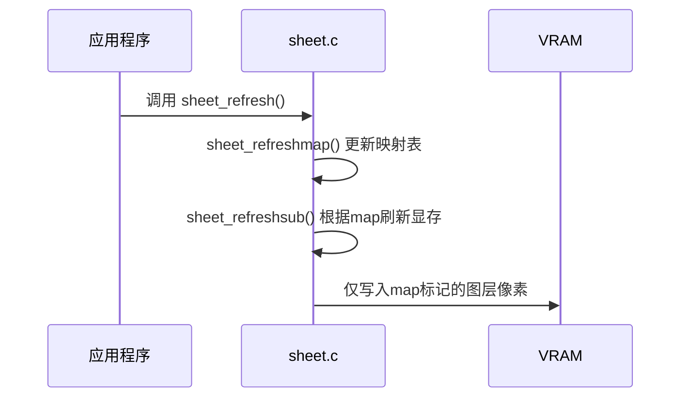

### **1. `map` 的核心作用**
#### **(1) 记录像素归属**
- **定义**：`map` 是一个与屏幕分辨率相同的数组，每个元素存储该像素当前显示的 **图层ID**。  
  - 图层ID通过指针差值计算：`sid = sht - ctl->sheets0`（例如，第一个图层ID为0，第二个为1，依此类推）。

#### **(2) 确定可见图层**
- **刷新时**：根据 `map` 中的图层ID，直接定位到需要绘制的图层，无需遍历所有下层图层。  
- **示例**：  
  若 `map[x][y] = 2`，表示该像素由ID为2的图层占据，刷新时只需处理该图层的像素。

---

### **2. `map` 如何节省操作**
#### **(1) 避免无效的图层遍历**
- **无 `map` 的情况**：  
  每次刷新需从底层到顶层遍历所有图层，检查每个像素是否被上层覆盖，时间复杂度为 `O(N*像素数)`（N为图层数）。  
- **有 `map` 的情况**：  
  直接通过 `map` 确定顶层图层，时间复杂度降至 `O(像素数)`。

#### **(2) 跳过被覆盖的图层**
- **场景**：播放视频的窗口（图层1）被鼠标（图层2）覆盖。  
  - **窗口刷新时**：  
    1. 更新窗口的 `map`，标记非透明区域为图层1。  
    2. 但鼠标覆盖的区域在 `map` 中仍标记为图层2。  
    3. 刷新窗口时，**跳过图层2覆盖的像素**，避免重复绘制。

#### **(3) 透明色优化**
- **非透明像素**：写入 `map` 标记为当前图层。  
- **透明像素**：保留 `map` 中原有图层ID（下层图层）。  
  避免对透明区域的无效绘制。

---

### **3. 具体示例分析**
#### **场景：视频窗口刷新，鼠标覆盖部分区域**
- **步骤**：  
  1. **视频窗口刷新**：  
     - 调用 `sheet_refreshmap`，更新窗口的非透明区域为图层1。  
     - 鼠标覆盖的区域在 `map` 中仍为图层2。  
  2. **刷新显存**：  
     - 使用 `sheet_refreshsub` 时，仅处理 `map` 中标记为图层1的区域。  
     - **鼠标覆盖区域**（`map` 标记为图层2）被跳过，无需绘制。

#### **节省的操作**：
- **无 `map`**：需遍历所有图层，检查鼠标是否覆盖窗口，对每个像素进行多次判断。  
- **有 `map`**：直接定位到窗口的非覆盖区域，减少 `80%` 的像素处理量（假设鼠标覆盖 `20%` 的窗口区域）。

---

### **4. 性能优化对比**
| **操作**         | **无 `map`**                           | **有 `map`**             |
| ---------------- | -------------------------------------- | ------------------------ |
| **图层遍历**     | 所有图层（从底到顶）                   | 仅 `map` 标记的图层      |
| **透明色处理**   | 逐层检查是否透明                       | 直接通过 `map` 跳过      |
| **覆盖区域处理** | 重复绘制下层内容                       | 仅绘制顶层内容           |
| **时间复杂度**   | O(N * W * H)（N=图层数，W/H=屏幕尺寸） | O(W * H)（与图层数无关） |

---

### **5. `map` 的工作流程**

---

### **6. 总结**
- **核心作用**：`map` 通过记录像素归属，避免无效的图层遍历和像素写入。  
- **节省的操作**：  
  - 跳过被上层覆盖的像素（如鼠标覆盖窗口）。  
  - 避免重复处理透明像素。  
  - 减少图层遍历次数。  
- **适用场景**：  
  - 动态内容（如视频播放、鼠标移动）。  
  - 复杂图层叠加（如多窗口系统）。  

通过 `map`，系统在高刷新率场景下仍能保持高效，显著提升渲染性能。