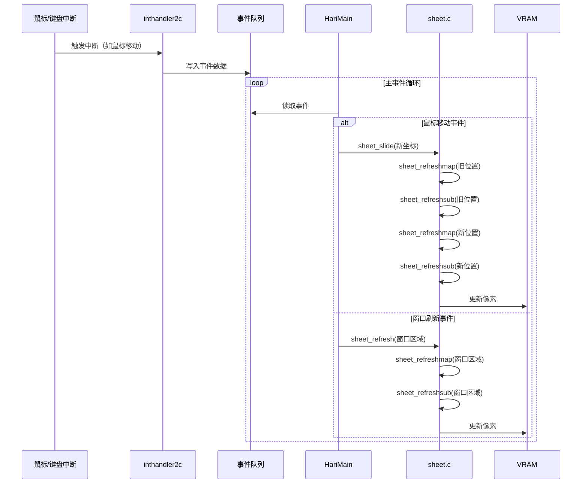
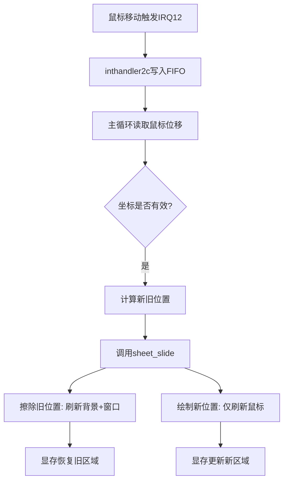
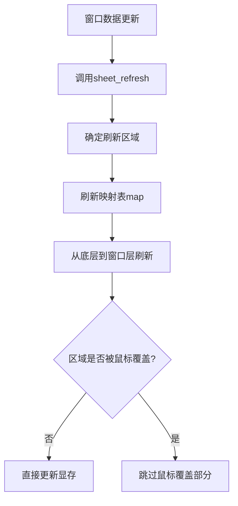
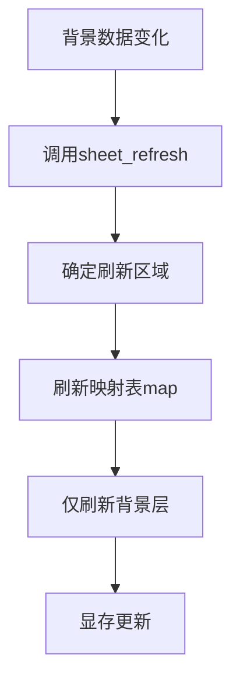
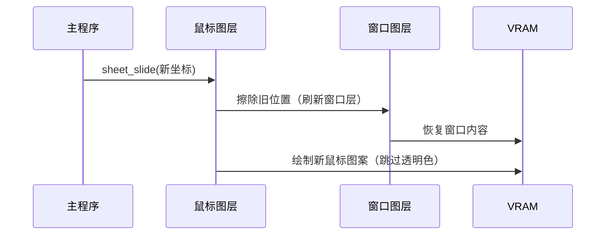

以下是图层刷新机制的全面梳理，结合时序图说明不同场景下的刷新逻辑：

---

### **1. 整体刷新机制时序图（Mermaid）**


---

### **2. 关键场景行为梳理**
#### **场景1：鼠标移动**


#### **场景2：窗口内容更新（如视频播放）**


#### **场景3：背景更新（如动态壁纸）**


---

### **3. 刷新规则总结**
| **场景**         | **触发条件**                 | **刷新范围**           | **影响图层**                                                 | **显存操作**                   |
| ---------------- | ---------------------------- | ---------------------- | ------------------------------------------------------------ | ------------------------------ |
| **鼠标移动**     | 硬件中断 + FIFO事件          | 新旧位置的 16x16 区域  | 旧位置：底层到窗口层新位置：仅鼠标层                         | 擦除旧内容 + 绘制新内容        |
| **窗口内容更新** | 应用主动调用 `sheet_refresh` | 窗口指定区域           | 窗口层及以下（注意：只会刷新窗口透明部分以及违背覆盖的背景部分） | 直接更新显存（跳过鼠标覆盖区） |
| **背景更新**     | 应用主动调用 `sheet_refresh` | 背景指定区域           | 仅背景层                                                     | 直接更新显存                   |
| **窗口层级调整** | 调用 `sheet_updown`          | 窗口及可能被覆盖的区域 | 所有相关图层                                                 | 全区域重绘                     |

---

### **4. 核心设计原则**
1. **分层刷新**  
   - 从底层到顶层逐层处理，确保上层覆盖下层。
   - **公式**：刷新高度范围 `[h0, h1]`，例如：
     - 擦除旧位置：`h0=0, h1=鼠标层高度-1`
     - 绘制新位置：`h0=鼠标层高度, h1=鼠标层高度`

2. **局部刷新优化**  
   - 仅处理实际变化的区域（如鼠标移动前后的 16x16 区域）。
   - **计算规则**：
     ```c
     // 屏幕坐标 → 图层坐标
     bx = vx - sht->vx0;
     by = vy - sht->vy0;
     ```

3. **透明色处理**  
   - 跳过透明像素，保留下层内容。
   - **代码逻辑**：
     ```c
     if (buf[by][bx] != sht->col_inv) {
         vram[vy][vx] = buf[by][bx];
     }
     ```

---

### **5. 示例：鼠标覆盖窗口时的显存更新**


---

通过这种设计，系统以最小计算量实现动态多图层显示，兼顾性能和显示正确性。