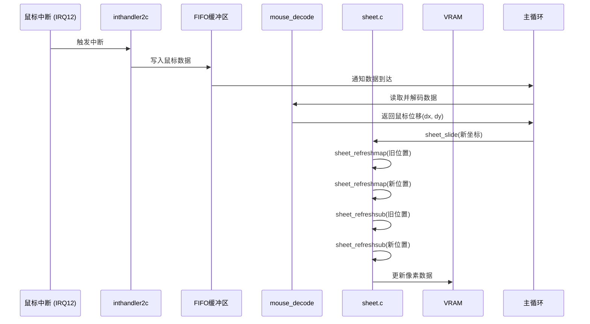
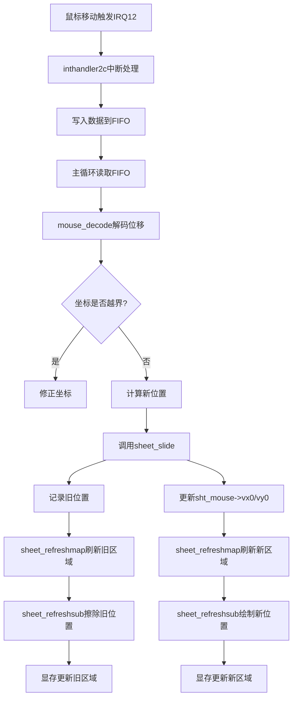

以下是 **鼠标移动时的完整刷新链** 分析，结合时序图和代码逻辑，详细说明从硬件中断到屏幕更新的完整流程：

---

### **时序图（Mermaid）**


---

### **流程图（Mermaid）**


---

### **完整刷新链步骤解析**
#### **1. 硬件中断触发**
- **场景**：鼠标移动时，PS/2控制器触发IRQ12中断。
- **代码**：`mouse.c` 中的 `inthandler2c` 函数。
- **关键操作**：
  ```c
  void inthandler2c(int *esp) {
      int data = io_in8(PORT_KEYDAT);      // 读取鼠标数据
      fifo32_put(mousefifo, data + mousedata0); // 写入FIFO
  }
  ```

#### **2. 主循环处理中断**
- **场景**：主事件循环 (`HariMain`) 从FIFO中读取数据。
- **代码**：`bootpack.c` 的主循环。
- **关键代码**：
  ```c
  while(1) {
      if (fifo32_status(&fifo) != 0) {
          int i = fifo32_get(&fifo);
          if (512 <= i && i <= 767) { // 鼠标数据范围
              if (mouse_decode(&mdec, i - 512) != 0) { // 解码数据
                  // 计算新坐标
                  mx += mdec.x;
                  my += mdec.y;
                  sheet_slide(sht_mouse, mx, my); // 触发移动
              }
          }
      }
  }
  ```

#### **3. 移动鼠标图层 (`sheet_slide`)**
- **作用**：更新鼠标位置并刷新显存。
- **代码**：`sheet.c` 中的 `sheet_slide`。
- **关键逻辑**：
  ```c
  void sheet_slide(struct SHEET *sht, int vx0, int vy0) {
      int old_vx0 = sht->vx0, old_vy0 = sht->vy0;
      sht->vx0 = vx0; // 新坐标
      sht->vy0 = vy0;
      if (sht->height >= 0) { // 若图层可见
          // 刷新旧位置
          sheet_refreshmap(sht->ctl, old_vx0, old_vy0, old_vx0 + 16, old_vy0 + 16, 0);
          // 刷新新位置
          sheet_refreshmap(sht->ctl, vx0, vy0, vx0 + 16, vy0 + 16, sht->height);
          // 重绘旧区域（擦除残影）
          sheet_refreshsub(sht->ctl, old_vx0, old_vy0, old_vx0 + 16, old_vy0 + 16, 0, sht->height - 1);
          // 重绘新区域
          sheet_refreshsub(sht->ctl, vx0, vy0, vx0 + 16, vy0 + 16, sht->height, sht->height);
      }
  }
  ```

#### **4. 映射表刷新 (`sheet_refreshmap`)**
- **作用**：更新新旧区域的像素归属映射。
- **关键代码**：
  ```c
  // 旧位置：标记为无图层（h0=0开始刷新）
  sheet_refreshmap(ctl, old_vx0, old_vy0, old_vx0+16, old_vy0+16, 0);
  // 新位置：从鼠标图层的高度开始刷新
  sheet_refreshmap(ctl, vx0, vy0, vx0+16, vy0+16, sht->height);
  ```

#### **5. 显存刷新 (`sheet_refreshsub`)**
- **作用**：根据映射表重绘屏幕。
- **旧位置刷新**：  
  ```c
  // 从底层到鼠标图层下方（h0=0, h1=height-1）
  sheet_refreshsub(ctl, old_vx0, old_vy0, ..., 0, sht->height-1);
  ```
  - 擦除旧位置的鼠标图案，显示下层内容。

- **新位置刷新**：  
  ```c
  // 仅绘制鼠标图层自身（h0=height, h1=height）
  sheet_refreshsub(ctl, vx0, vy0, ..., sht->height, sht->height);
  ```
  - 在新位置绘制鼠标光标。

---

### **关键设计亮点**
1. **双重刷新机制**  
   - **旧位置擦除**：刷新从底层到鼠标图层下方的所有图层，恢复背景内容。  
   - **新位置绘制**：仅绘制鼠标图层自身，避免重复处理下层像素。

2. **映射表优化**  
   - `map` 数组记录每个像素的顶层图层ID，`sheet_refreshsub` 直接通过查表确定是否需要绘制。

3. **局部刷新范围**  
   - 仅处理鼠标移动前后的 16x16 像素区域，而非全屏刷新。

---

### **性能影响**
- **计算量**：每次移动需刷新 2 个 16x16 区域，共 512 像素。  
- **时间复杂度**：O(n)（n为受影响像素数），远低于全屏刷新的 O(width*height)。

