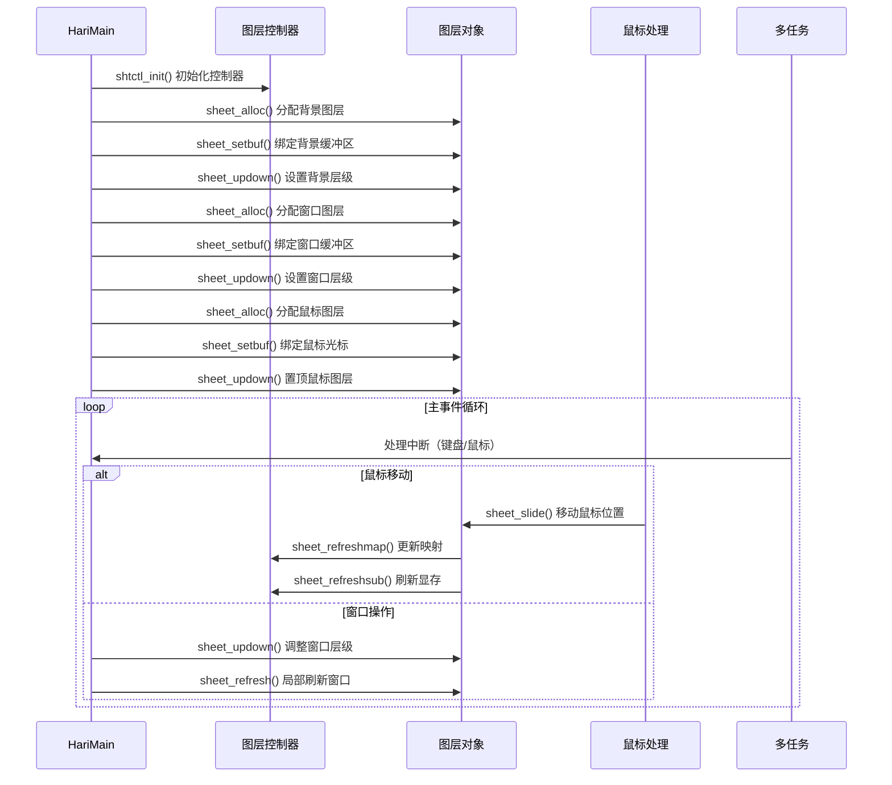
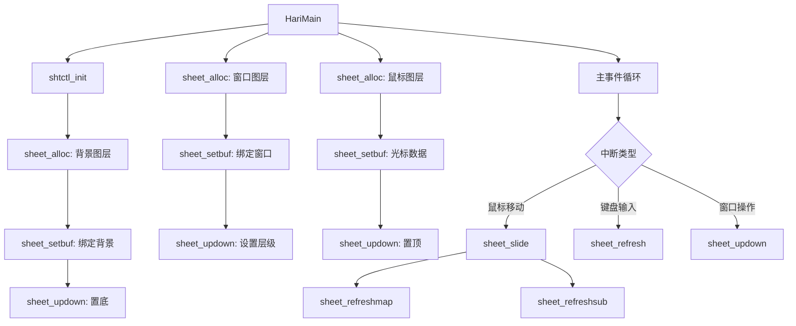

以下是图层相关函数的调用关系分析，结合 **bootpack.c** 的主流程绘制了 **时序图** 和 **调用流程图**，展示各函数在系统中的触发场景和作用。

---

### **时序图（Mermaid）**


---

### **调用流程图（Mermaid）**


---

### **关键函数在 bootpack.c 中的调用场景**
#### **1. 初始化阶段**
- **`shtctl_init`**  
  - **调用位置**：`HariMain` 开头。  
  - **作用**：创建全局图层控制器，管理所有图层。
  ```c
  struct SHTCTL *shtctl = shtctl_init(memman, binfo->vram, binfo->scrnx, bininfo->scrny);
  ```

- **`sheet_alloc` + `sheet_setbuf`**  
  - **调用位置**：初始化背景、窗口、鼠标。  
  - **作用**：分配图层并绑定缓冲区。  
  ```c
  // 背景图层
  struct SHEET *sht_back = sheet_alloc(shtctl);
  sheet_setbuf(sht_back, buf_back, scrnx, scrny, -1);
  
  // 窗口图层
  struct SHEET *sht_win = sheet_alloc(shtctl);
  sheet_setbuf(sht_win, buf_win, 160, 52, -1);
  
  // 鼠标图层
  struct SHEET *sht_mouse = sheet_alloc(shtctl);
  sheet_setbuf(sht_mouse, buf_mouse, 16, 16, 99); // 透明色99
  ```

- **`sheet_updown`**  
  - **调用位置**：设置图层初始层级。  
  - **作用**：背景置底，窗口居中，鼠标置顶。  
  ```c
  sheet_updown(sht_back, 0);  // 背景层
  sheet_updown(sht_win, 2);   // 窗口层
  sheet_updown(sht_mouse, 5); // 顶层
  ```

#### **2. 事件处理阶段**
- **`sheet_slide`**  
  - **调用位置**：鼠标移动事件（`inthandler2c` 处理）。  
  - **作用**：更新鼠标位置并刷新屏幕。  
  ```c
  void inthandler2c(...) {
      // 解码鼠标数据后
      sheet_slide(sht_mouse, new_mx, new_my);
  }
  ```

- **`sheet_refresh`**  
  - **调用位置**：窗口内容更新（如键盘输入）。  
  - **作用**：局部刷新文本框。  
  ```c
  if (键盘输入) {
      putfonts8_asc_sht(sht_win, x, y, color, buf);
      sheet_refresh(sht_win, x, y, x + len*8, y + 16);
  }
  ```

- **`sheet_updown`**  
  - **调用位置**：窗口激活/最小化。  
  - **作用**：动态调整窗口层级。  
  ```c
  // 点击窗口时置顶
  sheet_updown(sht_win, shtctl->top + 1);
  ```

#### **3. 资源释放**
- **`sheet_free`**  
  - **调用位置**：关闭窗口或退出任务。  
  - **作用**：释放图层资源。  
  ```c
  void task_exit(struct SHEET *sht) {
      sheet_free(sht);
  }
  ```

---

### **核心协作关系**
1. **图层控制器（SHTCTL）** 是全局管理者，维护 `sheets[]` 数组和 `map` 映射表。  
2. **sheet_alloc/sheet_free** 负责生命周期管理。  
3. **sheet_updown/sheet_slide** 控制图层的动态行为（层级和位置）。  
4. **sheet_refresh** 系列函数确保显存与实际数据同步。

