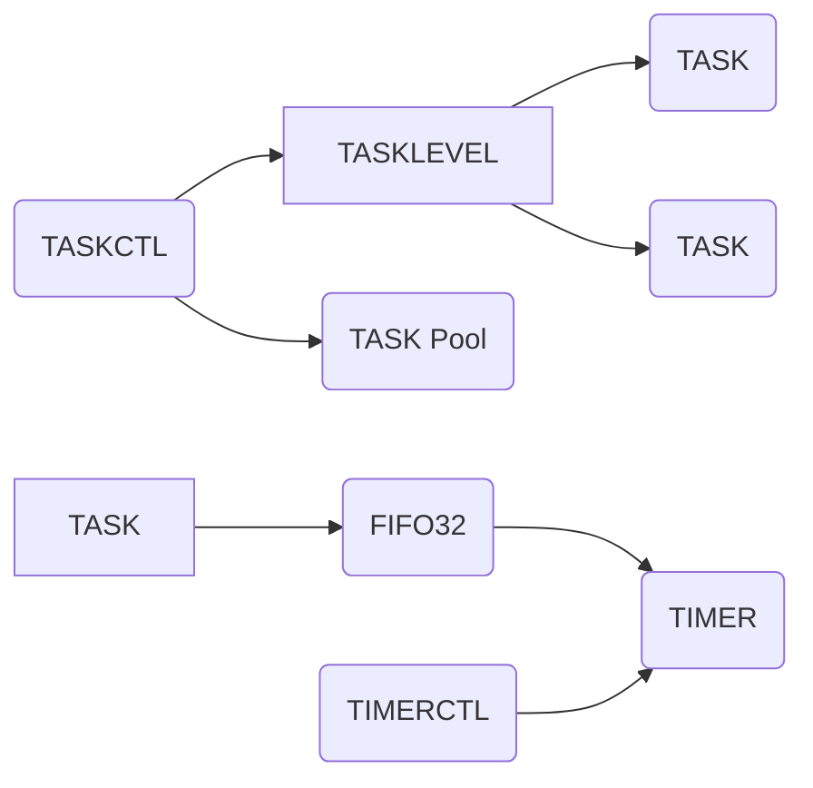

以下是 `bootpack.h` 中与多任务相关的关键数据结构及其简单解释：

---

### **1. 任务控制块 `struct TASK`**
```c
struct TASK {
    int sel, flags;     // sel: GDT中TSS描述符的选择子; flags: 任务状态标志
    int level, priority;// level: 优先级层级; priority: 时间片长度（单位：定时器中断周期）
    struct TSS32 tss;   // 任务状态段
};
```
- **字段说明**：
  - **`sel`**：GDT（全局描述符表）中该任务对应的 TSS 描述符的选择子。  
    例如，`sel = (TASK_GDT0 + task_id) * 8`，其中 `TASK_GDT0` 是 TSS 描述符的起始索引。
  - **`flags`**：任务状态标志：
    - `0`: 未使用（空闲）。
    - `1`: 休眠（暂停运行，但保留在队列中）。
    - `2`: 运行中（当前正在执行或处于就绪队列）。
  - **`level`**：任务所在的优先级层级（数值越小优先级越高）。
  - **`priority`**：时间片长度，决定任务每次获得 CPU 的时间（单位与定时器中断周期相关）。

---

### **2. 任务层级 `struct TASKLEVEL`**
```c
struct TASKLEVEL {
    int running;        // 当前层级中正在运行的任务数量
    int now;            // 当前正在执行的任务索引（轮转调度）
    struct TASK *tasks[MAX_TASKS_LV]; // 任务指针数组
};
```
- **字段说明**：
  - **`running`**：该层级中处于就绪状态的任务数量。
  - **`now`**：当前正在执行的任务在 `tasks` 数组中的索引，用于轮转调度。
  - **`tasks`**：存储指向该层级所有任务的指针数组，最大容量为 `MAX_TASKS_LV`（例如 100）。

---

### **3. 全局任务控制器 `struct TASKCTL`**
```c
struct TASKCTL {
    int now_lv;         // 当前活跃的优先级层级
    char lv_change;     // 是否需要切换层级（标志位）
    struct TASKLEVEL level[MAX_TASKLEVELS]; // 多级优先级队列
    struct TASK tasks0[MAX_TASKS];         // 任务对象池
};
```
- **字段说明**：
  - **`now_lv`**：当前正在执行的优先级层级（例如 `0` 为最高优先级）。
  - **`lv_change`**：标志位，表示是否需要重新选择活跃层级（例如当高优先级任务就绪时）。
  - **`level`**：多级优先级队列数组，每个元素管理一个优先级的任务集合。
  - **`tasks0`**：预分配的任务对象池，所有任务均从该数组中分配。

---

### **4. 环形缓冲区 `struct FIFO32`**
```c
struct FIFO32 {
    int *buf;           // 缓冲区指针
    int p, q;           // 写指针(p)和读指针(q)
    int size, free;     // 缓冲区总大小和剩余空间
    int flags;          // 状态标志（如溢出）
    struct TASK *task;  // 关联的任务（用于唤醒）
};
```
- **字段说明**：
  - **`buf`**：存储数据的缓冲区。
  - **`p`** 和 **`q`**：写操作和读操作的当前位置，实现环形队列。
  - **`size`** 和 **`free`**：缓冲区总容量和剩余可用空间。
  - **`flags`**：标志位，例如 `FLAGS_OVERRUN` 表示缓冲区溢出。
  - **`task`**：关联的任务对象，当数据写入缓冲区时，自动唤醒该任务。

---

### **5. 定时器 `struct TIMER`**
```c
struct TIMER {
    struct TIMER *next; // 链表指针（用于管理超时队列）
    unsigned int timeout, flags; // 超时时间和状态标志
    struct FIFO32 *fifo; // 关联的FIFO缓冲区
    int data;           // 超时事件发生时发送的数据
};
```
- **字段说明**：
  - **`next`**：指向下一个定时器的指针，用于构建超时链表。
  - **`timeout`**：超时时间（全局计数器 `timerctl.count` 的阈值）。
  - **`flags`**：状态标志：
    - `TIMER_FLAGS_ALLOC`: 已分配但未激活。
    - `TIMER_FLAGS_USING`: 正在运行。
  - **`fifo`** 和 **`data`**：超时发生时，向该 FIFO 写入 `data`，用于唤醒关联任务。

---

### **6. 定时器控制器 `struct TIMERCTL`**
```c
struct TIMERCTL {
    unsigned int count, next; // 全局计数器和下一个超时时间
    struct TIMER *t0;        // 超时链表的头节点
    struct TIMER timers0[MAX_TIMER]; // 定时器对象池
};
```
- **字段说明**：
  - **`count`**：全局时间计数器，每次定时器中断递增。
  - **`next`**：下一个即将触发的超时时间。
  - **`t0`**：超时链表的头节点，按超时时间排序。
  - **`timers0`**：预分配的定时器对象池。

---

### **结构体关系图**


---

### **关键机制说明**
1. **任务调度**：
   - 通过 `TASKCTL` 管理多级优先级队列 (`TASKLEVEL`)，调度器选择最高优先级的就绪任务。
   - 时间片耗尽时，`TIMERCTL` 触发中断，调度器切换到下一个任务。

2. **任务通信**：
   - 中断处理程序通过 `FIFO32` 向任务发送数据，并唤醒关联任务。

3. **动态优先级调整**：
   - 调用 `task_run(task, level, priority)` 可修改任务的优先级或时间片。

---

以上数据结构共同构成了多任务系统的核心框架，实现了任务调度、优先级管理、时间片控制及中断协同等功能。