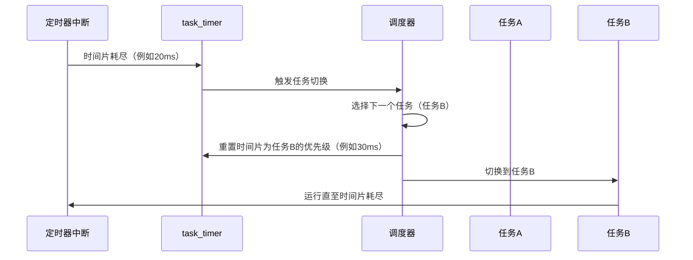

以下是关于 **`task_timer`** 的整理总结，特别是其 **全局唯一性** 和 **动态重置机制** 的详细解释：

---

### **1. `task_timer` 的核心作用**
- **唯一性**：整个系统中只有 **一个** `task_timer`，它是全局变量，专门用于管理 **当前正在运行的任务的时间片**。
- **核心职责**：  
  1. 跟踪当前任务的剩余时间片。  
  2. 时间片耗尽时触发任务切换。  
  3. 动态绑定到新任务的时间片。

---

### **2. 为什么 `task_timer` 是全局唯一的？**
- **单任务执行**：CPU 在任何时刻只能运行 **一个任务**，因此只需一个定时器跟踪当前任务的时间片。
- **动态重置机制**：  
  - 每次任务切换时，`task_timer` 会被重置为 **新任务的时间片**，无需为每个任务单独分配定时器。
  - 例如：  
    - 任务A运行：`task_timer` 设为 20ms。  
    - 任务B运行：`task_timer` 重置为 30ms。  
    - 任务C运行：`task_timer` 重置为 40ms。  

---

### **3. `task_timer` 的工作流程**


---

### **4. 动态重置机制详解**
#### **(1) 代码实现**
```c
// mtask.c (任务切换函数)
void task_switch(void) {
    // 1. 选择新任务 new_task
    struct TASK *new_task = ...;

    // 2. 重置 task_timer 为新任务的时间片
    timer_settime(task_timer, new_task->priority);

    // 3. 跳转到新任务
    farjmp(0, new_task->sel);
}
```

#### **(2) 重置过程**
- **`timer_settime` 函数**：  
  将 `task_timer` 的超时时间设置为 `当前时间 + 新任务的优先级值`。  
  例如：若新任务的 `priority = 2`（每个单位对应一个定时器中断周期，如 10ms），则超时时间 = 当前时间 + 2 * 10ms = 20ms。

---

### **5. 为什么不需要多个 `task_timer`？**
- **资源高效**：单一定时器减少内存占用，避免为每个任务分配独立定时器的开销。
- **逻辑简化**：  
  - 每次切换任务时，只需重置 `task_timer` 为当前任务的时间片。  
  - 无需维护多个定时器的超时队列。
- **硬件限制**：  
  硬件定时器（如 PIT）通常只能生成单一中断信号，无法直接支持多时间片管理。

---

### **6. 示例场景**
假设系统中有三个任务：
| 任务  | 时间片（priority） | 对应时间（假设定时器周期10ms） |
| ----- | ------------------ | ------------------------------ |
| 任务A | 2                  | 20ms                           |
| 任务B | 3                  | 30ms                           |
| 任务C | 4                  | 40ms                           |

1. **任务A运行**：  
   - `task_timer` 设为 20ms。  
   - 20ms后超时，触发切换至任务B。
2. **任务B运行**：  
   - `task_timer` 重置为 30ms。  
   - 30ms后超时，触发切换至任务C。
3. **任务C运行**：  
   - `task_timer` 重置为 40ms。  
   - 40ms后超时，循环回到任务A。

---

### **7. 总结**
- **`task_timer` 的唯一性**：全局单例，专用于管理当前任务的时间片。  
- **动态重置**：通过任务切换时的重置操作，实现多任务时间片轮转。  
- **优势**：资源高效、逻辑简洁、硬件兼容。  

这种设计通过 **单一定时器 + 动态重置**，优雅地解决了多任务时间片管理的复杂性，是操作系统调度算法的经典实现。