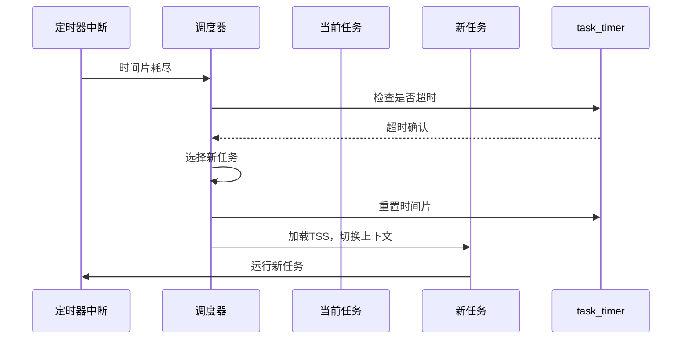

以下是 `bootpack.c` 中 **任务切换的核心流程** 及相关机制的详细解析：

---

### **1. 任务切换触发点**
任务切换主要通过以下两种方式触发：
1. **定时器中断（时间片耗尽）**：硬件定时器周期性中断，当 `task_timer` 超时时强制切换任务。
2. **主动休眠（无事件等待）**：任务主动调用 `task_sleep` 让出 CPU。

---

### **2. 主程序（HariMain）中的任务切换流程**
#### **(1) 初始化阶段**
```c
void HariMain(void) {
    // ...初始化硬件、内存、任务等...
    task_a = task_init(memman);        // 初始化任务系统，创建初始任务A
    fifo.task = task_a;                // 绑定FIFO到任务A
    task_run(task_a, 1, 2);            // 启动任务A，优先级层级1，时间片2个单位
    // ...创建其他任务（如任务B）并初始化窗口...
}
```
- **关键操作**：
  - `task_init`：创建任务管理器，初始化 `task_timer`。
  - `task_run`：将任务A加入调度队列，设置初始优先级和时间片。

#### **(2) 主事件循环**
```c
for (;;) {
    io_cli(); // 关中断
    if (fifo32_status(&fifo) == 0) {   // FIFO为空（无事件）
        task_sleep(task_a);            // 任务A休眠，触发任务切换
        io_sti(); // 开中断
    } else {
        // 处理键盘、鼠标等事件
        i = fifo32_get(&fifo);
        io_sti(); // 开中断
        // ...事件处理逻辑...
    }
}
```
- **关键操作**：
  - **任务A休眠**：当无事件可处理时，调用 `task_sleep(task_a)`，任务A被移出运行队列。
  - **调度器介入**：休眠操作触发调度器选择其他就绪任务（如任务B）。

---

### **3. 定时器中断驱动的任务切换**
#### **(1) 中断处理流程**
```c
// timer.c (inthandler20)
void inthandler20(int *esp) {
    io_out8(PIC0_OCW2, 0x60); // 确认中断
    timerctl.count++; // 全局时间计数器递增

    // 检查所有超时定时器
    struct TIMER *timer = timerctl.t0;
    while (timer->timeout <= timerctl.count) {
        if (timer == task_timer) { 
            // 任务调度定时器超时（时间片耗尽）
            task_switch(); // 强制任务切换
        } else {
            // 普通定时器处理（如向FIFO发送数据）
            fifo32_put(timer->fifo, timer->data);
        }
        timer = timer->next;
    }
}
```
- **关键操作**：
  - **时间片检查**：若 `task_timer` 超时（时间片耗尽），调用 `task_switch()`。
  - **切换任务**：调度器选择下一个任务，重置 `task_timer` 为其时间片。

#### **(2) 任务切换函数**
```c
// mtask.c (task_switch)
void task_switch(void) {
    struct TASKLEVEL *tl = &taskctl->level[taskctl->now_lv];
    struct TASK *new_task = tl->tasks[tl->now];
    
    // 轮转调度：更新当前任务索引
    tl->now = (tl->now + 1) % tl->running;
    
    // 重置任务定时器为新任务的时间片
    timer_settime(task_timer, new_task->priority);
    
    // 通过TSS跳转到新任务
    farjmp(0, new_task->sel);
}
```
- **关键操作**：
  - **选择新任务**：按轮转策略从当前优先级队列选择下一个任务。
  - **重置时间片**：`timer_settime` 将 `task_timer` 绑定到新任务的优先级。
  - **上下文切换**：`farjmp` 指令加载新任务的 TSS，恢复其执行状态。

---

### **4. 任务切换的完整流程**


---

### **5. 关键机制总结**
1. **时间片管理**：  
   - `task_timer` 跟踪当前任务的时间片，超时后触发切换。
   - 优先级 `priority` 决定时间片长度（单位：定时器中断周期）。
2. **主动休眠**：  
   - 任务在无事件时主动休眠，释放 CPU。
   - 休眠操作触发调度器立即切换任务。
3. **动态优先级队列**：  
   - 任务按优先级分组，调度器优先执行高优先级队列中的任务。
   - 同优先级任务按轮转策略分配时间片。

---

### **6. 示例场景**
1. **任务A运行**：  
   - `task_timer` 设为 20ms。
   - 处理键盘输入，更新窗口。
2. **时间片耗尽**：  
   - 定时器中断触发，调用 `task_switch` 切换到任务B。
3. **任务B运行**：  
   - `task_timer` 重置为 30ms。
   - 显示计时器计数，循环执行。
4. **任务B主动休眠**：  
   - 调用 `task_sleep`，切换回任务A。

---

通过以上流程，`bootpack.c` 实现了高效的多任务协作，兼顾实时性和公平性。