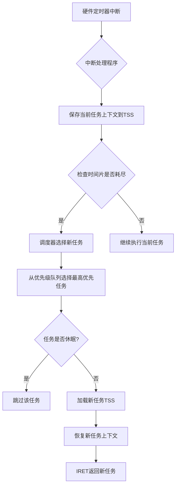
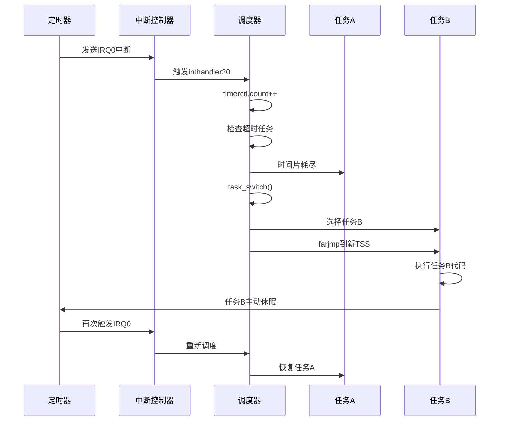
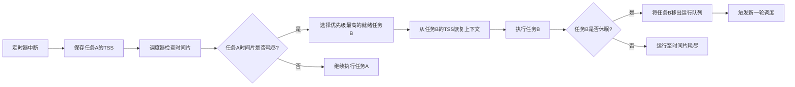

以下是完整的任务切换过程分析，结合优先级、时间片、中断和休眠机制，并有 **Mermaid 流程图** 和 **时序图**：

---

### **1. 任务切换全流程**


---

### **2. 时序图示例**


---

### **3. 详细步骤解析**

#### **步骤1：系统初始化**
```c
// bootpack.c (HariMain)
task_a = task_init(memman);       // 创建任务A（主任务）
task_run(task_a, 0, 2);          // 设置优先级0（最高），时间片2ms
timer = timer_alloc();
timer_init(timer, &fifo, 1);     // 绑定定时器到任务A的FIFO
timer_settime(timer, 50);        // 50ms触发一次时间片中断，（1s触发一次定时器中断）
```

#### **步骤2：定时器中断触发**
```c
// timer.c (inthandler20)
io_out8(PIC0_OCW2, 0x60);       // 确认中断
timerctl.count++;                // 全局时间计数器递增
if (timerctl.next <= timerctl.count) {
    task_switch();               // 调用任务切换
}
```

#### **步骤3：调度器选择任务**
```c
// mtask.c (task_switch)
struct TASKLEVEL *tl = &taskctl->level[taskctl->now_lv];
struct TASK *new_task, *now_task = tl->tasks[tl->now];

tl->now++;
if (tl->now == tl->running) {
	tl->now = 0;
} // 轮转调度

if (taskctl->lv_change) {
    task_switchsub();            // 检查更高优先级任务
}
farjmp(0, new_task->sel);        // 通过TSS跳转到新任务
```

#### **步骤4：任务主动休眠**
```c
// bootpack.c (HariMain循环)
if (fifo32_status(&fifo) == 0) {
    task_sleep(task_a);          // 无事件时休眠
    io_sti();
}
```

#### **步骤5：中断唤醒任务**
```c
// fifo.c (fifo32_put)
if (fifo->task->flags != 2) {
    task_run(fifo->task, -1, 0); // 唤醒关联任务
}
```

---

### **4. 关键机制说明**

#### **(1) 优先级管理**
- **层级队列**：`struct TASKLEVEL` 管理不同优先级的任务队列。
- **优先级切换**：
  ```c
  // mtask.c (task_switchsub)
  for (i = 0; i < MAX_TASKLEVELS; i++) {
      if (taskctl->level[i].running > 0) {
          taskctl->now_lv = i;   // 选择最高非空优先级
          break;
      }
  }
  ```

#### **(2) 时间片控制**
- **定时器设置**：
  ```c
  // mtask.c (task_init)
  task_timer = timer_alloc();
  timer_settime(task_timer, task->priority); // 时间片=priority
  ```
- **时间片耗尽逻辑**：
  ```c
  // timer.c (inthandler20)
  if (timer->timeout <= timerctl.count) {
      task_switch(); // 触发切换
  }
  ```

#### **(3) 上下文保存与恢复**
- **TSS 自动保存**：
  ```nasm
  ; naskfunc.nas (farjmp)
  JMP FAR [ESP+4] ; 跳转到新任务的TSS选择子
  ```
- **寄存器恢复**：CPU 自动从新任务的 TSS 加载 `EIP`、`ESP` 等寄存器。

---

### **5. 完整流程图解**


---

### **6. 典型场景示例**
1. **任务A运行**：处理键盘输入，更新窗口。
2. **定时器中断**：50ms时间片到期，触发 `inthandler20`。
3. **调度器选择任务B**：任务B优先级相同，轮转调度。
4. **任务B运行**：显示计时器计数，循环执行。
5. **任务B主动休眠**：调用 `task_sleep` 让出 CPU。
6. **调度器切回任务A**：无更高优先级任务，恢复执行。

---

### **总结**
- **优先级驱动**：高优先级任务总是优先获得 CPU。
- **时间片轮转**：相同优先级任务均分 CPU 时间。
- **中断协同**：硬件中断触发调度决策。
- **休眠优化**：无任务需运行时切换到空闲任务（`task_idle`）。

通过上述机制，系统实现了高效的多任务切换，兼顾实时性和公平性。