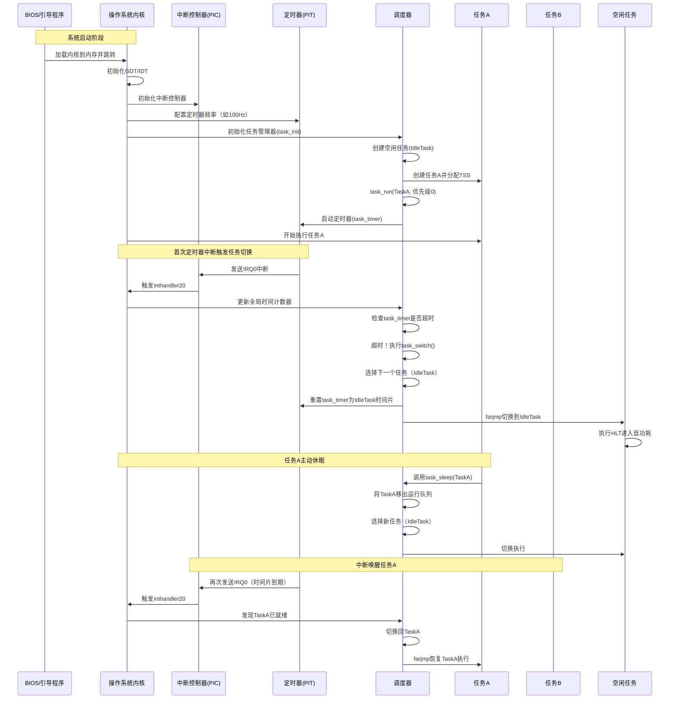
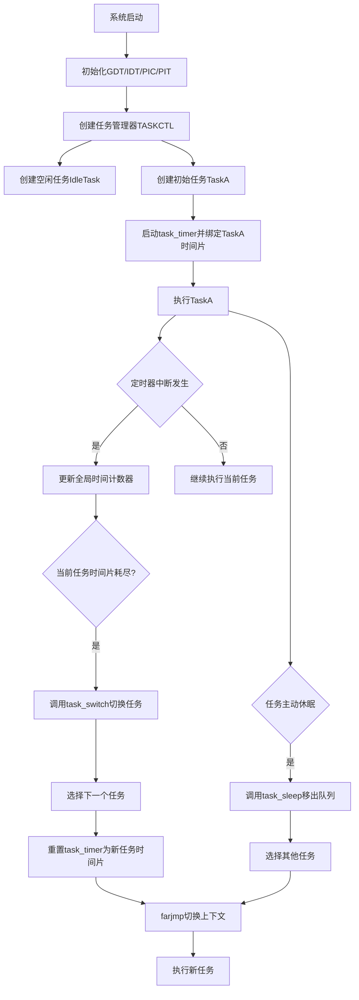

以下是 **任务切换的完整流程时序图**，涵盖 **系统启动、任务初始化、首次中断触发切换及任务休眠切换** 的全过程：

---

### **1. 完整任务切换时序图**

---

### **2. 详细步骤说明**

#### **(1) 系统启动与初始化**
1. **BIOS/引导程序**：  
   - 加载操作系统内核到内存，并跳转到内核入口。
2. **内核初始化**：  
   - 设置 GDT（全局描述符表）和 IDT（中断描述符表）。
   - 配置 PIC（中断控制器）和 PIT（可编程间隔定时器）。
3. **任务管理器初始化**：  
   - 调用 `task_init` 创建任务管理器 `TASKCTL`。
   - 创建空闲任务（`IdleTask`）和初始任务（`TaskA`）。
   - 启动 `task_timer` 定时器，绑定到 `TaskA` 的时间片。

#### **(2) 首次定时器中断触发切换**
1. **定时器中断**：  
   - PIT 每隔固定时间（如 10ms）发送 IRQ0 中断。
   - PIC 将中断转发给 CPU，触发 `inthandler20`。
2. **中断处理**：  
   - 更新全局时间计数器 `timerctl.count`。
   - 检查 `task_timer` 是否超时（时间片耗尽）。
3. **任务切换**：  
   - 调用 `task_switch`，按优先级选择下一个任务（如 `IdleTask`）。
   - 重置 `task_timer` 为新任务的时间片。
   - 通过 `farjmp` 指令加载新任务的 TSS，切换上下文。

#### **(3) 任务主动休眠**
1. **主动休眠调用**：  
   - `TaskA` 在事件循环中发现 FIFO 为空，调用 `task_sleep(task_a)`。
2. **移出运行队列**：  
   - 调度器将 `TaskA` 从运行队列中移除。
   - 重新选择当前层级的任务（如 `IdleTask`）。
3. **切换至空闲任务**：  
   - 空闲任务执行 `HLT` 指令，降低 CPU 功耗。

#### **(4) 中断唤醒任务**
1. **再次定时器中断**：  
   - 定时器中断触发，调度器发现 `TaskA` 已就绪（如 FIFO 收到数据）。
2. **恢复任务执行**：  
   - 调度器将 `TaskA` 重新加入运行队列。
   - `farjmp` 恢复 `TaskA` 的上下文，继续执行。

---

### **3. 关键流程图**

---

### **4. 总结**
- **硬件初始化**：GDT、IDT、PIC、PIT 是任务切换的基础设施。
- **任务调度**：通过 `task_timer` 和优先级队列实现时间片轮转。
- **中断驱动**：定时器中断是任务切换的触发源。
- **上下文切换**：`farjmp` 指令通过 TSS 实现任务状态的保存与恢复。
- **休眠与唤醒**：任务可主动休眠节省资源，事件到达后由中断唤醒。

此流程完整覆盖了从系统启动到多任务协作的全过程，体现了时间片调度与中断响应的核心机制。