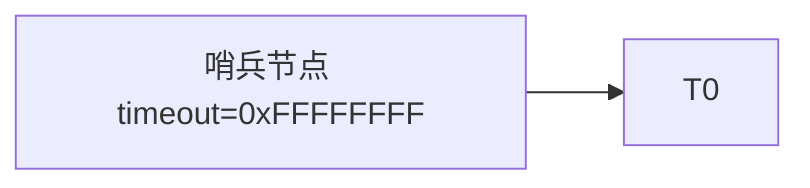
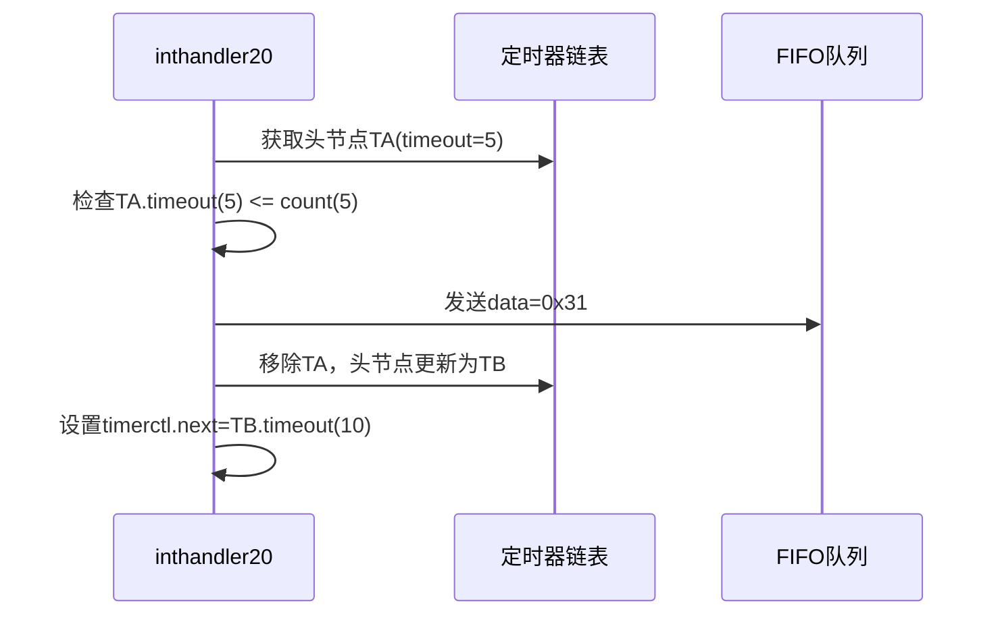
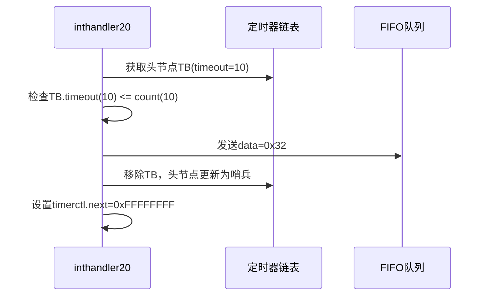

以下是两个定时器（A和B）切换的详细示例，包含计算过程和运行逻辑分析：

---

### **场景设定**
- **定时器A**：每 **50ms** 触发一次（相对时间）
- **定时器B**：每 **100ms** 触发一次（相对时间）
- **系统滴答频率**：100Hz（每10ms一个滴答）

---

### **1. 初始化阶段**
```c
// bootpack.c 中初始化
struct TIMER *timerA = timer_alloc();
timer_init(timerA, &fifo, 0x31); // data=0x31表示定时器A
timer_settime(timerA, 5);        // 50ms = 5个滴答（5*10ms）

struct TIMER *timerB = timer_alloc();
timer_init(timerB, &fifo, 0x32); // data=0x32表示定时器B
timer_settime(timerB, 10);       // 100ms = 10个滴答（10*10ms）
```

#### **计算过程**：
- $$
  \text{滴答间隔} = \frac{1}{\text{PIT频率}} = \frac{1}{100\,\text{Hz}} = 10\,\text{ms}
  $$

- $$
  \text{定时器A滴答数} = \frac{50\,\text{ms}}{10\,\text{ms/滴答}} = 5\,\text{滴答}
  $$

- $$
  \text{timeout}_{\text{absolute}} = \text{count} + \frac{\text{interval}_{\text{ms}}}{10}
  $$

---

### **2. 定时器链表插入过程**
假设当前系统滴答计数 `timerctl.count = 0`，链表初始状态如下：


#### **插入定时器A**（绝对超时时间 = 0 + 5 = 5）


#### **插入定时器B**（绝对超时时间 = 0 + 10 = 10）


---

### **3. 中断处理流程**
#### **时间轴演进**：
| 滴答计数 | 事件         | 链表状态                        |
| -------- | ------------ | ------------------------------- |
| 0        | 初始化完成   | Head -> TA(5) -> TB(10) -> 哨兵 |
| 1~4      | 无定时器触发 | 结构不变                        |
| 5        | 定时器A触发  | Head -> TB(10) -> 哨兵          |
| 6~9      | 无定时器触发 | 结构不变                        |
| 10       | 定时器B触发  | Head -> 哨兵                    |

---

#### **中断处理关键步骤（滴答计数=5时）**：


---

#### **中断处理关键步骤（滴答计数=10时）**：


---

### **4. 周期定时器的实现**
若需要定时器A周期触发（每次50ms），需在中断处理中重新插入：
```c
// inthandler20 中补充逻辑
if (timer == timerA) {
    timer_settime(timerA, 5); // 重新插入
}
```

#### **更新后的链表状态变化**：
| 滴答计数 | 事件             | 链表状态                         |
| -------- | ---------------- | -------------------------------- |
| 5        | 触发TA后重新插入 | Head -> TB(10) -> TA(15) -> 哨兵 |
| 10       | 触发TB           | Head -> TA(15) -> 哨兵           |
| 15       | 再次触发TA       | Head -> 哨兵                     |

---

### **5. 链表插入时间复杂度**以及绝对超时时间公式：

$$
\text{timeout}_{\text{absolute}} = \text{count} + \frac{\text{interval}_{\text{ms}}}{10}
$$

- $$
  \begin{aligned}
  \text{最佳情况} &: O(1) \\
  \text{最坏情况} &: O(n) \\
  \text{平均情况} &: O(\log n)
  \end{aligned}
  $$

---

### **6. 性能优化分析**
1. **哨兵节点作用**：
   - 消除对空链表的特殊判断
   - 保证循环终止条件 `timer->timeout > count` 始终有效

2. **next字段缓存**：
   - 快速预判是否需要处理中断：
   
     ```c
     if (timerctl.next > count) return;
     ```
   
   - 减少不必要的链表遍历

---

通过这个示例可以清晰看到：
1. 定时器如何基于绝对时间排序
2. 中断处理程序如何高效遍历链表
3. 周期性定时器的实现方法
4. 时间参数到滴答次数的转换关系