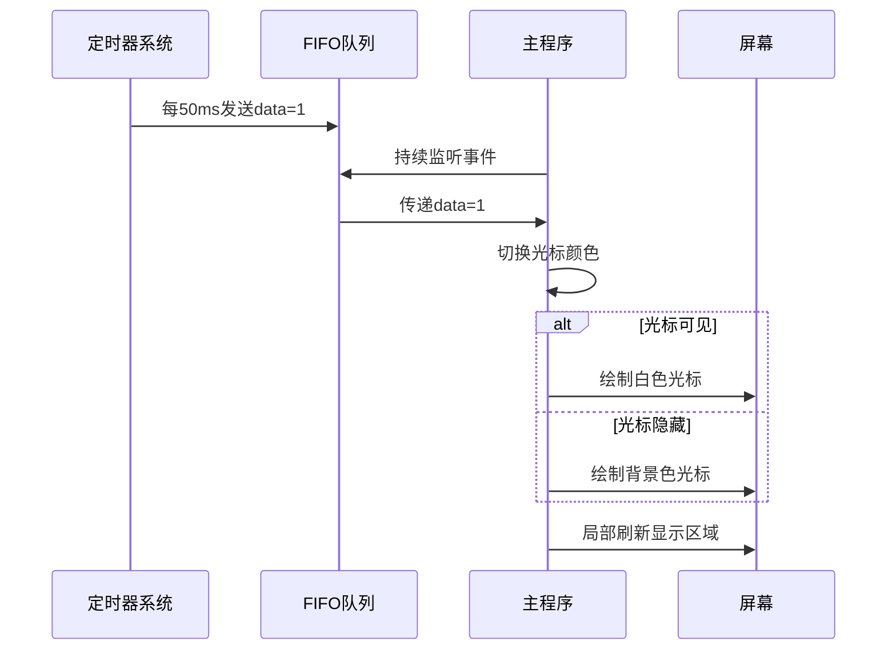

以下是关于 **光标定时器**（即文本输入框中的闪烁光标）的详细实现解析，基于您提供的代码：

---

### **一、光标定时器核心逻辑**
在 `bootpack.c` 的 `HariMain` 函数中，光标定时器的实现步骤如下：

#### **1. 定时器初始化**
```c
// 分配定时器
struct TIMER *timer = timer_alloc();

// 初始化定时器参数：绑定FIFO，设置标识数据为1
timer_init(timer, &fifo, 1);

// 设置定时器周期为50ms（5个滴答，每个滴答10ms）
timer_settime(timer, 50);
```

#### **2. 光标状态管理变量**
```c
int cursor_x = 8;    // 光标水平位置
int cursor_c = COL8_FFFFFF; // 初始颜色为白色（显示状态）
```

#### **3. 中断处理逻辑**
在 `inthandler20` 中处理定时器事件：
```c
if (i == 1) { // 定时器触发（data=1）
    // 切换光标颜色（闪烁效果）
    if (cursor_c == COL8_000000) {
        cursor_c = COL8_FFFFFF; // 显示光标
    } else {
        cursor_c = COL8_000000; // 隐藏光标
    }
    // 刷新光标显示
    boxfill8(sht_win->buf, sht_win->bxsize, cursor_c, cursor_x, 28, cursor_x+7, 43);
    sheet_refresh(sht_win, cursor_x, 28, cursor_x+8, 44);
}
```

---

### **二、完整工作流程**


---

### **三、关键代码分析**

#### **1. 光标绘制逻辑**
```c
// 用当前颜色填充光标区域（8x16像素）
boxfill8(
    sht_win->buf,           // 窗口缓冲区
    sht_win->bxsize,        // 窗口宽度
    cursor_c,               // 当前颜色（白/黑）
    cursor_x, 28,           // 左上角坐标 (x,y)
    cursor_x + 7, 43        // 右下角坐标 (x+7,y+15)
);

// 刷新屏幕局部区域
sheet_refresh(sht_win, cursor_x, 28, cursor_x + 8, 44);
```
- **视觉效果**：通过交替绘制白色（`COL8_FFFFFF`）和背景色（`COL8_000000`）实现闪烁。

#### **2. 文本框初始化**
```c
// 创建文本框（位于窗口内）
make_textbox8(sht_win, 8, 28, 128, 16, COL8_FFFFFF);
```
- **参数解析**：
  - `(8, 28)`：文本框左上角坐标
  - `128x16`：文本框尺寸
  - `COL8_FFFFFF`：背景色（白色）

---

### **四、性能优化设计**
1. **局部刷新**：
   - 仅刷新光标所在区域（8x16像素），而非整个窗口。
   - 通过 `sheet_refresh` 的坐标参数限制刷新范围。

2. **颜色切换算法**：
   ```c
   cursor_c = (cursor_c == COL8_000000) ? COL8_FFFFFF : COL8_000000;
   ```
   - 单次判断完成状态切换，时间复杂度 _O(1)_。

3. **定时器精度控制**：
   - 50ms 周期（20Hz）符合人眼视觉暂留特性，平衡性能与视觉效果。

---

通过这种设计，光标定时器在保证视觉效果的同时，实现了低资源占用和高响应性。