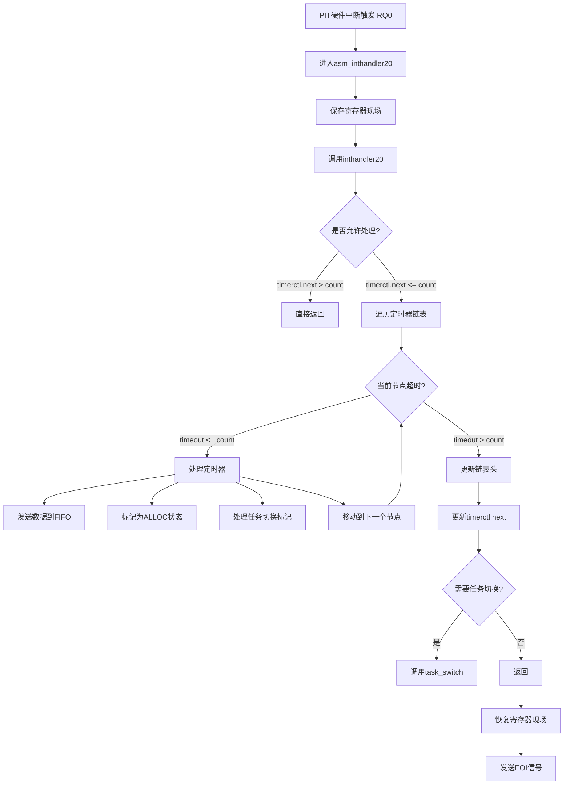
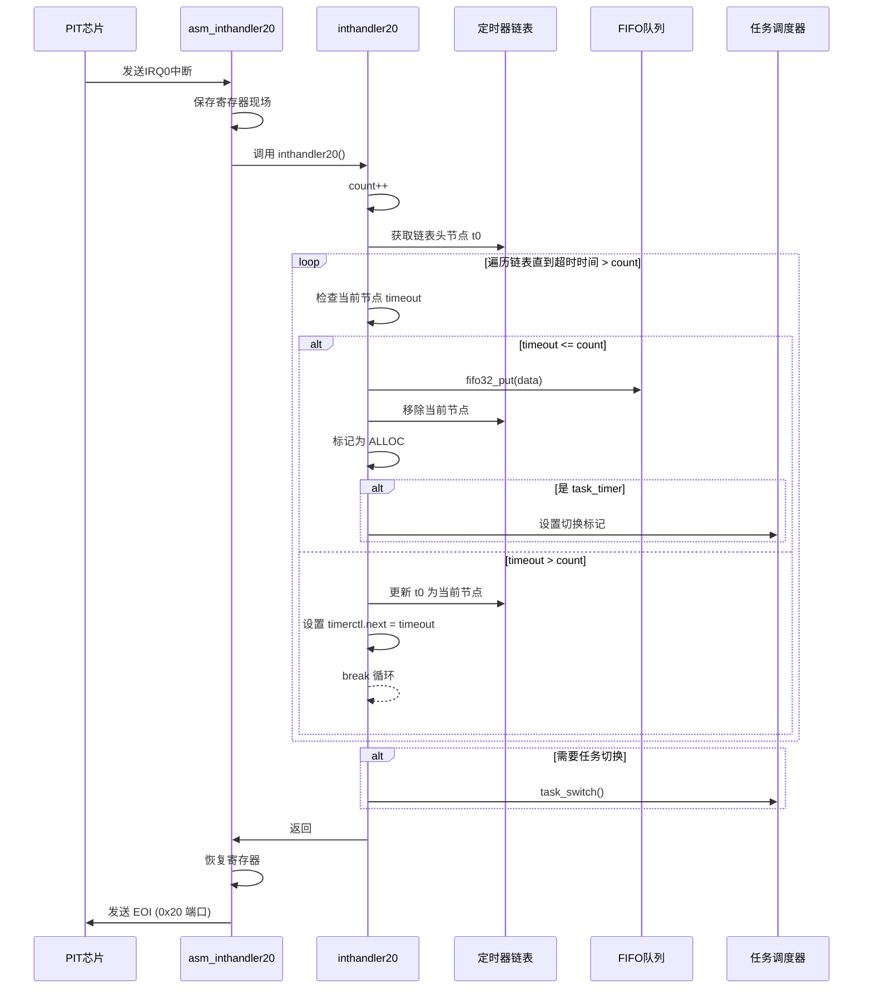

以下是定时器中断处理判断逻辑的流程图和时序图：

---

### **一、中断处理判断逻辑流程图**


---

### **二、中断处理判断逻辑时序图**


---

### **三、关键判断逻辑详解**
#### **1. 中断触发条件检查**
```c
if (timerctl.next > timerctl.count) {
    return; // 快速跳过无定时器触发的场景
}
```
- **作用**：通过比较`next`（最近一个定时器的超时时间）和`count`（当前滴答数），快速判断是否有定时器需要处理。

#### **2. 链表遍历逻辑**
```c
struct TIMER *timer = timerctl.t0;
for (;;) {
    if (timer->timeout > timerctl.count) break; // 遇到未到期定时器停止遍历
    // 处理到期定时器...
    timer = timer->next; // 移动到下一个节点
}
```
- **特点**：链表按超时时间排序，只需处理头部连续到期的定时器。

#### **3. 任务切换特殊处理**
```c
if (timer != task_timer) {
    fifo32_put(timer->fifo, timer->data); // 普通定时器
} else {
    ts = 1; // 任务定时器标记
}
```
- **设计意图**：将任务调度器的定时器与其他定时器区分处理，避免在中断上下文中直接切换任务。

---

### **四、性能优化点**
1. **有序链表**：保证只需检查链表头部节点，时间复杂度接近 _O(1)_。
2. **哨兵节点**：链表尾部包含一个永不过期的定时器（`timeout=0xFFFFFFFF`），避免处理空链表。
3. **next字段缓存**：记录最近要触发的超时时间，快速跳过无事件中断。

