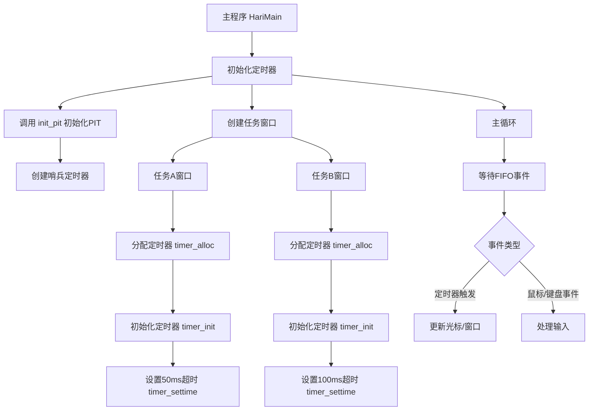
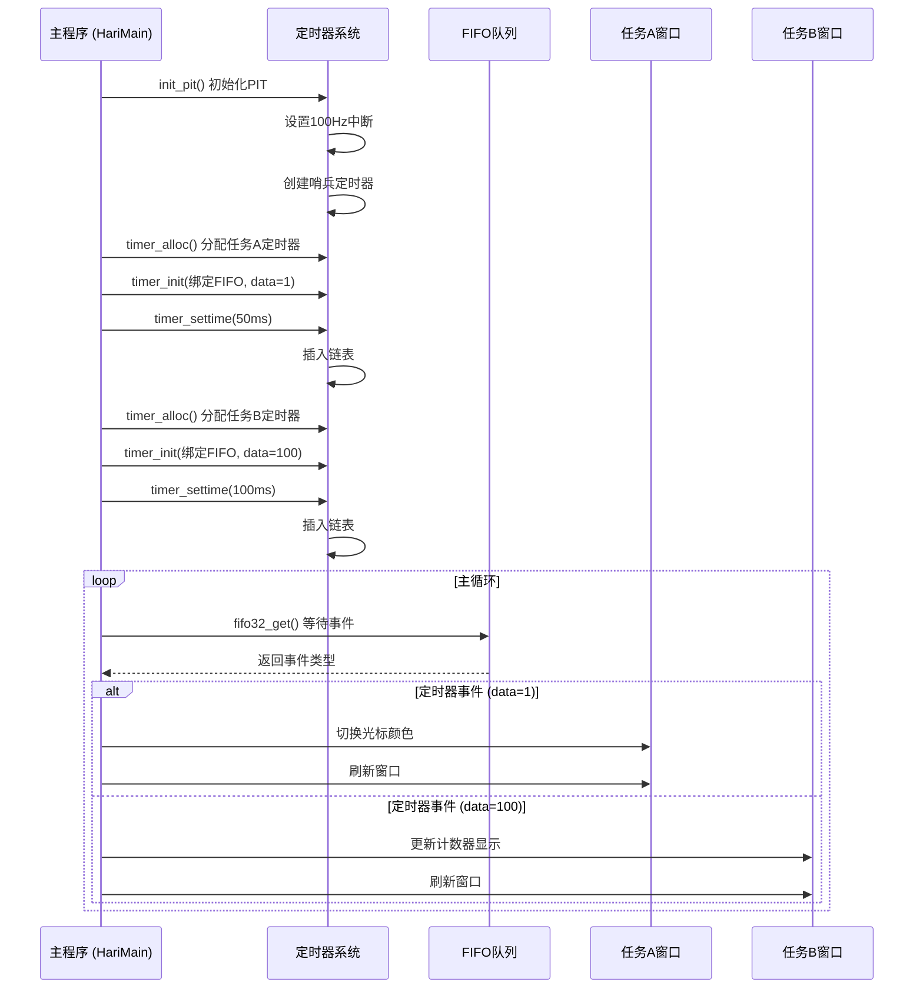

以下是使主程序中与定时器相关的流程图和时序图

---

### **一、主程序定时器相关流程图**



---

### **二、主程序定时器时序图**



---

### **三、关键代码段解释**

#### **1. 定时器初始化（`bootpack.c`）**
```c
// 初始化定时器
init_pit(); // 在HariMain中调用

// 创建任务A的定时器
struct TIMER *timer = timer_alloc();
timer_init(timer, &fifo, 1); // data=1表示光标定时器
timer_settime(timer, 50); // 50ms触发

// 创建任务B的定时器（task_b_main中）
struct TIMER *timer_1s = timer_alloc();
timer_init(timer_1s, &fifo, 100); // data=100表示统计定时器
timer_settime(timer_1s, 100); // 100ms触发
```

#### **2. 定时器处理逻辑（`inthandler20`）**
```c
// 中断处理函数
void inthandler20() {
    // 遍历链表处理到期定时器
    while (timerctl.t0->timeout <= timerctl.count) {
        if (timer == task_timer) {
            task_switch_needed = 1; // 任务切换标记
        } else {
            fifo32_put(timer->fifo, timer->data); // 发送数据到主程序FIFO
        }
    }
}
```

#### **3. 主程序事件循环（`bootpack.c`）**
```c
for (;;) {
    io_cli();
    if (fifo32_status(&fifo) == 0) {
        task_sleep(task_a); // 无事件时休眠
        io_sti();
    } else {
        int i = fifo32_get(&fifo);
        io_sti();
        if (i == 1) { // 光标定时器触发
            // 切换光标颜色
            boxfill8(sht_win->buf, sht_win->bxsize, cursor_c, cursor_x, 28, cursor_x+7, 43);
        } else if (i == 100) { // 任务B定时器触发
            // 更新计数器显示
            sprintf(s, "%11d", count - count0);
            putfonts8_asc_sht(sht_win_b, 24, 28, COL8_000000, COL8_C6C6C6, s, 11);
        }
    }
}
```

---

### **四、流程特点**
1. **分层设计**：
   - 硬件层（PIT芯片）通过中断触发。
   - 驱动层（`timer.c`）管理定时器链表。
   - 应用层（`bootpack.c`）处理具体业务逻辑。

2. **事件驱动**：
   - 所有定时器事件通过统一的FIFO队列传递。
   - 主循环根据 `data` 字段区分不同定时器。

3. **优先级管理**：
   - 定时器链表按超时时间排序，确保高优先级（短超时）事件优先处理。
