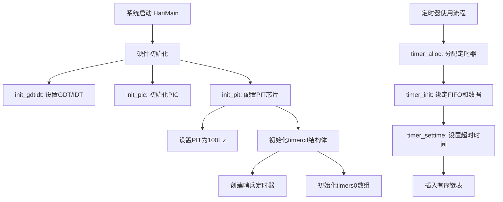
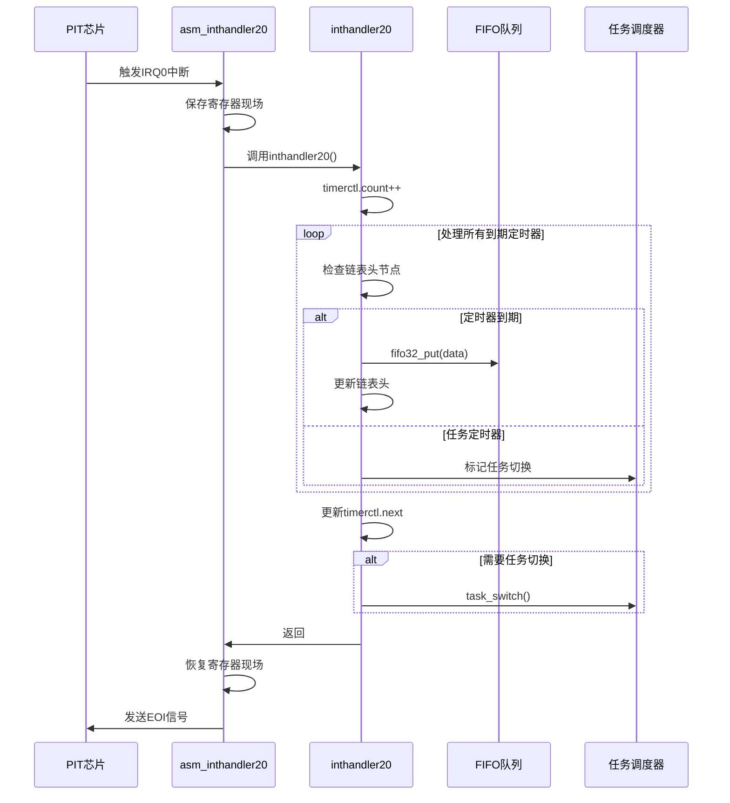
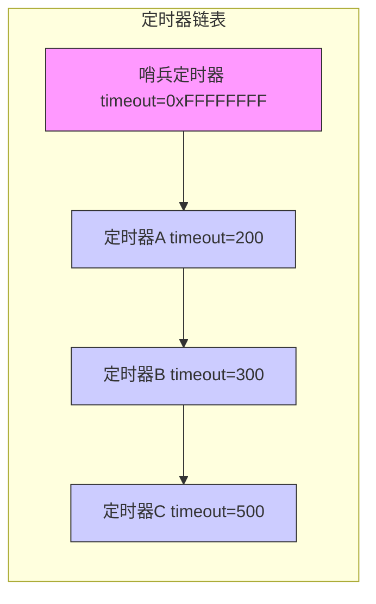

以下是定时器从初始化到多个定时器一起运行的流程图和时序图：

---

### **1. 系统初始化与定时器管理流程图**

---

### **2. 定时器中断处理时序图**

---

### **3. 多定时器链表操作示意图**

---

### **图表说明**
1. **流程图**：
   - 展示了从系统启动到定时器使用的完整初始化流程
   - 突出硬件初始化与定时器管理的分层设计

2. **时序图**：
   - 详细描述了中断触发到任务切换的完整时序
   - 强调硬件与软件的交互过程

3. **链表示意图**：
   - 可视化定时器按超时时间排序的链表结构
   - 哨兵节点始终作为链表尾，简化边界条件处理

