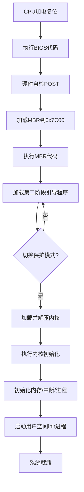

以下是 **CPU 如何指引操作系统启动的详细流程**，从加电到内核执行的每个关键步骤：

---

### **1. CPU 加电复位**
- **动作**：
  1. **复位向量**：CPU 从物理地址 `0xFFFF0`（16位实模式下的 `CS:IP = 0xF000:0xFFF0`）读取第一条指令。
  2. **跳转至 BIOS**：该地址通常指向 BIOS 的入口代码。

---

### **2. BIOS 初始化阶段**
- **CPU 角色**：
  1. **执行 BIOS 代码**：CPU 逐条执行 BIOS 固件中的指令。
  2. **硬件自检（POST）**：
     - 检测内存、外设（键盘、磁盘控制器等）。
     - 初始化中断向量表（IVT），地址为 `0x00000~0x003FF`。
  3. **加载引导扇区**：
     - BIOS 调用 `INT 0x19` 中断，从启动设备（磁盘、USB等）读取首个扇区（MBR）到内存 `0x7C00`。
     - 验证扇区末尾魔数 `0x55AA`，无效则尝试其他设备。

---

### **3. 执行引导扇区（MBR）代码**
- **CPU 角色**：
  1. **实模式运行**：CPU 处于 16 位实模式，直接访问 1MB 物理内存。
  2. **初始化环境**：
     ```nasm
     MOV AX, 0       ; 设置数据段寄存器
     MOV DS, AX
     MOV SS, AX
     MOV SP, 0x7C00   ; 栈指针指向引导扇区顶部
     ```
  3. **加载后续代码**：
     - 通过 `INT 0x13` 中断加载第二阶段引导程序（如 GRUB）到内存（如 `0x8000`）。
  4. **跳转执行**：
     ```nasm
     JMP 0x8000:0x0000  ; 移交控制权到第二阶段代码
     ```

---

### **4. 第二阶段引导程序（Bootloader）**
- **CPU 角色**：
  1. **切换至保护模式**：
     - 加载全局描述符表（GDT）：`LGDT [GDTR]`。
     - 设置控制寄存器 `CR0.PE=1`。
     - 通过远跳转（`JMP 选择子:偏移`）清空流水线并进入 32 位保护模式。
  2. **加载内核**：
     - 解析文件系统（如 FAT32、EXT4），定位内核文件（如 `vmlinuz`）。
     - 解压内核到内存（如 `0x100000`，即 1MB 以上）。
  3. **传递参数**：
     - 准备 `boot_params` 结构体（内存布局、命令行参数等），通过寄存器（如 `EBX`）传递给内核。

---

### **5. 内核初始化**
- **CPU 角色**：
  1. **执行内核入口代码**：
     - 内核入口点通常为 `start_kernel()`（Linux）或 `KiSystemStartup`（Windows）。
  2. **初始化关键功能**：
     - **内存管理**：建立页表，启用分页（`CR0.PG=1`）。
     - **中断处理**：加载中断描述符表（IDT），设置 `LIDT`。
     - **对称多处理（SMP）**：唤醒其他 CPU 核心（通过 APIC）。
  3. **启动调度器**：
     - 创建初始进程（如 `init_task`），开始进程调度。

---

### **6. 用户空间初始化**
- **CPU 角色**：
  1. **执行用户态代码**：
     - 通过 `SYSEXIT` 或 `IRET` 指令从内核态切换到用户态。
  2. **运行首个用户进程**：
     - 启动 `init` 或 `systemd`（PID=1），加载系统服务。

---

### **关键流程图**


---

### **关键寄存器与指令**
| **组件**      | **作用**                                                   |
| ------------- | ---------------------------------------------------------- |
| **CS:IP**     | 实模式下决定下一条指令地址（`CS<<4 + IP`）。               |
| **CR0**       | 控制寄存器，`CR0.PE=1` 启用保护模式，`CR0.PG=1` 启用分页。 |
| **GDTR/IDTR** | 存储 GDT/IDT 的基址和界限，通过 `LGDT/LIDT` 加载。         |
| **中断指令**  | `INT n` 触发 BIOS 中断，`IRET` 从中断返回。                |
| **远跳转**    | `JMP 段选择子:偏移` 用于切换代码段和保护模式。             |

---

### **示例：x86 启动时序**
1. **t=0ms**：CPU 复位，从 `0xFFFF0` 执行 BIOS 代码。  
2. **t=50ms**：BIOS 加载 MBR 到 `0x7C00`，CPU 开始执行引导扇区。  
3. **t=100ms**：引导程序加载内核到 `0x100000`，切换保护模式。  
4. **t=200ms**：内核初始化完成，启动 `init` 进程。  
5. **t=500ms**：用户登录界面显示。

---

通过这一流程，CPU 从底层硬件控制逐步过渡到高级操作系统管理，最终将系统控制权移交给用户空间应用程序。