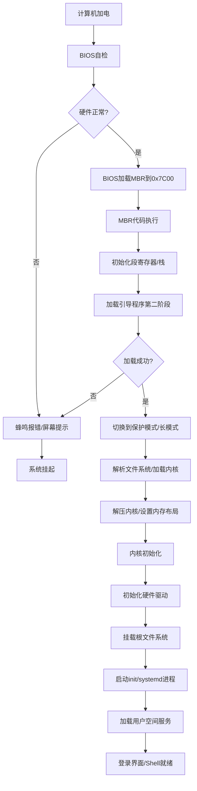

以下是操作系统启动过程的 **理论流程图**，涵盖从加电到系统初始化的完整流程：



---

### **流程详解**
1. **BIOS自检（POST）**  
   - **动作**：检测CPU、内存、存储设备等硬件状态。  
   - **失败处理**：通过蜂鸣代码或屏幕提示错误（如内存故障）。

2. **加载MBR**  
   - **位置**：从启动设备首个扇区（LBA 0）加载512字节到内存`0x7C00`。  
   - **验证**：检查末尾魔数`0x55AA`。

3. **MBR代码执行**  
   - **任务**：  
     - 初始化段寄存器（`DS=SS=0`）和栈指针（`SP=0x7C00`）。  
     - 加载第二阶段引导程序（如GRUB）到内存。

4. **第二阶段引导程序**  
   - **功能**：  
     - 切换至保护模式/长模式。  
     - 解析文件系统（如FAT/EXT4），定位内核文件（如`vmlinuz`）。  
     - 解压内核并设置内存映射（如页表）。

5. **内核初始化**  
   - **关键步骤**：  
     1. **硬件抽象层**：初始化中断控制器（APIC）、时钟、DMA。  
     2. **驱动加载**：探测PCI设备，加载磁盘、网卡等驱动。  
     3. **内存管理**：建立伙伴系统、虚拟内存机制。  
     4. **进程管理**：创建初始进程（`init_task`）。  
     5. **文件系统**：挂载根文件系统（`/`）。

6. **用户空间初始化**  
   - **动作**：  
     - 启动首个用户进程（如`init`或`systemd`）。  
     - 加载系统服务（网络、日志、GUI等）。  
   - **终点**：显示登录界面或Shell提示符。

---

### **关键理论概念**
1. **引导阶段**  
   - **MBR vs GPT**：传统MBR限制4个分区，GPT支持更多分区和更大磁盘。  
   - **UEFI**：取代BIOS的新标准，直接读取FAT分区中的EFI可执行文件。

2. **模式切换**  
   - **实模式→保护模式**：启用分段/分页机制，隔离用户与内核空间。  
   - **保护模式→长模式**（x86_64）：扩展64位地址空间。

3. **内核启动**  
   - **解压缩**：内核通常以压缩格式（如zImage）存储，需在内存中解压。  
   - **设备树（DTB）**：ARM架构通过DTB传递硬件信息，替代BIOS。

4. **初始化顺序**  
   - **同步与依赖**：服务按依赖关系顺序启动（如网络服务依赖网卡驱动）。  
   - **并行化**：现代系统（如systemd）支持并行初始化加速启动。

---

### **示例：Linux启动时间线**
```text
0.000s | BIOS POST
1.200s | MBR加载完成
1.500s | GRUB菜单显示
2.000s | 内核解压并初始化
3.500s | 挂载根文件系统（ext4）
4.000s | systemd启动用户服务
5.200s | 显示登录界面（GUI）
```

---

此流程图和理论框架适用于x86/ARM架构的传统BIOS/UEFI启动流程，涵盖了从硬件初始化到用户空间就绪的全链路关键节点。