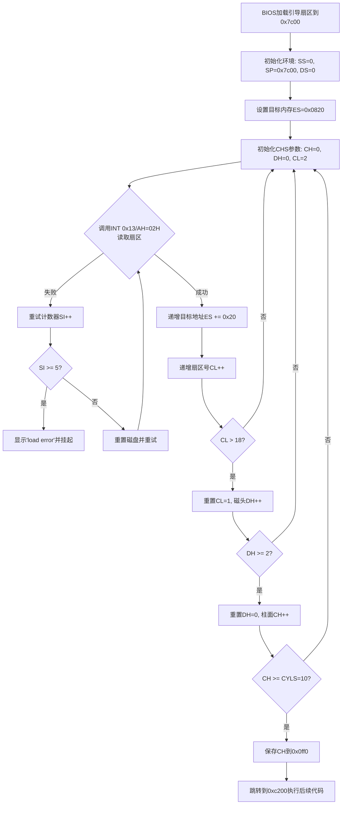
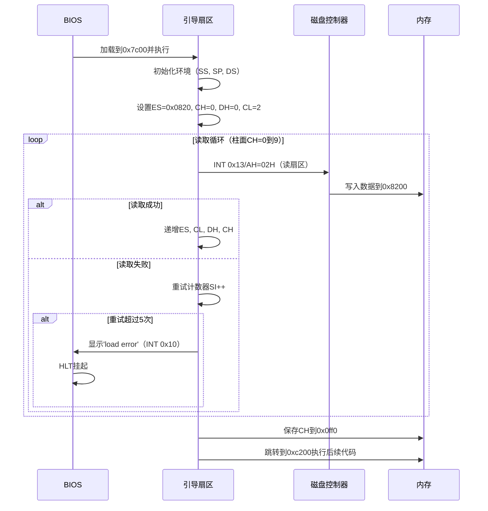

---

### **1. 流程图 (Flowchart)**

---

### **2. 时序图 (Sequence Diagram)**

---

### **使用方法**
1. **流程图**：  
   - 描述了从BIOS加载到跳转执行的完整逻辑分支，包含错误处理和参数递增逻辑。

2. **时序图**：  
   - 展示了BIOS、引导扇区、磁盘控制器和内存之间的交互顺序，突出关键操作（如磁盘读取和错误处理）。

3. **渲染工具**：  
   - 将代码粘贴至支持 Mermaid 的编辑器（如 [Mermaid Live Editor](https://mermaid-js.github.io/mermaid-live-editor/)）即可生成可视化图表。

如需调整样式或逻辑分支，可参考 Mermaid 官方文档修改语法。