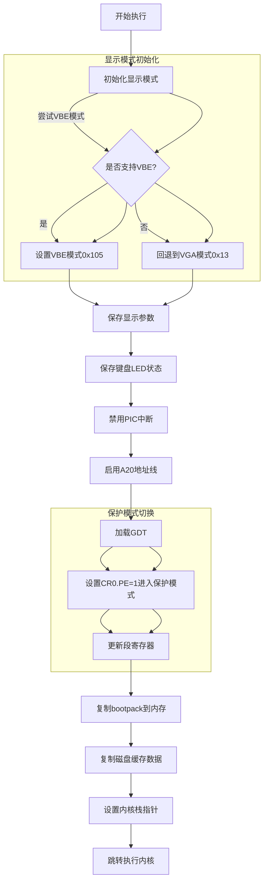
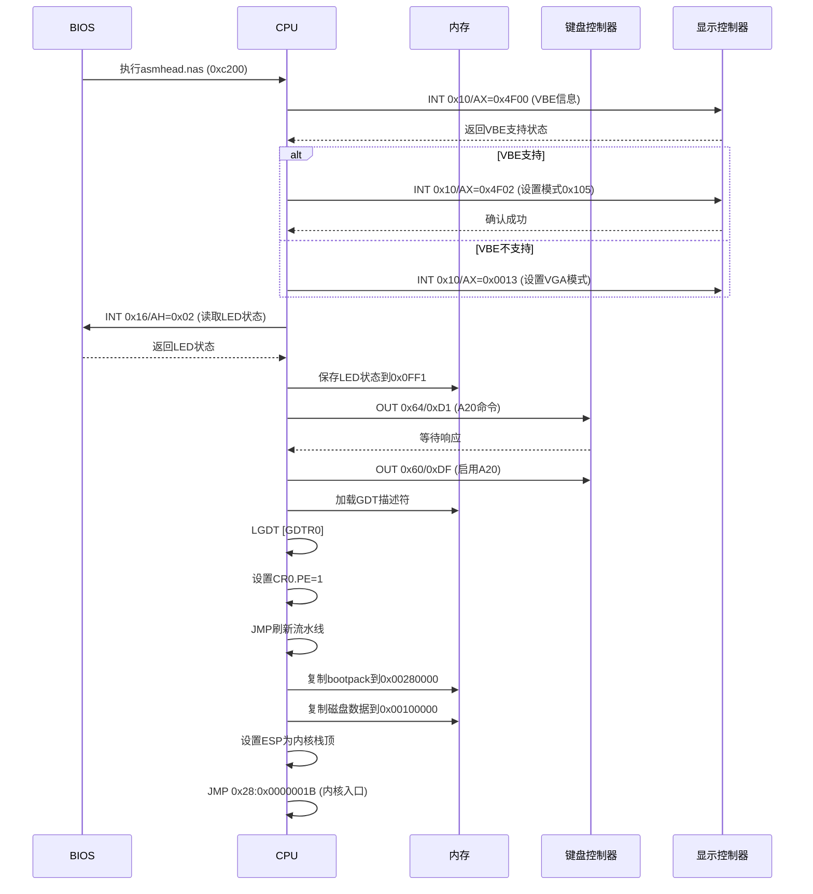

以下是 **`asmhead.nas` 的流程图与时序图**，基于其核心逻辑设计：

---

### **1. 流程图**

---

### **2. 时序图**

---

### **关键步骤说明**
1. **显示模式初始化**  
   - 尝试使用VBE设置高分辨率模式（1024x768x8bit），失败则回退到VGA模式（320x200x8bit）。

2. **硬件状态保存与配置**  
   - 通过BIOS获取键盘LED状态（用于后续恢复）。  
   - 禁用PIC中断控制器，防止外部中断干扰。  
   - 通过键盘控制器启用A20地址线，解除1MB内存限制。

3. **保护模式切换**  
   - 加载GDT（全局描述符表），定义内存段的权限和属性。  
   - 设置CR0寄存器的PE位（Protection Enable），进入保护模式。  
   - 通过远跳转（Far Jump）更新段寄存器和指令流水线。

4. **内核加载与跳转**  
   - 使用`memcpy`函数将内核代码（`bootpack`）复制到高内存地址（`0x00280000`）。  
   - 复制磁盘缓存数据（如文件系统信息）到保留区域（`0x00100000`）。  
   - 设置内核栈指针，通过远跳转移交控制权到内核入口点。

---

### **核心理论背景**
1. **VBE显示模式**  
   - VBE（VESA BIOS Extensions）是BIOS的扩展规范，允许设置高分辨率显示模式。  
   - 模式`0x105`对应1024x768x8bit颜色，需验证颜色深度和内存布局是否匹配。

2. **保护模式切换**  
   - **GDT作用**：定义内存段的基址、界限和访问权限（如代码段/数据段）。  
   - **A20地址线**：突破8086的20位地址限制，使CPU可访问超过1MB的内存。

3. **内存复制优化**  
   - `memcpy`按4字节块操作，减少循环次数（`ECX = 总字节数/4`）。  
   - 使用`REP MOVSD`指令（本例未用）可进一步优化复制速度。

---

通过上述图表，可清晰理解 `asmhead.nas` 从硬件初始化到内核加载的完整逻辑链。