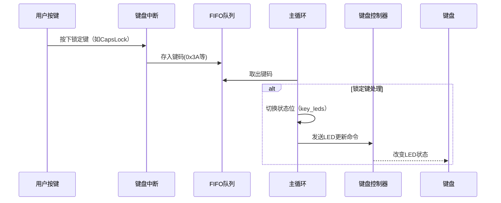

以下是该操作系统对锁定键（CapsLock/NumLock/ScrollLock）的支持实现详解：

---

### **锁定键处理流程图**


---

### **具体实现步骤**

#### **1. 状态跟踪变量**
```c
int key_leds = (binfo->leds >> 4) & 7; // 初始状态从BIOS获取
// 位掩码：
// bit0: ScrollLock (1=ON)
// bit1: NumLock    (2=ON)
// bit2: CapsLock   (4=ON)
```

#### **2. 键码识别**
当检测到特定键码时触发状态切换：
```c
if (i == 256 + 0x3a) { // CapsLock键码=0x3A
    key_leds ^= 4;     // 翻转CapsLock位
}
if (i == 256 + 0x45) { // NumLock键码=0x45
    key_leds ^= 2;     // 翻转NumLock位
}
if (i == 256 + 0x46) { // ScrollLock键码=0x46
    key_leds ^= 1;     // 翻转ScrollLock位
}
```

#### **3. LED状态同步**
通过键盘控制命令更新硬件LED：
```c
// 发送LED控制序列
fifo32_put(&keycmd, KEYCMD_LED); // 命令码0xED
fifo32_put(&keycmd, key_leds);   // 参数（bit0-2对应LED）
```

#### **4. 键盘控制器通信**
最终通过端口操作发送到硬件：
```c
void wait_KBC_sendready(void) {
    while ((io_in8(PORT_KEYSTA) & KEYSTA_SEND_NOTREADY) != 0);
}
// 发送流程：
wait_KBC_sendready(); // 等待键盘就绪
io_out8(PORT_KEYDAT, data); // 发送数据
```

---

### **与其他模块的交互**

#### **对输入处理的影响**
- **CapsLock**：在字符转换阶段生效
  ```c
  if ('A' <= s[0] && s[0] <= 'Z') {
      if ((key_leds & 4) ^ key_shift) { // XOR判断
          s[0] += 0x20; // 转小写
      }
  }
  ```
- **NumLock**：影响小键盘行为（代码中未完全实现，但预留处理位）

#### **状态持久化**
- 系统启动时从`binfo->leds`获取初始状态
- 运行时状态保存在`key_leds`变量中

---

### **关键设计特点**
1. **原子操作**：使用位掩码和异或(^)确保状态切换的原子性
2. **异步通信**：通过`keycmd`队列解耦状态更新与硬件操作
3. **硬件抽象**：
   - 将LED控制封装为`KEYCMD_LED`命令
   - 通过`wait_KBC_sendready`处理硬件同步
4. **状态继承**：继承BIOS的初始LED状态

---

### **实际运行示例**
用户按下**CapsLock键**时的完整流程：
1. 产生键码`0x3A`的按下事件
2. `key_leds ^= 4` → 翻转CapsLock位
3. 发送命令序列`0xED`+`key_leds`到键盘控制器
4. 键盘点亮CapsLock LED
5. 后续输入的字母字符自动应用大小写规则

