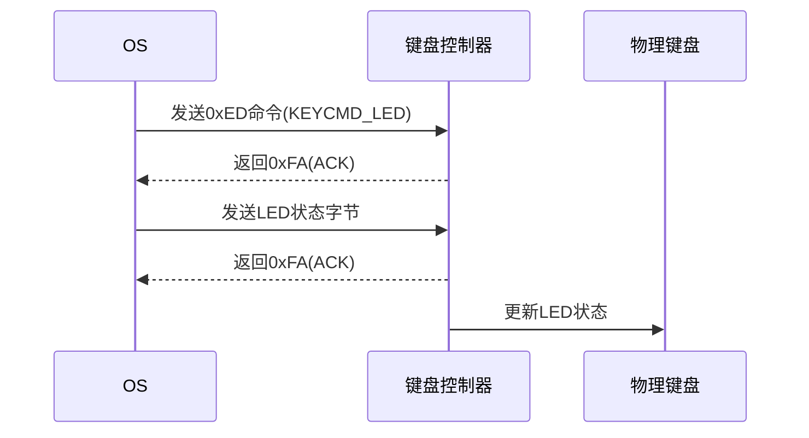

以下是键盘控制器对LED控制的详细说明：



### 具体控制流程：
1. **命令阶段**：
   - OS通过`PORT_KEYCMD(0x64)`端口发送`0xED`命令
   ```c
   io_out8(PORT_KEYCMD, KEYCMD_LED); // KEYCMD_LED=0xED
   ```
   
2. **等待响应**：
   - 调用`wait_KBC_sendready()`检查控制器状态：
   ```c
   while ((io_in8(PORT_KEYSTA) & KEYSTA_SEND_NOTREADY) != 0);
   // KEYSTA_SEND_NOTREADY=0x02
   ```

3. **发送LED状态**：
   - 通过`PORT_KEYDAT(0x60)`端口发送1字节状态：
   ```c
   io_out8(PORT_KEYDAT, key_leds);
   // bit0: ScrollLock(1=ON)
   // bit1: NumLock(1=ON) 
   // bit2: CapsLock(1=ON)
   ```

4. **硬件响应**：
   - 键盘控制器返回应答码：
     - `0xFA`：接收成功
     - `0xFE`：要求重发
   - 代码中通过`keycmd_wait`处理重发：
   ```c
   if (i == 256 + 0xfa) { // 成功
       keycmd_wait = -1;
   }
   if (i == 256 + 0xfe) { // 需要重发
       io_out8(PORT_KEYDAT, keycmd_wait);
   }
   ```

### 关键技术细节：
1. **端口分工**：
   - `0x64`：命令端口（写控制命令）
   - `0x60`：数据端口（读写数据）

2. **状态寄存器**：
   ```c
   #define PORT_KEYSTA 0x64
   #define KEYSTA_SEND_NOTREADY 0x02
   ```
   检查bit1(发送就绪位)是否为0才能发送数据

3. **LED状态编码**：
   | 位   | 功能       | 值   |
   | ---- | ---------- | ---- |
   | 0    | ScrollLock | 1    |
   | 1    | NumLock    | 2    |
   | 2    | CapsLock   | 4    |
   
   例如：CapsLock+NumLock亮时发送`0x06`(二进制00000110)

4. **时序要求**：
   - 必须在发送命令后500μs内发送LED数据
   - 代码通过`wait_KBC_sendready`确保时序

### 典型错误处理：
当键盘处于不可用状态时：
```c
void wait_KBC_sendready(void) {
    for (int i = 0; i < 0xffff; i++) {
        if ((io_in8(PORT_KEYSTA) & KEYSTA_SEND_NOTREADY) == 0) {
            return;
        }
    }
    // 超时处理（代码中未实现）
}
```

