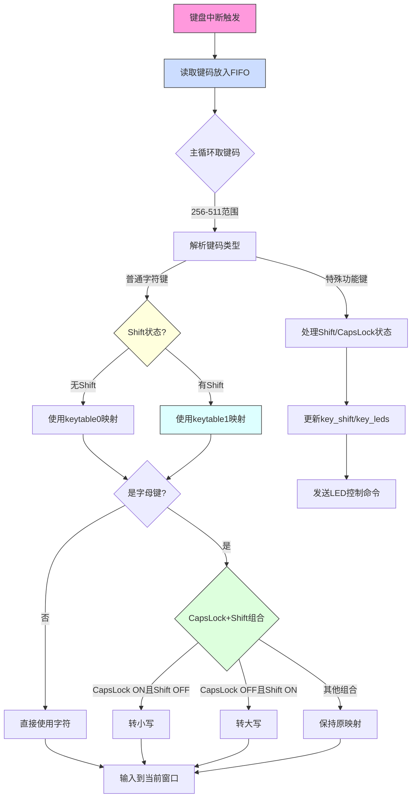

以下是键盘输入处理中大小写字母及特殊字符的实现流程的详细说明：



### 详细流程说明：
1. **键盘中断处理**
   - 硬件触发中断`int 0x21`
   - 读取键码（PORT_KEYDAT）
   - 将键码存入FIFO队列

2. **主循环处理**
   ```c
   if (256 <= i && i <= 511) { // 键盘事件
       unsigned char keycode = i - 256;
       if (keycode < 0x80) { // 按下事件
           // 进入字符处理流程
       }
   }
   ```

3. **Shift状态判断**
   ```c
   if (key_shift != 0) {
       char = keytable1[keycode]; // 如Shift+2->"@"
   } else {
       char = keytable0[keycode]; // 如2->"2"
   }
   ```

4. **大小写转换逻辑**
   ```c
   if ('A' <= c && c <= 'Z') {
       if ((key_leds & 4) && !key_shift) ||  // CapsLock ON且无Shift
           (!(key_leds & 4) && key_shift)) { // CapsLock OFF且有Shift
           c += 0x20; // 转小写
       }
   }
   ```

5. **特殊字符映射**
   - keytable1预定义组合：
     ```c
     static char keytable1[0x80] = {
         0,   0,   '!', 0x22, '#', '$', '%', '&', ...
     // 对应键码0x02->'!',0x03->'"'...
     ```

6. **最终输出**
   ```c
   if (key_to == 0) { // 任务窗口
       putfonts8_asc_sht(sht_win, cursor_x, 28, color, s, 1);
   } else { // 控制台
       fifo32_put(&task_cons->fifo, c + 256);
   }
   ```

### 典型示例：
1. **输入大写"A"**：
   - CapsLock ON + 按下A键
   - keytable0[0x1E] = 'A'
   - 满足`(key_leds&4 && !key_shift)` → 保持大写

2. **输入"!"**：
   - 按住Shift + 按下1键
   - keytable1[0x02] = '!'
   - 直接输出

3. **输入小写"a"**：
   - 无修饰键 + 按下A键
   - keytable0[0x1E] = 'A'
   - 触发`!(key_leds&4) && !key_shift` → +0x20转'a'

需要我进一步解释某个具体环节的实现细节吗？