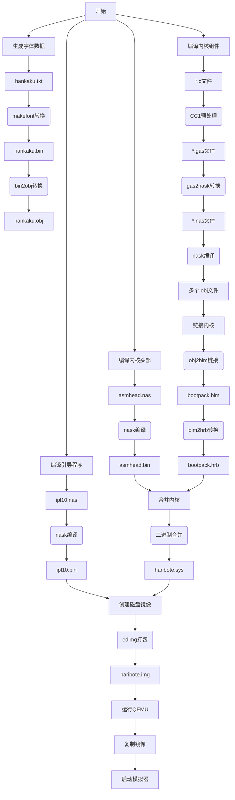

以下是该项目的启动流程详细解读（Makefile文件）及对应的Mermaid流程图：

### 流程说明：
1. **引导程序编译阶段**
   - 使用nask汇编器编译ipl10.nas生成512字节引导扇区文件ipl10.bin

2. **内核头部编译**
   - 编译asmhead.nas生成内核头部二进制asmhead.bin

3. **字体数据生成**
   - 将hankaku.txt字库文件转换为二进制格式
   - 将二进制字体数据转换为目标文件格式

4. **内核组件编译**
   - 使用定制工具链（CC1+GAS2NASK）编译C源文件
   - 分阶段处理：C代码→gas中间格式→nasm汇编→目标文件

5. **内核链接与转换**
   - 使用obj2bim链接所有目标文件生成bim中间文件
   - 通过bim2hrb转换为可执行格式hrb文件

6. **系统镜像构建**
   - 合并内核头部和主程序（asmhead.bin + bootpack.hrb）
   - 使用edimg工具构建完整磁盘镜像：
     - 插入引导程序到0扇区
     - 写入内核文件到文件系统区域

7. **模拟运行**
   - 将生成的img镜像复制到QEMU目录
   - 启动虚拟机加载镜像运行

### 关键工具说明：
- **nask**: 专用汇编编译器
- **CC1+GAS2NASK**: 定制C编译工具链
- **obj2bim/bim2hrb**: 专用的链接转换工具
- **edimg**: 磁盘镜像构建工具
- **makefont**: 字库转换工具

这个构建系统展示了典型的操作系统开发流程，包含了从底层引导程序到高层内核组件的完整构建过程，最终生成可直接在虚拟机运行的磁盘镜像文件。