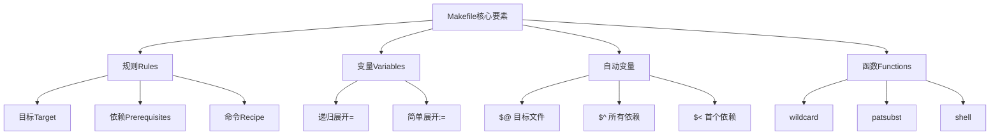
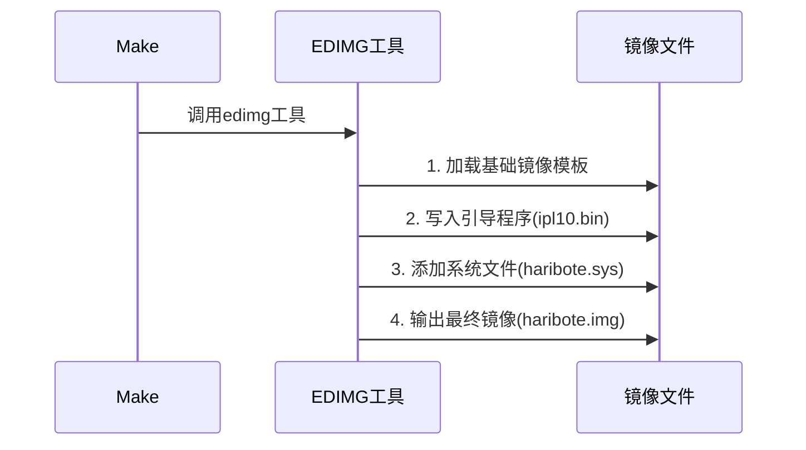

以下是对Makefile知识的系统讲解，结合项目实例进行分析：



### 一、项目Makefile解析（结合您提供的文件）
```makefile
# 工具路径定义（简单展开变量）
TOOLPATH = ../z_tools/
NASK     = $(TOOLPATH)nask.exe  # 递归展开变量

# 默认目标（第一个出现的target）
default :
	$(MAKE) img

# 构建规则示例（显式规则）
ipl10.bin : ipl10.nas Makefile
	$(NASK) ipl10.nas ipl10.bin ipl10.lst

# 模式规则（隐式规则）
%.obj : %.nas Makefile
	$(NASK) $*.nas $*.obj $*.lst

# 特殊目标
clean :
	-$(DEL) *.bin
```

### 二、核心概念详解

1. **变量类型**
   
   | 类型     | 符号 | 展开时机         | 示例                |
   | -------- | ---- | ---------------- | ------------------- |
   | 递归展开 | =    | 使用时展开       | `CC = gcc`          |
   | 简单展开 | :=   | 定义时立即展开   | `CFLAGS := -Wall`   |
   | 条件赋值 | ?=   | 仅当未定义时赋值 | `OPT ?= -O0`        |
   | 追加赋值 | +=   | 追加内容         | `SRCS += newfile.c` |
   
2. **自动变量**
   | 变量 | 含义             | 示例用法         |
   | ---- | ---------------- | ---------------- |
   | $@   | 当前目标名称     | `$@.o: $@.c`     |
   | $<   | 第一个依赖项     | `$(CC) -c $<`    |
   | $^   | 所有依赖项       | `$(CC) $^ -o $@` |
   | $*   | 模式匹配中的词干 | `$*.o: $*.c`     |
   | $?   | 比目标新的依赖项 | 用于增量构建     |

3. **常见函数**
   ```makefile
   # 文件列表获取
   SRC_FILES := $(wildcard src/*.c)
   
   # 路径替换
   OBJS := $(patsubst %.c,%.o,$(SRC_FILES))
   
   # shell命令执行
   BUILD_DATE := $(shell date +%Y%m%d)
   ```

### 三、项目Makefile关键技术点
1. **伪目标声明**
   ```makefile
   .PHONY: clean install  # 声明非文件目标
   ```

2. **递归make调用**
   ```makefile
   $(MAKE) -C subdir     # 进入子目录执行make
   ```

3. **错误抑制**
   ```makefile
   -$(DEL) *.tmp        # 前缀-表示忽略命令错误
   ```

4. **文件依赖管理**
   ```makefile
   DEPENDS = $(OBJS:.o=.d)
   -include $(DEPENDS)  # 包含自动生成的依赖关系
   ```

### 四、构建流程示例分析
以项目中的`haribote.img`构建为例：
```makefile
haribote.img : ipl10.bin haribote.sys
	$(EDIMG) imgin:template.img \
	         wbinimg src:ipl10.bin len:512 from:0 to:0 \
	         copy from:haribote.sys to:@: \
	         imgout:haribote.img
```

构建流程图：


### 五、调试技巧
1. **调试输出**
   ```makefile
   $(info Building target: $@)
   ```

2. **详细模式**
   ```bash
   make V=1      # 显示完整命令
   ```

3. **dry-run模式**
   ```bash
   make -n       # 仅显示将要执行的命令
   ```

4. **依赖关系图生成**
   ```bash
   make -Bnd | graphviz       # 生成构建流程图
   ```

### 六、现代Makefile最佳实践
1. **目录结构组织**
   ```makefile
   BUILD_DIR := build
   OBJS := $(addprefix $(BUILD_DIR)/, $(SRCS:.c=.o))
   ```

2. **自动依赖生成**
   ```makefile
   CFLAGS += -MMD -MP      # 生成.d依赖文件
   ```

3. **并行构建支持**
   ```bash
   make -j4               # 使用4个线程编译
   ```

4. **颜色输出支持**
   ```makefile
   CC_COLOR = \033[34m    # 定义颜色代码
   @printf "%b" "$(CC_COLOR)Compiling $<\n"
   ```

当前项目的Makefile是典型的裸机开发构建系统，具有以下特点：
1. 使用定制工具链（nask/obj2bim等）
2. 分阶段构建（nas→bin→obj→bim→hrb）
3. 强依赖顺序管理（引导程序必须位于镜像首扇区）
4. 跨平台支持（Windows环境适配）

