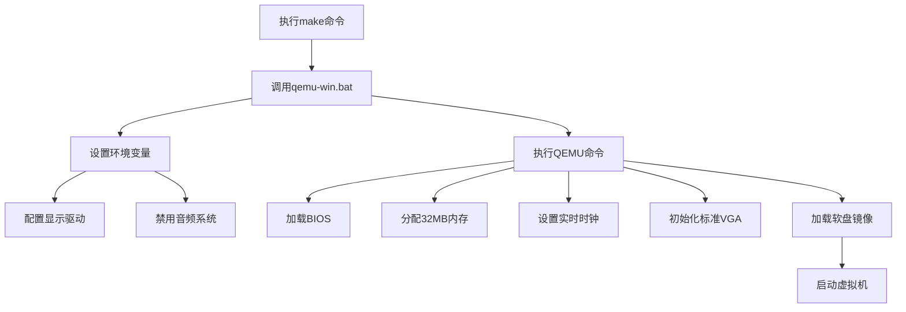

QEMU的启动流程：



### 详细流程解析（基于qemu-win.bat）：

1. **环境准备阶段**
   ```bat
   @set SDL_VIDEODRIVER=windib     # Windows显示驱动设置
   @set QEMU_AUDIO_DRV=none       # 禁用音频驱动
   @set QEMU_AUDIO_LOG_TO_MONITOR=0 # 禁止音频日志输出
   ```

2. **QEMU核心启动命令**
   ```bat
   qemu.exe -L . -m 32 -localtime -std-vga -fda fdimage0.bin
   ```
   
   参数解析表：
   | 参数                | 说明                                   |
   | ------------------- | -------------------------------------- |
   | `-L .`              | 指定BIOS和VGA ROM所在目录为当前目录    |
   | `-m 32`             | 分配32MB内存给虚拟机                   |
   | `-localtime`        | 使用宿主机本地时间而非UTC时间          |
   | `-std-vga`          | 模拟标准VGA显示适配器（分辨率800x600） |
   | `-fda fdimage0.bin` | 加载软盘镜像作为第一个软驱设备         |

3. **完整启动流程**
   1. 通过Makefile触发批处理执行
   2. 配置Windows显示子系统驱动（SDL视频驱动）
   3. 禁用音频子系统（避免无音频设备时的警告）
   4. 初始化虚拟机环境：
      - 加载BIOS固件（从当前目录）
      - 分配32MB内存空间
      - 同步宿主机时间
      - 初始化标准VGA显示设备
   5. 加载软盘镜像文件`fdimage0.bin`到虚拟软驱
   6. 执行BIOS启动流程：
      - 读取软盘第一个扇区的引导程序
      - 加载操作系统内核
      - 移交控制权给操作系统

### 关键路径说明
```bash
make → qemu-win.bat → 环境配置 → QEMU初始化 → BIOS启动 → 加载OS镜像
```

### 补充说明
1. **文件依赖关系**：
   - `fdimage0.bin`需要预先由项目构建系统生成（参考原始Makefile中的`haribote.img`生成流程）
   - 镜像文件需要包含完整的引导扇区和操作系统内核

2. **Windows特定配置**：
   - `SDL_VIDEODRIVER=windib`是Windows系统下SDL库的推荐设置
   - 音频驱动禁用是为了避免在没有音频设备的系统上出现错误

3. **内存映射**：
   ```text
   0x00000000-0x01FFFFFF: 分配的32MB物理内存
   0x000A0000-0x000BFFFF: VGA显存区域
   0x000C0000-0x000FFFFF: BIOS ROM区域
   ```

这个配置展示了典型的QEMU启动方式，适用于开发调试小型操作系统（如课程用OS），通过软盘镜像加载系统，使用最小化硬件配置来简化调试过程。