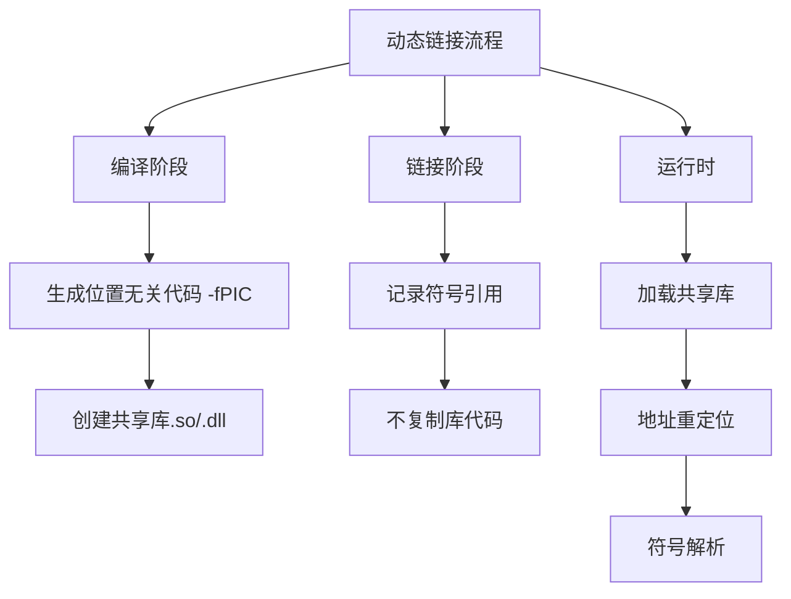

以下是关于动态链接的详细解释，结合项目特点进行说明：



### 一、核心概念对比
| 特性     | 静态链接           | 动态链接         |
| -------- | ------------------ | ---------------- |
| 链接时机 | 编译时             | 运行时           |
| 文件大小 | 较大（包含所有库） | 较小（仅存引用） |
| 内存占用 | 每个进程独立       | 多进程共享       |
| 更新方式 | 重新编译程序       | 替换库文件即可   |
| 典型文件 | .a/.lib            | .so/.dll         |

### 二、动态链接关键技术
1. **PLT/GOT 表机制**
   - PLT（Procedure Linkage Table）：函数跳转表
   - GOT（Global Offset Table）：全局偏移表
   - 首次调用函数时通过这两级跳转实现延迟绑定

2. **地址无关代码（PIC）**
   ```c
   // 非PIC代码
   static int global;
   void func() {
       global = 10; // 直接访问绝对地址
   }
   
   // PIC代码
   void func() {
       // 通过GOT间接访问
       *((int*)(GOT[global_index])) = 10;
   }
   ```

3. **动态链接器工作流程**
   ```mermaid
   sequenceDiagram
       participant A as 可执行文件
       participant B as 动态链接器(ld-linux.so)
       participant C as 共享库
   
       A->>B: 执行时触发加载
       B->>C: 加载依赖库
       B->>B: 符号解析
       B->>B: 重定位操作
       B->>A: 移交控制权
   ```

### 三、在操作系统开发中的应用
在项目（类似Haribote OS）中实现动态链接需要：
1. **内存管理支持**
   - 共享库加载地址分配
   - 页表映射管理

2. **动态链接协议**
   ```c
   // 库头信息示例
   struct SharedLibHeader {
       uint32_t magic;          // 魔数标识
       uint32_t version;        // 版本号
       uint32_t text_size;      // 代码段大小
       uint32_t data_size;      // 数据段大小
       uint32_t symbol_table;   // 符号表偏移
       uint32_t relocation_table;// 重定位表偏移
   };
   ```

3. **系统调用扩展**
   - 添加`dlopen()`/`dlsym()`等函数
   - 实现库的加载/卸载机制

### 四、项目现状分析
根据您提供的Makefile：
1. 当前使用`obj2bim`和`bim2hrb`工具链
2. 所有`.obj`文件被静态链接到`bootpack.bim`
3. 未出现动态链接相关参数（如`-shared`/`-fPIC`）

如需添加动态链接支持需要：
```makefile
# 示例修改步骤
libexample.so: example.c
    $(CC) -shared -fPIC -o $@ $^

bootpack.bim: $(OBJS_BOOTPACK) libexample.so
    $(LD) -dynamic-linker /lib/ld-linux.so.2 -lexample ...
```

### 五、调试技巧
1. 使用`readelf -d`查看动态段
2. `LD_DEBUG=files`环境变量跟踪加载过程
3. `objdump -T`查看动态符号表

### 六、典型问题解决方案
| 问题现象           | 可能原因     | 解决方法           |
| ------------------ | ------------ | ------------------ |
| "undefined symbol" | 库版本不匹配 | ldd检查依赖链      |
| 段错误(segfault)   | 库未正确加载 | strace跟踪系统调用 |
| 内存占用过高       | 多副本加载   | 确认库是否位置无关 |

当前项目的构建系统更适合静态链接方式，若需要实现动态链接，建议先研究：
1. ELF文件格式规范
2. 动态重定位原理
3. 内存映射机制（mmap）
这些基础理解后，可以尝试在现有OS中添加简单的动态加载器。