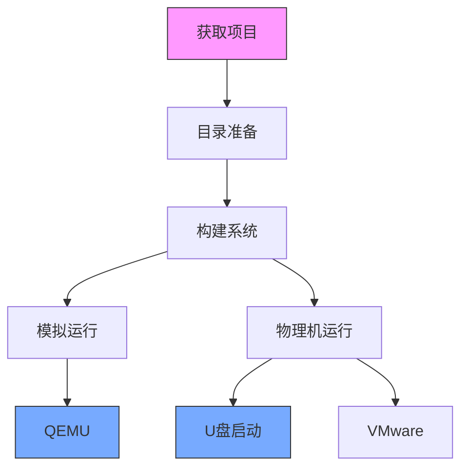
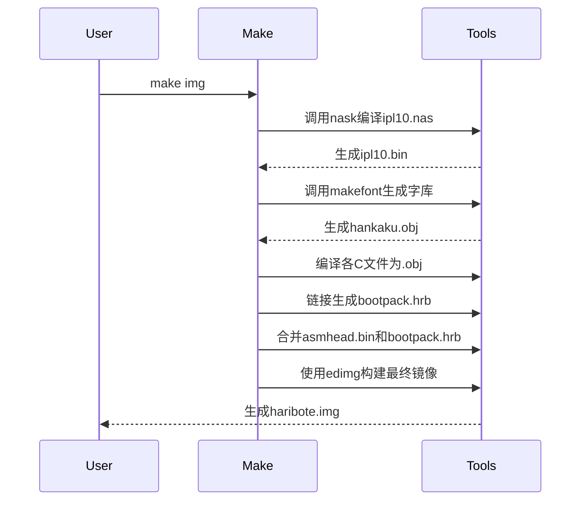

以下是该项目启动的详细步骤说明，结合您提供的文档和Makefile内容整理：



### 一、快速启动（QEMU方式）

#### 1.克隆地址

```bash
https://github.com/yourtion/30dayMakeOS.git
项目名：30dayMakeOS(汉化版)
```

#### 1. 项目准备
```bash
# 假设初始目录结构
30OS/
├── Project/         # 源码目录
│   └── day01/      # 各天数的实现版本
│       └── ...
├── tolset/         # 工具集目录
|	└── z_tools/        # 构建工具链
```

#### 2. 选择版本并移动
```bash
# 示例操作（Windows PowerShell）
cd 30OS
# 复制第5天的版本到tolset
Copy-Item -Path "Project/day05/harib05a" -Destination "tolset/" -Recurse
cd tolset/harib05a
```

#### 3. 构建并运行
```bash
# 在harib05a目录中执行
make img    # 生成系统镜像
make run    # 自动调用QEMU
```

### 二、详细流程解析

#### 步骤1：环境准备检查
| 检查项       | 验证方法                                                     | 常见问题处理                     |
| ------------ | :----------------------------------------------------------- | -------------------------------- |
| 工具链完整性 | 确认z_tools目录存在且包含：<br>- make.exe<br>- nask.exe<br>- edimg.exe | 若缺失需从原项目仓库完整获取     |
| 目录结构     | 确保当前操作目录结构符合要求                                 | 使用`tree /F`命令检查（Windows） |
| 路径规范     | 使用纯英文路径                                               | 避免中文/特殊字符路径            |

#### 步骤2：构建过程详解


#### 步骤3：QEMU运行参数解析
查看`qemu-win.bat`文件内容：
```batch
@set SDL_VIDEODRIVER=windib
@set QEMU_AUDIO_DRV=none
qemu.exe -L . -m 32 -localtime -std-vga -fda fdimage0.bin
```
参数说明表：
| 参数       | 作用         | 推荐值           |
| ---------- | ------------ | ---------------- |
| `-L .`     | 指定BIOS目录 | 保持默认         |
| `-m 32`    | 内存分配     | 32MB适合小型OS   |
| `-std-vga` | 显示模式     | 标准VGA(640x480) |
| `-fda`     | 软盘镜像路径 | fdimage0.bin     |

### 三、物理机运行方案

#### 方案1：U盘启动（需谨慎操作）

具体步骤：
1. 使用`dd`命令写入镜像（Linux/Mac）：
   ```bash
   sudo dd if=haribote.img of=/dev/sdX bs=4M status=progress
   ```
   （Windows推荐使用Rufus工具）

2. BIOS设置：
   - 关闭Secure Boot
   - 启用Legacy Boot模式
   - 设置USB为第一启动设备

#### 方案2：VMware虚拟化
```bash
# 将.img转换为.vmdk（需要比原项目更新的qume模拟器，自行下载，下载后找到qemu-img.exe即可，只要保证qemu-img.exe和haribote.img在同一文件夹下即可）
qemu-img convert -f raw -O vmdk haribote.img haribote.vmdk

# 新建虚拟机配置：
  类型: Other
  版本: Other
  磁盘: 使用现有虚拟磁盘 -> 选择.vmdk文件
```

### 四、常见问题排查表
| 现象             | 可能原因           | 解决方案                         |
| ---------------- | ------------------ | -------------------------------- |
| 报错'nask未找到' | 工具链路径错误     | 检查Makefile中TOOLPATH定义       |
| 黑屏无输出       | 引导扇区未正确写入 | 重新执行`make clean && make img` |
| QEMU窗口闪退     | 显卡模式不兼容     | 尝试添加`-vga cirrus`参数        |
| 键盘/鼠标无响应  | PS/2驱动未启用     | 检查Makefile中的设备驱动编译     |
| 内存不足错误     | 镜像文件损坏       | 删除后重新生成镜像               |

### 五、进阶调试技巧
1. **调试模式启动**：
   ```bash
   make debug    # 需要提前配置GDB
   ```
   （需在Makefile中添加调试目标）

2. **查看中间文件**：
   ```bash
   # 检查引导扇区
   hexdump -C ipl10.bin | less
   
   # 查看系统镜像结构
   qemu-img info haribote.img
   ```

3. **修改编译选项**：
   编辑Makefile中的编译参数：
   ```makefile
   # 添加调试信息
   CC1 = $(TOOLPATH)cc1.exe -I$(INCPATH) -Os -Wall -quiet -g
   ```

建议首次运行时：
1. 使用最新日期的版本（系统完成度更高）
2. 确保杀毒软件未拦截构建工具
3. 在纯英文路径下操作
4. 保持控制台窗口打开观察构建日志

若遇到镜像转换问题，可尝试使用转换工具：
```bash
# 示例转换命令（Linux）
sudo apt install qemu-utils
qemu-img convert -f raw -O iso haribote.img haribote.iso
```
