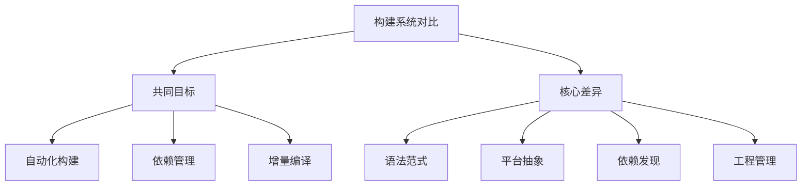

以下是对Makefile与现代CMake的详细对比分析，结合您提供的操作系统开发项目特点：



### 一、相同核心目标
| 特性       | Makefile | CMake |
| ---------- | -------- | ----- |
| 构建自动化 | ✅        | ✅     |
| 增量编译   | ✅        | ✅     |
| 自定义规则 | ✅        | ✅     |
| 多目标支持 | ✅        | ✅     |

### 二、关键差异分析（以您的项目为例）

#### 1. 语法范式对比
**项目Makefile示例片段**：
```makefile
OBJS_BOOTPACK = bootpack.obj naskfunc.obj 
bootpack.bim : $(OBJS_BOOTPACK)
	$(OBJ2BIM) @$(RULEFILE) out:bootpack.bim
```

**等效CMake实现**：
```cmake
set(OBJS_BOOTPACK 
    bootpack.obj 
    naskfunc.obj
)

add_custom_command(
    OUTPUT bootpack.bim
    COMMAND ${OBJ2BIM} @${RULEFILE} out:bootpack.bim
    DEPENDS ${OBJS_BOOTPACK}
)
```

差异点总结：
| 特性       | Makefile         | CMake             |
| ---------- | ---------------- | ----------------- |
| 语法类型   | 基于规则的声明式 | 过程式+声明式混合 |
| 变量作用域 | 全局性           | 目标作用域        |
| 依赖表达   | 显式文件依赖     | 逻辑目标依赖      |

#### 2. 工具链管理对比
**项目Makefile工具链配置**：
```makefile
TOOLPATH = ../z_tools/
NASK = $(TOOLPATH)nask.exe
```

**CMake等效实现**：
```cmake
set(TOOLPATH "${CMAKE_SOURCE_DIR}/../z_tools/")
find_program(NASK nask.exe PATHS ${TOOLPATH} REQUIRED)
```

关键差异：
| 特性       | Makefile    | CMake                 |
| ---------- | ----------- | --------------------- |
| 工具发现   | 硬编码路径  | 自动搜索+缓存机制     |
| 跨平台支持 | 需手动适配  | 抽象为生成器概念      |
| 配置复用   | 需要include | 通过Toolchain文件管理 |

#### 3. 跨平台构建对比
**项目中的Windows特定设置**：
```makefile
COPY = copy
DEL = del

qemu-win.bat:
    set SDL_VIDEODRIVER=windib
```

**CMake跨平台实现**：
```cmake
if(WIN32)
    set(COPY_COMMAND copy)
    set(DEL_COMMAND del)
    add_definitions(-DSDL_VIDEODRIVER=windib)
else()
    # Linux/Mac配置...
endif()
```

平台处理能力对比：
| 能力       | Makefile               | CMake                      |
| ---------- | ---------------------- | -------------------------- |
| 条件编译   | 有限支持（需外部脚本） | 原生平台检测               |
| 路径处理   | 需手动转换             | 自动路径规范化             |
| 编译器抽象 | 直接指定工具           | 通过CMAKE_C_COMPILER等变量 |

### 三、在操作系统开发中的特殊考量

#### 1. 低级构建任务处理
**项目中的特殊步骤**：
```makefile
hankaku.bin : hankaku.txt
	$(MAKEFONT) $< $@

%.gas : %.c
	$(CC1) -o $@ $<
```

**CMake实现方案**：
```cmake
add_custom_command(
    OUTPUT hankaku.bin
    COMMAND ${MAKEFONT} ${CMAKE_CURRENT_SOURCE_DIR}/hankaku.txt ${CMAKE_CURRENT_BINARY_DIR}/hankaku.bin
    MAIN_DEPENDENCY hankaku.txt
)

add_custom_command(
    OUTPUT ${CMAKE_CURRENT_BINARY_DIR}/%.gas
    COMMAND ${CC1} -o ${CMAKE_CURRENT_BINARY_DIR}/$*.gas ${CMAKE_CURRENT_SOURCE_DIR}/$*.c
    DEPENDS $*.c
)
```

#### 2. 镜像文件生成
**原Makefile规则**：
```makefile
haribote.img : ipl10.bin haribote.sys
	$(EDIMG) imgin:template.img ...
```

**CMake等效实现**：
```cmake
add_custom_target(haribote_img ALL
    COMMAND ${EDIMG} imgin:template.img ...
    DEPENDS ipl10.bin haribote.sys
    WORKING_DIRECTORY ${CMAKE_BINARY_DIR}
)
```

### 四、迁移成本与收益分析

#### 迁移收益矩阵：
| 优势项       | CMake收益度 | 说明                       |
| ------------ | ----------- | -------------------------- |
| 多平台构建   | ★★★★★       | 自动处理路径/编译器差异    |
| 依赖管理     | ★★★★☆       | 更好的find_package支持     |
| 现代IDE集成  | ★★★★★       | VS/CLion/QtCreator原生支持 |
| 构建类型管理 | ★★★★☆       | Debug/Release便捷切换      |
| 单元测试集成 | ★★★★☆       | 原生CTest支持              |

#### 迁移成本矩阵：
| 成本项       | 影响度 | 说明                |
| ------------ | ------ | ------------------- |
| 学习曲线     | ★★★★☆  | 需要掌握新语法概念  |
| 历史规则转换 | ★★★☆☆  | 自定义步骤需要重写  |
| 工具链适配   | ★★★☆☆  | 需创建Toolchain文件 |
| 团队技能     | ★★★★☆  | 需要CMake知识储备   |

### 五、推荐实践策略

对于您的操作系统开发项目：

1. **保留Makefile的情形**：
   - 项目深度依赖特定工具链（如nask/obj2bim）
   - 构建流程高度定制化且稳定
   - 开发团队熟悉现有构建系统

2. **推荐迁移到CMake的情形**：
   ```mermaid
   graph LR
       A[需要新增功能] --> B[跨平台支持]
       A --> C[IDE集成需求]
       A --> D[复杂依赖管理]
       A --> E[自动化测试集成]
   ```

3. **混合构建方案示例**：
   ```cmake
   # CMakeLists.txt
   project(HariboteOS LANGUAGES C ASM_NASM)
   
   # 复用现有工具链
   set(TOOLPATH "${CMAKE_SOURCE_DIR}/../z_tools")
   find_program(NASK nask.exe PATHS ${TOOLPATH} REQUIRED)
   
   # 自定义构建规则
   add_custom_command(
       OUTPUT ipl10.bin
       COMMAND ${NASK} ipl10.nas ipl10.bin
       DEPENDS ipl10.nas
   )
   
   # 集成QEMU运行
   add_custom_target(run
       COMMAND qemu-system-i386 -fda haribote.img
       DEPENDS haribote.img
   )
   ```

### 六、现代CMake最佳实践
1. **目标导向编程**：
   ```cmake
   add_library(Hankaku STATIC hankaku.obj)
   target_include_directories(Hankaku PRIVATE ${TOOLPATH}/include)
   ```

2. **包依赖管理**：
   ```cmake
   find_package(SDL2 REQUIRED)
   target_link_libraries(MyOS PRIVATE SDL2::SDL2)
   ```

3. **生成器表达式**：
   ```cmake
   target_compile_options(MyOS PRIVATE
       $<$<CONFIG:Debug>:-O0 -g>
       $<$<CONFIG:Release>:-O3>
   )
   ```

4. **交叉编译支持**：
   ```cmake
   set(CMAKE_SYSTEM_NAME Generic)
   set(CMAKE_C_COMPILER i686-elf-gcc)
   ```

对于您的项目，建议分阶段迁移：
1. 先用CMake包装现有构建流程
2. 逐步替换核心组件构建规则
3. 最终实现全CMake管理

两种构建系统各有优势，CMake更适合长期维护和扩展，而Makefile在简单/特定场景下更直接。根据项目发展需求选择合适的工具更为重要。