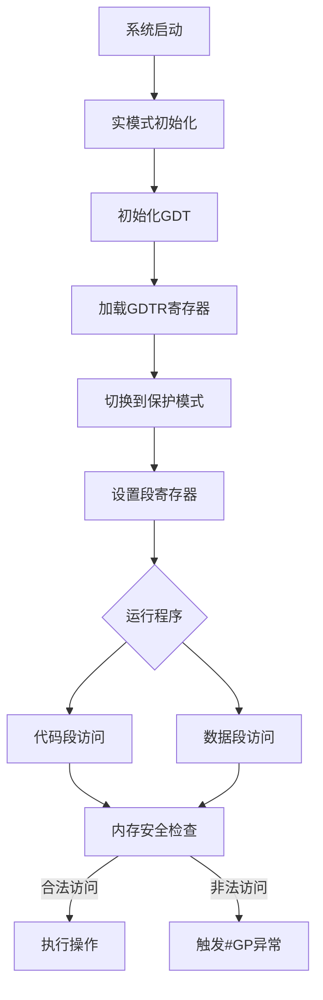
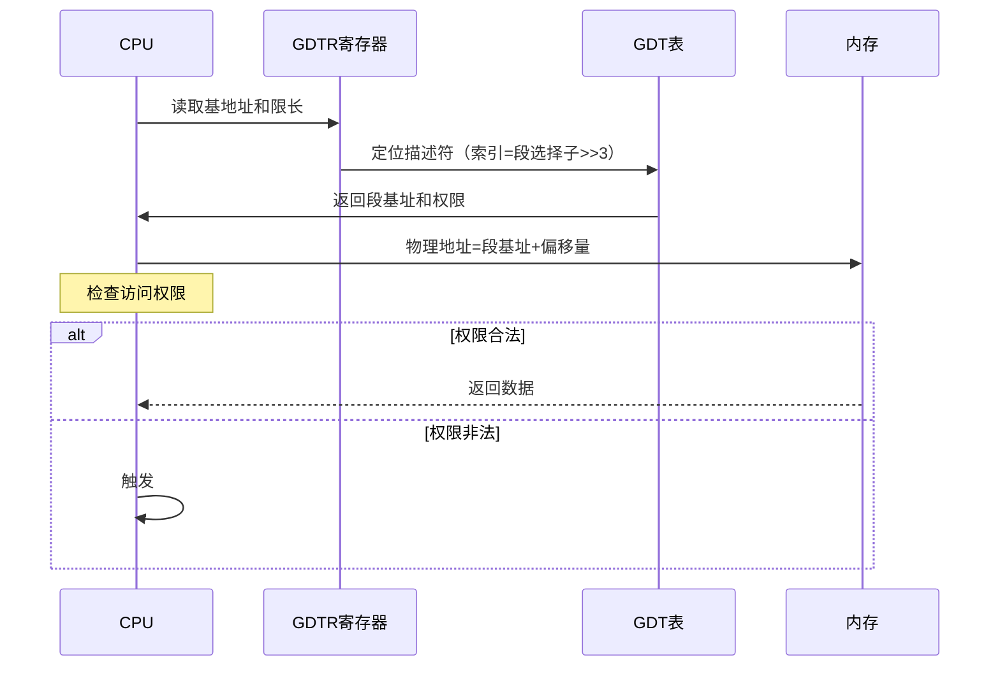

以下是关于GDT（全局描述符表）的作用及其在程序中的完整流程说明：

---

### **GDT的作用**
1. **内存分段管理**  
   - 定义代码段、数据段等内存区域的基地址、大小和访问权限。
2. **权限控制**  
   - 通过段描述符的DPL（描述符特权级）实现内核态和用户态的隔离。
3. **保护模式支持**  
   - 从实模式切换到保护模式必须初始化GDT。
4. **多任务基础**  
   - 通过TSS（任务状态段）支持任务切换。

---

### **GDT在程序中的完整流程**


---

### **关键步骤详解**
#### **1. GDT初始化（dsctbl.c）**
```c
// bootpack.h中的GDT描述符定义
struct SEGMENT_DESCRIPTOR {
    short limit_low;     // 段限长低16位
    short base_low;      // 段基址低16位
    char base_mid;       // 段基址中8位
    char access_right;   // 访问权限（如0x9a=内核代码段）
    char limit_high;     // 段限长高4位 + 标志位
    char base_high;      // 段基址高8位
};

// dsctbl.c中的初始化
void init_gdtidt() {
    struct SEGMENT_DESCRIPTOR *gdt = (struct SEGMENT_DESCRIPTOR *) ADR_GDT;
    
    // 内核代码段（0x00000000 - 0xffffffff，4GB）
    set_segmdesc(gdt + 1, 0xffffffff, 0x00000000, AR_CODE32_ER);
    
    // 内核数据段（同上）
    set_segmdesc(gdt + 2, 0xffffffff, 0x00000000, AR_DATA32_RW);
    
    // 加载GDTR
    load_gdtr(LIMIT_GDT, ADR_GDT);
}
```

#### **2. 加载GDTR寄存器**
```nasm
; naskfunc.nas
_load_gdtr:
    MOV     AX, [ESP+4]     ; LIMIT_GDT
    MOV     [ESP+6], AX     ; 将限长存入临时位置
    LGDT    [ESP+6]         ; 加载GDTR
    RET
```
- **GDTR结构**：
  - 16位表限长（LIMIT_GDT）
  - 32位基地址（ADR_GDT）

#### **3. 段寄存器设置**
```c
// bootpack.c中的任务初始化
struct TASK *task_init(struct MEMMAN *memman) {
    task->tss.cs = 2 * 8;   // 内核代码段选择子（GDT索引2）
    task->tss.ss = 1 * 8;   // 内核数据段选择子（GDT索引1）
    // ...其他段寄存器设置
}
```

---

### **GDT与内存访问的交互**


---

### **GDT描述符示例**
| 字段           | 内核代码段（0x08）        | 用户数据段（0x23）        |
| -------------- | ------------------------- | ------------------------- |
| **limit_low**  | 0xffff                    | 0xffff                    |
| **base_low**   | 0x0000                    | 0x0000                    |
| **base_mid**   | 0x00                      | 0x00                      |
| **access**     | 0x9a (P=1, DPL=0, 代码段) | 0xf2 (P=1, DPL=3, 数据段) |
| **limit_high** | 0xcf (G=1, 段限长4GB)     | 0xcf                      |
| **base_high**  | 0x00                      | 0x00                      |

---

### **典型场景：任务切换**

- **依赖GDT**：每个任务的TSS在GDT中有独立的描述符（通过`AR_TSS32`类型）。

---

### **总结**
- **核心作用**：GDT是保护模式下内存管理和权限控制的基础设施。
- **关键流程**：初始化→加载GDTR→设置段寄存器→内存访问校验。
- **设计特点**：  
  - 通过段限长防止内存越界  
  - 通过DPL实现特权级隔离  
  - 支持多任务环境下的上下文切换