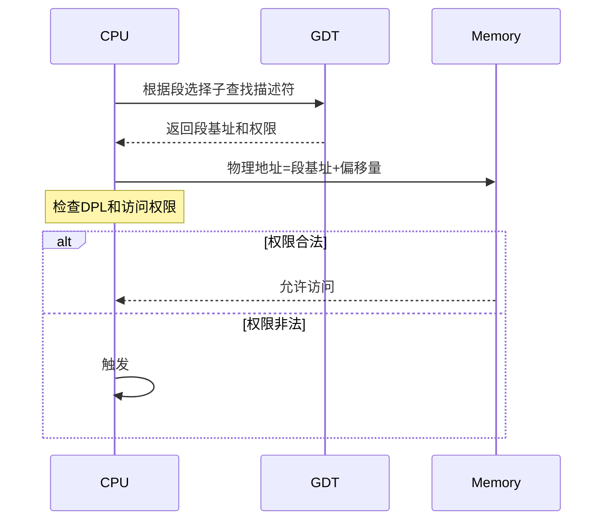

对 GDT（全局描述符表）的详细解析：

---

### **1. GDT 数据结构定义**
在 `bootpack.h` 中定义的段描述符结构体：
```c
struct SEGMENT_DESCRIPTOR {
    short limit_low;    // 段限长低16位
    short base_low;     // 段基址低16位
    char base_mid;      // 段基址中间8位
    char access_right;  // 访问权限和类型
    char limit_high;    // 段限长高4位 + 标志位
    char base_high;     // 段基址高8位
};
```

---

### **2. 字段详解**
#### **(1) 段基址（32位）**
- **分段存储**：
  - `base_low`（16位）：基地址的低16位（0-15）
  - `base_mid`（8位）：基地址的中间8位（16-23）
  - `base_high`（8位）：基地址的高8位（24-31）
- **计算公式**：
  ```c
  base = (base_high << 24) | (base_mid << 16) | base_low
  ```

#### **(2) 段限长（20位）**
- **分段存储**：
  - `limit_low`（16位）：限长低16位（0-15）
  - `limit_high`（高4位）：限长高4位（16-19）
- **实际限长计算**：
  ```c
  limit = (limit_high & 0x0f) << 16 | limit_low
  ```

#### **(3) 访问权限（access_right）**
- **字节结构**：
  ```
  Bit 7 (P):   存在位（1=有效）
  Bits 6-5 (DPL): 描述符特权级（0=内核，3=用户）
  Bit 4 (S):   描述符类型（0=系统段，1=代码/数据段）
  Bits 3-0 (Type): 段类型（如代码段、数据段）
  ```
- **常用值**（定义在 `bootpack.h`）：
  ```c
  #define AR_CODE32_ER    0x409a  // 可执行/可读的32位代码段（DPL=0）
  #define AR_DATA32_RW    0x4092  // 可读写的32位数据段（DPL=0）
  #define AR_TSS32        0x0089  // 32位任务状态段（TSS）
  ```

#### **(4) 段限长标志（limit_high的高4位）**
- **Bit 3 (G)**：粒度（0=字节粒度，1=4KB粒度）
- **Bit 2 (D/B)**：默认操作大小（0=16位，1=32位）
- **Bit 1 (L)**：保留（64位模式使用）
- **Bit 0 (AVL)**：保留位

---

### **3. GDT 初始化代码分析**
在 `dsctbl.c` 中的关键初始化代码：
```c
void set_segmdesc(struct SEGMENT_DESCRIPTOR *sd, 
                 unsigned int limit, int base, int ar) {
    if (limit > 0xfffff) {
        ar |= 0x8000; // 设置G位（4KB粒度）
        limit /= 0x1000;
    }
    sd->limit_low    = limit & 0xffff;
    sd->base_low     = base & 0xffff;
    sd->base_mid     = (base >> 16) & 0xff;
    sd->access_right = ar & 0xff;
    sd->limit_high   = ((limit >> 16) & 0x0f) | ((ar >> 8) & 0xf0);
    sd->base_high    = (base >> 24) & 0xff;
}
```

#### **初始化示例：内核代码段**
```c
set_segmdesc(gdt + 1, 0xffffffff, 0x00000000, AR_CODE32_ER);
```
- **参数解析**：
  - `limit = 0xffffffff`：段限长为4GB（G位=1，实际限长=0xfffff * 4KB）
  - `base = 0x00000000`：基地址从0开始
  - `ar = AR_CODE32_ER`（0x409a）：
    - `access_right = 0x9a`（二进制 `10011010`）
      - P=1, DPL=00, S=1, Type=1010（可执行/可读代码段）
    - `limit_high高4位`：0x4（G=1, D/B=1）

---

### **4. GDT 在内存中的布局**


---

### **5. 段选择子（Segment Selector）**
- **结构**：
  ```
  Bit 15-3: 描述符索引（如索引1对应gdt[1]）
  Bit 2: TI位（0=GDT，1=LDT）
  Bit 1-0: RPL（请求特权级）
  ```
- **示例**：
  ```c
  #define TASK_GDT0        3       // TSS从GDT索引3开始分配
  task->tss.cs = 2 * 8;           // 内核代码段选择子（索引2，RPL=0）
  ```
  - `2 * 8 = 0x10`（二进制 `00010 0 00`）：
    - 索引=2, TI=0, RPL=0

---

### **6. GDT 的实际作用场景**
#### **(1) 内存访问保护**


#### **(2) 任务切换**
```c
// mtask.c 中任务切换
void task_switch(void) {
    // 加载新任务的TSS选择子
    farjmp(0, taskctl->now_lv->tasks[taskctl->now_lv->now]->sel);
}
```
- **TSS描述符**：
  - 类型为 `AR_TSS32`（0x0089）
  - 包含任务的寄存器和栈指针

---

### **7. 关键设计细节**
#### **(1) 平坦内存模型**
- 内核代码段和数据段设置为基地址0，限长4GB，实现平坦内存访问：
  ```c
  set_segmdesc(gdt + 1, 0xffffffff, 0x00000000, AR_CODE32_ER); // 代码段
  set_segmdesc(gdt + 2, 0xffffffff, 0x00000000, AR_DATA32_RW); // 数据段
  ```
- **优势**：无需处理分段，简化地址计算。

#### **(2) 权限控制**
- 内核代码段 `DPL=0`，用户程序若尝试访问会触发异常。
- 用户段（未在此代码中实现）应设置 `DPL=3`。

#### **(3) TSS 描述符**
- 每个任务需要独立的TSS描述符，存储任务状态：
  ```c
  set_segmdesc(gdt + TASK_GDT0 + index, 
               sizeof(struct TSS32) - 1, 
               (int) &task->tss, 
               AR_TSS32);
  ```

---

### **总结**
- **核心作用**：GDT是保护模式下内存管理和权限控制的基础。
- **关键字段**：基地址、限长、访问权限共同定义段的属性和保护规则。
- **实际应用**：
  - 内核通过平坦模型简化内存访问
  - 任务切换依赖TSS描述符
  - 硬件自动进行权限检查