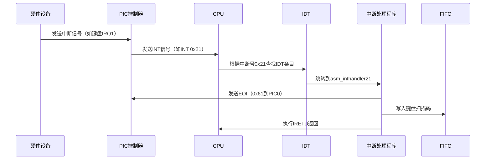
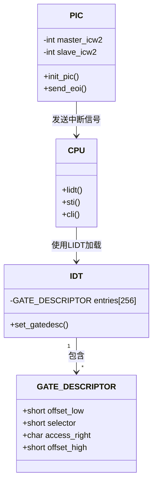

以下是基于`bootpack.h`中定义的IDT结构体，对IDT（中断描述符表）和PIC（可编程中断控制器）的详细解析：

---

### **1. IDT（中断描述符表）**
#### **数据结构定义**
在`bootpack.h`中定义了以下关键结构：
```c
// 门描述符（对应IDT条目）
struct GATE_DESCRIPTOR {
    short offset_low;   // 处理函数地址的低16位
    short selector;     // 代码段选择子（指向GDT条目）
    char dw_count;      // 保留字段（在中断门中未使用）
    char access_right;  // 访问权限和类型（如0x8e=中断门）
    short offset_high;  // 处理函数地址的高16位
};
```

#### **字段详解**
1. **offset_low/offset_high**（32位）：
   - 组成中断处理函数的入口地址（`offset_high << 16 | offset_low`）。
   - 例如：若处理函数地址为`0x00123456`，则：
     ```c
     offset_low = 0x3456;
     offset_high = 0x0012;
     ```

2. **selector**（16位）：
   - 代码段选择子，指向GDT中的段描述符。
   - 在代码中通常设置为`2*8`（内核代码段），计算方式：
     ```c
     selector = (GDT索引 << 3) | RPL（权限级别）
     ```

3. **access_right**（8位）：
   - 定义门的类型和权限：
     - Bit 7: Present位（必须为1）
     - Bits 6-5: DPL（描述符特权级，0=内核，3=用户）
     - Bits 4-0: 门类型（如`0xE`=32位中断门）
   - 示例：`0x8e`表示：
     - Present=1, DPL=00, Type=1110（32位中断门）

#### **IDT初始化流程**
```c
// dsctbl.c
void init_gdtidt() {
    struct GATE_DESCRIPTOR *idt = (struct GATE_DESCRIPTOR *) ADR_IDT;
    
    // 设置键盘中断（IRQ1 → INT 0x21）
    set_gatedesc(idt + 0x21, 
        (int)asm_inthandler21, // 处理函数地址
        2 * 8,                 // 选择子：GDT索引2，RPL=0
        AR_INTGATE32            // 属性：0x008e（中断门）
    );
}
```

---

### **2. PIC（可编程中断控制器）**
#### **寄存器定义**
在`bootpack.h`中定义了PIC的寄存器地址：
```c
// 主PIC (PIC0) 寄存器
#define PIC0_ICW1		0x0020  // 初始化命令字1
#define PIC0_OCW2		0x0020  // 操作命令字2
#define PIC0_IMR		0x0021  // 中断屏蔽寄存器

// 从PIC (PIC1) 寄存器
#define PIC1_ICW1		0x00a0
#define PIC1_OCW2		0x00a0
#define PIC1_IMR		0x00a1
```

#### **关键寄存器作用**
| 寄存器   | 功能                                          |
| -------- | --------------------------------------------- |
| **ICW1** | 初始化命令字1：设置级联模式、触发方式         |
| **ICW2** | 初始化命令字2：定义中断向量号偏移             |
| **ICW3** | 初始化命令字3：定义级联引脚                   |
| **ICW4** | 初始化命令字4：定义模式（如8086模式）         |
| **IMR**  | 中断屏蔽寄存器：每一位对应一个IRQ线（1=屏蔽） |

#### **PIC初始化代码**
```c
// int.c
void init_pic() {
    // 主PIC初始化
    io_out8(PIC0_ICW1, 0x11);  // 边沿触发 + 级联模式
    io_out8(PIC0_ICW2, 0x20);  // IRQ0-7映射到中断号0x20-0x27
    io_out8(PIC0_ICW3, 1 << 2);// 主PIC的IRQ2连接从PIC
    io_out8(PIC0_ICW4, 0x01);  // 非缓冲模式

    // 从PIC初始化
    io_out8(PIC1_ICW1, 0x11);
    io_out8(PIC1_ICW2, 0x28);  // IRQ8-15映射到中断号0x28-0x2f
    io_out8(PIC1_ICW3, 2);     // 从PIC连接到主PIC的IRQ2
    io_out8(PIC1_ICW4, 0x01);

    // 屏蔽所有中断（初始化完成后按需开启）
    io_out8(PIC0_IMR, 0xfb);   // 11111011：仅允许IRQ2（从PIC）和IRQ1（键盘）
    io_out8(PIC1_IMR, 0xff);   // 11111111：屏蔽所有从PIC中断
}
```

---

### **3. IDT与PIC的协同工作**
#### **中断触发流程**


#### **数据结构交互**


---

### **4. 关键设计细节**
#### **中断门 vs 陷阱门**
- **中断门（Interrupt Gate）**：
  - 执行时自动关闭中断（`CLI`），防止嵌套中断。
  - 在`bootpack.h`中通过`AR_INTGATE32`（0x008e）定义。
  
- **陷阱门（Trap Gate）**：
  - 保持中断开启（`STI`），允许嵌套中断。
  - 未在此系统中使用。

#### **中断优先级**
- **PIC的优先级规则**：
  - IRQ0（定时器） > IRQ1（键盘） > ... > IRQ7（从PIC）
  - 从PIC的IRQ8-15优先级在主PIC的IRQ2之后。

#### **EOI（End of Interrupt）**
- **发送方式**：
  ```c
  io_out8(PIC0_OCW2, 0x60 | irq_num); // 主PIC的EOI
  io_out8(PIC1_OCW2, 0x60 | (irq_num - 8)); // 从PIC的EOI
  ```
- **示例**：
  - 键盘中断（IRQ1）：发送`0x61`到`PIC0_OCW2`。
  - 鼠标中断（IRQ12）：需发送EOI到主PIC和从PIC。

---

### **5. 总结：IDT与PIC的关系**
- **IDT**：定义中断向量到处理函数的映射。
- **PIC**：管理硬件中断的优先级和路由。
- **协同工作**：
  1. PIC接收硬件中断，转换为对应的中断号（如IRQ1 → 0x21）。
  2. CPU通过IDT找到处理函数地址。
  3. 处理程序通过PIC端口完成中断确认（EOI）。
  4. 数据通过FIFO传递给上层应用处理。