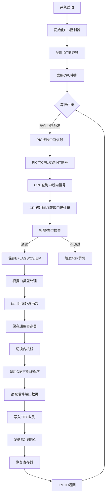
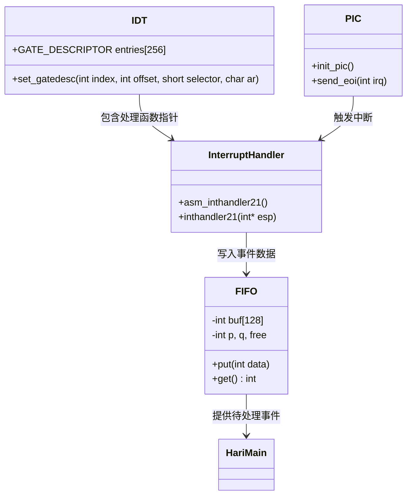

以下是完整的IDT中断处理流程：



关键步骤详细说明：

**1. PIC初始化阶段**
```c
// int.c
void init_pic() {
    // 主PIC设置
    io_out8(PIC0_ICW1, 0x11);  // 边沿触发+级联模式
    io_out8(PIC0_ICW2, 0x20);  // IRQ0-7映射到0x20-0x27
    io_out8(PIC0_ICW3, 1<<2);  // 主PIC IRQ2连接从PIC
    io_out8(PIC0_ICW4, 0x01);  // 非缓冲模式

    // 从PIC设置
    io_out8(PIC1_ICW1, 0x11);
    io_out8(PIC1_ICW2, 0x28);  // IRQ8-15映射到0x28-0x2f
    io_out8(PIC1_ICW3, 2);     // 从PIC ID=2
    io_out8(PIC1_ICW4, 0x01);

    io_out8(PIC0_IMR, 0xfb);   // 仅允许IRQ1(键盘)和IRQ2(从PIC)
    io_out8(PIC1_IMR, 0xff);   // 初始屏蔽所有从PIC中断
}
```

**2. IDT设置阶段**
```c
// dsctbl.c
void init_gdtidt() {
    // 设置键盘中断门(IRQ1 -> INT 0x21)
    set_gatedesc(idt + 0x21, 
        (int)asm_inthandler21, // 处理函数地址
        2 * 8,                 // 代码段选择子
        AR_INTGATE32           // 属性:32位中断门
    );
    
    // 设置鼠标中断门(IRQ12 -> INT 0x2c)
    set_gatedesc(idt + 0x2c,
        (int)asm_inthandler2c,
        2 * 8,
        AR_INTGATE32
    );
}

// 门描述符结构
struct GATE_DESCRIPTOR {
    short offset_low;
    short selector;
    char dw_count;
    char access_right;
    short offset_high;
};
```

**3. 中断处理阶段**
```nasm
; naskfunc.nas
_asm_inthandler21:
    ; 保存上下文
    PUSH    ES,DS,EAX,ECX,EDX,EBX,ESP,EBP,ESI,EDI
    
    ; 设置内核数据段
    MOV     AX,SS
    MOV     DS,AX
    MOV     ES,AX
    
    ; 调用C处理函数
    CALL    _inthandler21
    
    ; 恢复上下文
    POP     EDI,ESI,EBP,ESP,EBX,EDX,ECX,EAX
    POP     DS,ES
    
    ; 中断返回
    IRETD
```

**4. C语言处理程序**
```c
// keyboard.c
void inthandler21(int *esp) {
    // 发送EOI
    io_out8(PIC0_OCW2, 0x61); 
    
    // 读取键盘扫描码
    int data = io_in8(PORT_KEYDAT);
    
    // 存入FIFO队列(基值256)
    fifo32_put(keyfifo, data + 256);
}
```

**5. 主循环处理**
```c
// bootpack.c
void HariMain() {
    for(;;) {
        if(fifo32_status(&fifo) > 0) {
            int i = fifo32_get(&fifo);
            if(256 <= i && i <= 511) { // 键盘事件
                handle_keyboard(i - 256);
            } else if(512 <= i && i <= 767) { // 鼠标事件
                handle_mouse(i - 512);
            }
        } else {
            io_hlt(); // 无事件时休眠
        }
    }
}
```

关键数据结构关系图：


该中断机制的特点：
1. **分层架构**：硬件层(PIC)→驱动层(IDT)→服务层(FIFO)→应用层
2. **异步处理**：中断服务程序(ISR)仅做最简操作，耗时操作延后处理
3. **优先级控制**：通过PIC的IMR寄存器可动态调整中断屏蔽状态
4. **安全隔离**：IDT门描述符包含DPL检查，防止用户模式直接调用关键中断
5. **性能优化**：FIFO缓冲机制避免中断丢失，同时减少上下文切换开销