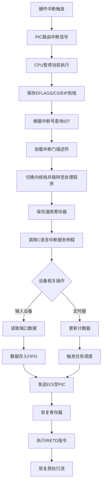

以下是程序中通用的中断处理流程，不特定于鼠标或键盘设备：

---

### **通用中断处理流程**



---

### **详细步骤说明**

#### **1. 中断初始化阶段**
```c
// 系统启动时执行
void HariMain() {
    init_gdtidt();  // 初始化GDT和IDT
    init_pic();     // 配置可编程中断控制器
    // 其他设备初始化...
    io_sti();       // 允许CPU响应中断
}
```
- **关键操作**：
  - 填充IDT表项，设置中断门（类型、段选择子、处理函数地址）
  - 配置PIC的IRQ映射和屏蔽位
  - 设置CR0寄存器进入保护模式

#### **2. 中断触发阶段**
```c
// 硬件层行为（非代码）
1. 设备检测到事件（按键、时钟周期等）
2. 设备控制器拉高中断请求线（IRQ）
3. PIC将IRQ转换为中断向量号（如IRQ1→0x21）
4. PIC通过INTR引脚通知CPU
```

#### **3. CPU响应阶段**
```nasm
; CPU硬件行为
1. 检查EFLAGS.IF是否为1（中断是否允许）
2. 保存当前EFLAGS、CS、EIP到栈
3. 清除EFLAGS.IF位（关闭中断）
4. 根据中断号从IDT获取门描述符
5. 验证权限（CPL ≤ 门描述符DPL）
6. 跳转到处理函数地址
```

#### **4. 中断处理阶段**
```nasm
; 汇编入口（如asm_inthandlerXX）
_asm_inthandlerXX:
    PUSH    ES,DS,EAX,ECX... ; 保存所有通用寄存器
    MOV     AX,SS
    MOV     DS,AX            ; 设置内核数据段
    CALL    _inthandlerXX    ; 调用C处理函数
    POP     EDI,ESI...       ; 恢复寄存器
    IRETD
```

#### **5. C语言服务例程**
```c
// 通用处理模式
void inthandlerXX(int *esp) {
    // 1. 设备I/O操作
    uint8_t data = io_in8(port); // 读取设备数据
    
    // 2. 事件数据封装
    fifo32_put(&sys_fifo, (dev_id << 16) | data); // 设备ID+数据
    
    // 3. 中断结束通知
    io_out8(PIC0_OCW2, 0x60 + irq); // 发送EOI
    
    // 4. 可选唤醒任务
    if (sys_fifo.task) task_run(sys_fifo.task, -1, 0);
}
```

#### **6. 主循环处理阶段**
```c
// 主任务循环
for (;;) {
    if (fifo32_status(&fifo) > 0) {
        int data = fifo32_get(&fifo);
        
        // 解析设备ID和数据
        uint16_t dev_id = (data >> 16) & 0xFFFF;
        uint16_t raw_data = data & 0xFFFF;
        
        // 分发给处理模块
        switch(dev_id) {
            case DEV_TIMER:  handle_timer(raw_data); break;
            case DEV_KBD:    handle_keyboard(raw_data); break;
            case DEV_MOUSE: handle_mouse(raw_data); break;
        }
    } else {
        io_hlt(); // 无事件时休眠
    }
}
```

---

### **关键设计特征**

#### **1. 中断类型统一处理**
| 中断类型       | 特征                      | 处理方式           |
| -------------- | ------------------------- | ------------------ |
| **外部硬件**   | 通过PIC传递IRQ            | 读取端口，存FIFO   |
| **系统定时器** | 周期性触发                | 更新计数，触发调度 |
| **异常**       | CPU直接产生（如除零错误） | 进入错误处理程序   |

#### **2. 上下文保存结构**
```c
// 中断栈帧结构（由CPU自动保存）
struct int_frame {
    uint32_t eip;
    uint32_t cs;
    uint32_t eflags;
    /* 若发生特权级切换还会保存SS/ESP */
};

// 寄存器保存区（由汇编代码保存）
struct regs {
    uint32_t edi, esi, ebp, esp, ebx, edx, ecx, eax;
    uint32_t ds, es;
};
```

#### **3. 优先级管理**
```c
// 通过PIC的优先级固定模式：
1. IRQ0（定时器）最高优先级
2. IRQ1（键盘）次之
3. IRQ7（级联从PIC）最低

// 中断嵌套控制：
- 进入中断处理时自动关闭中断（EFLAGS.IF=0）
- 若需允许嵌套，可手动执行STI指令
```

#### **4. 数据流抽象**


---

### **性能优化策略**

#### **1. 快速路径优化**
```c
// 高频中断处理（如网络收包）
void fast_isr() {
    fifo_put(dma_buffer[read_ptr++]); // 直接访问DMA缓冲区
    send_eoi();
}
```

#### **2. 批处理机制**
```c
// 合并多个事件
while (device_has_pending_data()) {
    fifo_put(batch_data);
}
```

#### **3. 缓存预取**
```nasm
; 提前加载后续数据
PREFETCHT0 [buffer_addr + 64] ; 预取下一缓存行
```

---

### **错误处理机制**

#### **1. 中断丢失检测**
```c
// 维护中断计数器
static volatile uint32_t irq_count[16];
void isr_handler() {
    irq_count[irq_num]++;
    if (irq_count[irq_num] - last_count > 1) {
        log_error("IRQ %d lost!", irq_num);
    }
}
```

#### **2. 看门狗恢复**
```c
// 长时间无响应时复位设备
watchdog_timer = set_timer(1000); // 1秒超时
if (!response_received) {
    reset_device();
}
```

---

该流程通过分层设计和标准化接口，实现了以下目标：
1. **硬件无关性**：设备差异由驱动层屏蔽
2. **实时性保障**：中断响应时间可控
3. **可扩展性**：新增设备只需注册处理模块
4. **安全性**：严格的特权级检查和数据验证

实际系统（如Linux内核）的中断处理机制在此基础上增加了更多复杂特性，如中断线程化、软中断机制等，但核心原理保持一致。