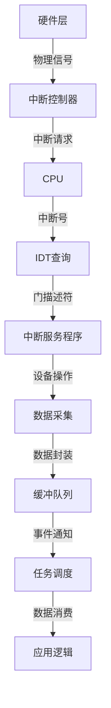

以下是键盘与鼠标中断的抽象化流程模型，适用于通用外部设备中断处理：

---

### **通用外设中断处理流程模型**


---

### **分层架构与组件职责**

| 层级         | 组件              | 职责                                                         |
| ------------ | ----------------- | ------------------------------------------------------------ |
| **硬件层**   | 外设设备          | 产生物理信号（按键/移动），触发中断                          |
| **中断路由** | PIC/APIC          | 接收中断信号，路由到对应CPU核心，传递中断号                  |
| **核心响应** | CPU               | 保存上下文，通过IDT定位中断处理程序                          |
| **驱动层**   | 中断服务程序(ISR) | 设备I/O操作（读端口），数据预处理，写入缓冲队列              |
| **数据通道** | 缓冲队列(FIFO)    | 解耦生产-消费，缓存原始设备数据                              |
| **调度层**   | 任务调度器        | 唤醒消费者任务，分配CPU时间片处理数据                        |
| **应用层**   | 业务逻辑模块      | 解析数据语义（如扫描码→ASCII），执行具体业务逻辑（显示/控制） |

---

### **泛化处理流程**

1. **中断触发阶段**
   - 硬件设备检测到事件（输入/状态变化）
   - 向中断控制器发送电平/边沿触发信号
   - *示例：键盘检测到按键闭合，拉低IRQ1信号线*

2. **中断路由阶段**
   ```mermaid
   sequenceDiagram
       participant Device as 外设
       participant PIC as 中断控制器
       participant CPU as CPU核心
       Device->>PIC: 发送中断请求(IRQx)
       PIC->>CPU: 发送中断向量号(INT n)
       CPU->>CPU: 保存EFLAGS/CS/EIP
   ```
   - 中断控制器确定优先级，向目标CPU发送中断号
   - *优化点：多核系统中的中断负载均衡*

3. **中断处理阶段**
   ```c
   // 伪代码示例
   void generic_isr(int vector) {
       disable_interrupts();       // 关闭中断（可选）
       uint8_t data = inb(port);   // 设备I/O操作
       fifo_put(&dev_fifo[vector], data | (vector<<8)); // 数据+中断号编码
       send_eoi(vector);          // 中断结束通知
       enable_interrupts();       // 恢复中断
   }
   ```
   - **关键操作**：
     - 读取设备数据端口
     - 数据编码（附加设备标识）
     - 快速退出中断上下文

4. **数据缓冲阶段**
   - **队列设计要素**：
     ```c
     struct device_event {
         uint16_t dev_id;  // 设备标识（由中断号推导）
         uint32_t data;    // 原始数据/状态字
         timestamp_t ts;   // 时间戳（可选）
     };
     ```
   - **策略**：
     - 多设备共享队列 vs 每设备独立队列
     - 环形缓冲区实现无锁访问

5. **任务调度阶段**
   ```mermaid
   flowchart LR
       A[中断服务程序] -->|触发| B[等待队列]
       B --> C[工作线程]
       C --> D{数据处理}
       D -->|成功| E[资源释放]
       D -->|失败| F[错误恢复]
   ```
   - 生产者-消费者模式
   - 优先级继承机制防止优先级反转

6. **应用处理阶段**
   - **数据语义化**：
     ```c
     void process_event(device_event *evt) {
         switch(evt->dev_id) {
             case DEV_KEYBOARD:
                 keycode_to_ascii(evt->data); break;
             case DEV_MOUSE:
                 decode_mouse_packet(evt->data); break;
             case DEV_NETWORK:
                 parse_network_frame(evt->data); break;
         }
     }
     ```
   - **业务逻辑**：
     - 输入法处理
     - 光标运动计算
     - 协议解析

---

### **关键设计模式**

1. **分层中断处理**
   - **Top Half**：在ISR中快速处理（保存数据、发EOI）
   - **Bottom Half**：延后处理（任务/软中断处理复杂逻辑）

2. **设备标识编码**
   ```c
   // 将设备ID与原始数据打包
   #define ENCODE_DEVID(irq)    ((irq) << 12)
   #define DECODE_DEVID(data)   ((data) >> 12)
   ```
   - 适用于多设备共享同一队列的场景

3. **时间戳插入**
   ```c
   void isr_handler() {
       event.timestamp = get_high_precision_time();
       fifo_push(event);
   }
   ```
   - 为实时系统提供事件时序信息

---

### **异常处理机制**

| 异常类型         | 处理策略                                         |
| ---------------- | ------------------------------------------------ |
| **中断丢失**     | 使用硬件FIFO/状态寄存器检测，统计中断计数器      |
| **数据溢出**     | 动态队列扩容，丢弃最旧数据策略，触发溢出警告     |
| **设备无响应**   | Watchdog定时器检测，重置设备控制器               |
| **数据校验失败** | CRC校验+重传机制（对可靠传输设备），错误日志记录 |

---

### **性能优化技巧**

1. **批处理优化**
   ```c
   // 一次中断处理多个数据包（如网络设备）
   while (device_has_data()) {
       fifo_put(bulk_data);
   }
   ```

2. **缓存友好设计**
   - 队列元素对齐至缓存行大小（通常64字节）
   - 预取下一个处理元素

3. **中断合并**
   ```c
   // 合并高频小数据中断（如GPU垂直同步）
   if (time_since_last_isr < threshold) {
       defer_processing();
   }
   ```

---

### **跨平台适配层**

```c
// 硬件抽象层接口
struct interrupt_ops {
    void (*enable_irq)(int irq);
    void (*disable_irq)(int irq);
    void (*ack_irq)(int irq);
};

// 注册不同平台的实现
#ifdef ARCH_X86
    static const struct interrupt_ops pic_ops = { ... };
#elif ARCH_ARM
    static const struct interrupt_ops gic_ops = { ... };
#endif
```

---

该抽象模型将中断处理流程标准化，具有以下优势：
1. **模块解耦**：硬件驱动与业务逻辑分离
2. **可扩展性**：支持动态添加新设备类型
3. **实时性保障**：通过优先级队列实现关键事件优先处理
4. **容错能力**：分层错误检测与恢复机制

实际系统（如Linux内核）的中断处理机制即基于类似模型，但增加了更多复杂优化，如软中断线程化、中断亲和性设置等。