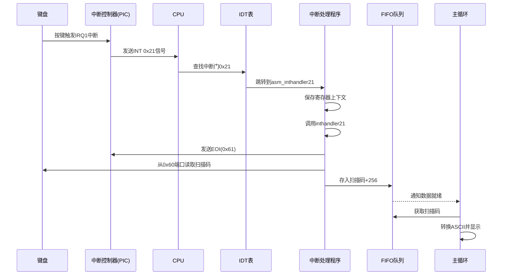

以下是键盘中断的全流程说明，结合代码逐步解析：

---

### **键盘中断全流程**



---

### **详细步骤解析**

#### **1. 硬件触发**
- **按键动作**：用户按下或释放键盘按键。
- **键盘控制器**：通过PS/2接口发送扫描码到主板。

#### **2. 中断触发**
- **PIC路由**：
  - 键盘连接在 **主PIC的IRQ1**。
  - PIC检测到IRQ1后，向CPU发送 **INT 0x21** 信号。

#### **3. CPU响应中断**
- **IDT查询**：
  - CPU通过中断号0x21查找IDT表项。
  - 在`dsctbl.c`中设置的门描述符：
    ```c
    set_gatedesc(idt + 0x21, (int)asm_inthandler21, 2*8, AR_INTGATE32);
    ```
  - 参数：处理函数地址`asm_inthandler21`，段选择子`2*8`（内核代码段），属性`AR_INTGATE32`（中断门）。

#### **4. 汇编层处理**
```nasm
; naskfunc.nas
_asm_inthandler21:
    PUSH    ES,DS,EAX,ECX,EDX,EBX,ESP,EBP,ESI,EDI
    MOV     AX,SS
    MOV     DS,AX       ; 切换到内核数据段
    MOV     ES,AX
    CALL    _inthandler21
    POP     EDI,ESI,EBP,ESP,EBX,EDX,ECX,EAX
    POP     DS,ES
    IRETD
```
- **保存现场**：所有通用寄存器入栈。
- **设置内核数据段**：确保中断处理程序使用正确的数据段。
- **调用C处理程序**：`inthandler21`。

#### **5. C语言中断处理**
```c
// keyboard.c
void inthandler21(int *esp) {
    unsigned char data;
    io_out8(PIC0_OCW2, 0x61); // 发送EOI到主PIC
    data = io_in8(PORT_KEYDAT); // 从0x60端口读取扫描码
    fifo32_put(&keyfifo, data + 256); // 存入FIFO（基值256）
}
```
- **发送EOI**：通知PIC中断处理完成。
- **读取扫描码**：通过端口`0x60`获取1字节扫描码。
- **存入FIFO**：扫描码加上基值256（区分设备）。

#### **6. FIFO队列传递**
- **数据结构**：
  ```c
  // bootpack.h
  struct FIFO32 {
      int *buf;
      int p, q, size, free, flags;
      struct TASK *task;
  };
  ```
- **写入队列**：
  ```c
  // fifo.c
  int fifo32_put(struct FIFO32 *fifo, int data) {
      if (fifo->free > 0) {
          fifo->buf[fifo->p] = data;
          fifo->p = (fifo->p + 1) % fifo->size;
          fifo->free--;
          if (fifo->task) task_run(fifo->task, -1, 0); // 唤醒任务
          return 0;
      }
      return -1;
  }
  ```

#### **7. 主循环处理**
```c
// bootpack.c
for (;;) {
    if (fifo32_status(&fifo) != 0) {
        int i = fifo32_get(&fifo);
        if (256 <= i && i <= 511) { // 键盘事件
            unsigned char scancode = i - 256;
            if (scancode < 0x54) { // 有效扫描码
                char c = keytable[scancode];
                if (c != 0) { // 可显示字符
                    put_char_to_screen(c);
                }
            }
            // 处理特殊键（如退格）
            if (scancode == 0x0e) { // Backspace
                erase_last_char();
            }
        }
    } else {
        io_hlt(); // 无事件时休眠
    }
}
```
- **扫描码转换**：使用`keytable`映射到ASCII。
- **退格键处理**：特殊逻辑删除字符。

---

### **关键代码分析**

#### **1. 键盘初始化**
```c
// keyboard.c
void init_keyboard(struct FIFO32 *fifo, int data0) {
    keyfifo = fifo;
    keydata0 = data0; // 256
    wait_KBC_sendready();
    io_out8(PORT_KEYCMD, KEYCMD_WRITE_MODE);
    wait_KBC_sendready();
    io_out8(PORT_KEYDAT, KBC_MODE);
}
```
- **设置键盘模式**：通过命令`0x60`（`KEYCMD_WRITE_MODE`）和模式字节`0x47`（`KBC_MODE`）启用键盘数据报告。

#### **2. 扫描码转ASCII**
```c
// bootpack.c
static char keytable[0x54] = {
    0, 0, '1', '2', '3', '4', '5', '6', '7', '8', '9', '0', '-', '^', 0, 0,
    'Q', 'W', 'E', 'R', 'T', 'Y', 'U', 'I', 'O', 'P', '@', '[', 0, 0, 'A', 'S',
    'D', 'F', 'G', 'H', 'J', 'K', 'L', ';', ':', 0, 0, ']', 'Z', 'X', 'C', 'V',
    'B', 'N', 'M', ',', '.', '/', 0, '*', 0, ' ', 0, 0, 0, 0, 0, 0,
    0, 0, 0, 0, 0, 0, 0, '7', '8', '9', '-', '4', '5', '6', '+', '1',
    '2', '3', '0', '.'
};
```
- **映射规则**：根据标准PS/2扫描码集1定义。

#### **3. 退格键处理**
```c
if (scancode == 0x0e) { // 0x0e是退格键的扫描码
    if (cursor_x > 8) {
        cursor_x -= 8;
        putfonts8_asc_sht(sht_win, cursor_x, 28, COL8_000000, COL8_FFFFFF, " ", 1);
    }
}
```
- **光标回退**：每按一次退格，光标左移8像素。
- **屏幕更新**：用空格覆盖原字符。

---

### **异常处理与优化**

#### **1. 扫描码错误处理**
- **无效扫描码**：若`scancode >= 0x54`，直接忽略。
- **多字节扫描码**（如`0xE0`前缀）：当前代码未处理，需扩展解析逻辑。

#### **2. FIFO溢出处理**
```c
if (fifo->free == 0) {
    fifo->flags |= FLAGS_OVERRUN;
    return -1;
}
```
- **溢出标志**：当FIFO满时标记溢出，上层可检测此状态。

#### **3. 键盘LED控制**
- **可选功能**：通过发送命令（如`0xED`）控制NumLock/CapsLock指示灯。

---

### **总结**
- **硬件交互**：键盘→PIC→CPU→IDT→中断处理程序。
- **数据处理**：扫描码→FIFO→主循环→ASCII转换→显示。
- **关键优化点**：异步处理（中断快速响应）、FIFO缓冲（解耦生产/消费）、状态机管理（退格等特殊键）。

通过此流程，系统能够实时响应键盘输入，高效处理字符显示和编辑操作。