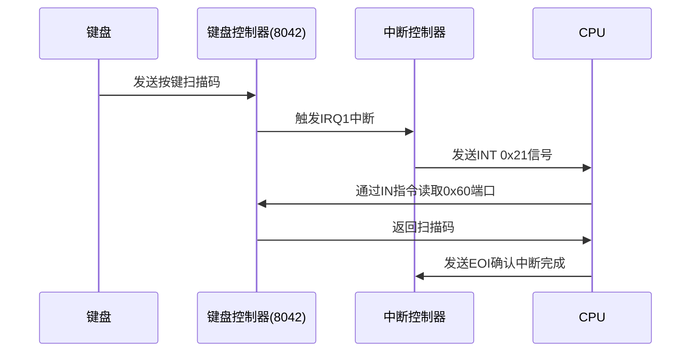

以下是程序中键盘控制电路的详细说明：

---

### **键盘控制电路组成**
键盘控制电路主要包含以下硬件组件：
1. **PS/2键盘接口**：物理连接键盘的6针Mini-DIN接口。
2. **键盘控制器（KBC，如Intel 8042）**：负责与键盘通信、解析扫描码。
3. **可编程中断控制器（PIC）**：管理中断请求（IRQ1）。
4. **I/O端口**：
   - **0x60**：数据端口（读取扫描码）。
   - **0x64**：控制/状态端口（发送命令）。

---

### **代码中的键盘控制流程**

#### **1. 初始化键盘控制器**
```c
// keyboard.c
void init_keyboard(struct FIFO32 *fifo, int data0) {
    keyfifo = fifo;
    keydata0 = data0; // 键盘数据基值（256）
    
    // 等待键盘控制器就绪
    wait_KBC_sendready();
    
    // 发送命令：设置KBC模式
    io_out8(PORT_KEYCMD, KEYCMD_WRITE_MODE);
    
    // 再次等待就绪后发送模式字节
    wait_KBC_sendready();
    io_out8(PORT_KEYDAT, KBC_MODE);
}
```
- **关键函数**：
  - `wait_KBC_sendready()`：轮询状态端口，直到控制器空闲。
    ```c
    void wait_KBC_sendready(void) {
        while ((io_in8(PORT_KEYSTA) & KEYSTA_SEND_NOTREADY) != 0);
    }
    ```
  - `io_out8(PORT_KEYCMD, KEYCMD_WRITE_MODE)`：发送命令`0x60`到控制端口，表示要写入KBC模式。
  - `io_out8(PORT_KEYDAT, KBC_MODE)`：发送模式字节`0x47`，启用键盘中断和数据报告。

---

#### **2. 中断处理流程**
```c
// keyboard.c
void inthandler21(int *esp) {
    unsigned char data;
    // 发送EOI（End of Interrupt）到主PIC
    io_out8(PIC0_OCW2, 0x61); 
    
    // 从数据端口读取扫描码
    data = io_in8(PORT_KEYDAT);
    
    // 存入FIFO队列（基值256）
    fifo32_put(keyfifo, data + keydata0);
}
```
- **关键操作**：
  - **发送EOI**：通知PIC中断处理完成（`0x61`发送到主PIC的`0x20`端口）。
  - **读取扫描码**：从端口`0x60`读取1字节扫描码。
  - **数据存储**：扫描码加上基值256存入FIFO，用于后续处理。

---

### **键盘控制电路工作原理**

#### **1. 键盘输入到中断触发**


#### **2. 扫描码类型**
- **通码（Make Code）**：按键按下时发送（如`0x1C`代表"A"键）。
- **断码（Break Code）**：按键释放时发送（通码 + `0x80`，如`0x9C`）。
- **扩展扫描码**：部分键（如方向键）以`0xE0`为前缀。

---

### **关键硬件交互细节**

#### **1. 端口操作**
| 端口地址 | 方向 | 功能                               |
| -------- | ---- | ---------------------------------- |
| **0x60** | 读   | 读取扫描码或控制器返回数据         |
| **0x60** | 写   | 发送数据到键盘（如LED控制命令）    |
| **0x64** | 读   | 读取控制器状态                     |
| **0x64** | 写   | 发送控制器命令（如复位、设置模式） |

#### **2. 控制器状态寄存器（0x64）**
| 位   | 名称               | 说明                         |
| ---- | ------------------ | ---------------------------- |
| 0    | Output Buffer Full | 1=有数据可从0x60读取         |
| 1    | Input Buffer Full  | 1=禁止向0x60/0x64写入        |
| 2    | System Flag        | 1=上电自检通过               |
| 3    | Command/Data       | 0=最后写入的是数据，1=是命令 |

---

### **代码与硬件协同示例**

#### **场景：用户按下"A"键**
1. **硬件动作**：
   - 键盘发送通码`0x1C`到KBC。
   - KBC将数据存入缓冲区，触发IRQ1。
2. **中断处理**：
   - CPU跳转到`inthandler21`。
   - 从`0x60`读取`0x1C`。
   - 存入FIFO：`0x1C + 256 = 284`。
3. **主循环处理**：
   ```c
   int scancode = 284 - 256; // 0x1C
   char c = keytable[scancode]; // 'A'
   put_char_to_screen(c);
   ```

---

### **异常处理**
1. **控制器无响应**：
   - 在`wait_KBC_sendready`中循环等待状态位，直到超时。
2. **无效扫描码**：
   - 若`scancode >= 0x54`，忽略该数据。
3. **FIFO溢出**：
   - 设置`flags`标志，上层可检测并处理。

---

### **总结**
- **核心组件**：键盘控制器（KBC）是CPU与键盘之间的桥梁。
- **关键流程**：中断触发→读取扫描码→存入队列→主循环处理。
- **代码实现**：通过端口I/O和中断服务程序实现低延迟响应。

此设计确保了键盘输入的实时性和可靠性，为操作系统提供了基础输入支持。