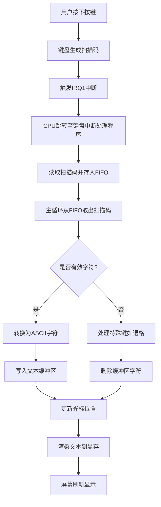

以下是键盘输入在屏幕文本框上显示的完整流程原理，结合代码实现逐步说明：

---

### **键盘输入到屏幕显示的完整流程**



---

### **详细步骤解析**

#### **1. 硬件信号产生**
- **按键事件**：用户按下或释放按键时，键盘控制器生成扫描码（如"A"键通码`0x1C`）。
- **中断触发**：通过IRQ1通知PIC，CPU接收INT 0x21中断信号。

#### **2. 中断处理阶段**
```c
// keyboard.c
void inthandler21(int *esp) {
    unsigned char data = io_in8(PORT_KEYDAT); // 读取扫描码
    fifo32_put(&keyfifo, data + 256); // 存入FIFO（基值256）
    io_out8(PIC0_OCW2, 0x61); // 发送EOI
}
```
- **关键操作**：中断服务程序读取扫描码，存入全局FIFO队列，确保实时性与非阻塞。

#### **3. 主循环处理**
```c
// bootpack.c
for (;;) {
    if (fifo32_status(&fifo) > 0) {
        int data = fifo32_get(&fifo);
        if (256 <= data && data <= 511) { // 键盘事件
            handle_keyboard(data - 256); // 转换为扫描码
        }
    } else {
        task_sleep(task_a); // 无事件时休眠
    }
}
```

#### **4. 扫描码转ASCII**
```c
// 扫描码到ASCII的映射表
static char keytable[0x54] = {
    0, 0, '1', '2', '3', '4', '5', '6', '7', '8', '9', '0', '-', '^', 0, 0,
    'Q', 'W', 'E', 'R', 'T', 'Y', 'U', 'I', 'O', 'P', '@', '[', 0, 0, 'A', 'S',
    'D', 'F', 'G', 'H', 'J', 'K', 'L', ';', ':', 0, 0, ']', 'Z', 'X', 'C', 'V',
    'B', 'N', 'M', ',', '.', '/', 0, '*', 0, ' ', 0, 0, 0, 0, 0, 0,
    0, 0, 0, 0, 0, 0, 0, '7', '8', '9', '-', '4', '5', '6', '+', '1',
    '2', '3', '0', '.'
};

void handle_keyboard(unsigned char scancode) {
    if (scancode < 0x54) {
        char c = keytable[scancode];
        if (c != 0) {
            text_buffer_append(c); // 写入文本缓冲区
            cursor_x += 8; // 光标右移
        }
    } else if (scancode == 0x0e) { // 退格键
        text_buffer_delete_last(); // 删除最后字符
        cursor_x -= 8; // 光标左移
    }
}
```

#### **5. 文本缓冲区管理**
```c
#define TEXT_BUF_SIZE 256
static char text_buf[TEXT_BUF_SIZE];
static int text_len = 0;

void text_buffer_append(char c) {
    if (text_len < TEXT_BUF_SIZE - 1) {
        text_buf[text_len++] = c;
        text_buf[text_len] = '\0'; // C风格字符串结尾
    }
}

void text_buffer_delete_last() {
    if (text_len > 0) {
        text_buf[--text_len] = '\0';
    }
}
```

#### **6. 屏幕渲染**
```c
// 渲染文本到显存（假设使用sheet.c的图形接口）
void render_text(struct SHEET *sht, int x, int y) {
    // 清空文本框区域
    boxfill8(sht->buf, sht->bxsize, COL8_FFFFFF, x, y, x + 128, y + 16);
    
    // 绘制当前文本
    putfonts8_asc_sht(sht, x, y, COL8_000000, COL8_FFFFFF, text_buf, text_len);
    
    // 绘制光标（闪烁效果）
    static int cursor_visible = 1;
    if (cursor_visible) {
        boxfill8(sht->buf, sht->bxsize, COL8_000000, 
                 x + cursor_x, y, x + cursor_x + 7, y + 15);
    }
    cursor_visible = !cursor_visible;
    sheet_refresh(sht, x, y, x + 128, y + 16);
}
```

---

### **关键技术细节**

#### **1. 光标管理**
- **位置计算**：每个字符占8像素宽，`cursor_x`按`text_len * 8`更新。
- **闪烁实现**：通过定时器（如每500ms切换`cursor_visible`标志）实现光标闪烁。

#### **2. 字符渲染**
- **字体位图**：使用8x16像素字体，每个字符对应预先定义的位图。
- **颜色处理**：前景色（COL8_000000=黑色），背景色（COL8_FFFFFF=白色）。

#### **3. 显存更新**
- **双缓冲机制**：所有绘制操作先在内存缓冲区完成，再通过`sheet_refresh`更新到显存。
- **局部刷新**：仅刷新文本框区域（坐标`x, y`到`x+128, y+16`）。

---

### **典型场景示例**
**用户输入"Hello"**：
1. 依次按下H(0x23)、E(0x12)、L(0x4B)、L(0x4B)、O(0x44)
2. FIFO队列存入: 0x23+256=0x123, 0x12+256=0x112, ...
3. 主循环转换得到字符'H','E','L','L','O'
4. 文本缓冲区内容变为"Hello"
5. 光标从(8,28)逐步右移到(48,28)
6. 每次按键后调用`render_text`，屏幕显示"Hello"并闪烁光标

---

### **异常处理**
1. **缓冲区溢出**：
   - 当`text_len >= TEXT_BUF_SIZE`时忽略新字符。
2. **无效扫描码**：
   - 若`scancode >= 0x54`，直接跳过处理。
3. **退格到行首**：
   - 当`cursor_x < 8`时，保持光标在起始位置。

---

### **性能优化**
1. **局部渲染**：仅重绘文本变化区域（如最后一个字符位置）。
2. **定时器节流**：避免频繁刷新，例如每100ms强制刷新一次。
3. **字形缓存**：预渲染常用字符到位图，减少实时绘制开销。

---

通过此流程，系统实现了从物理按键到屏幕字符显示的全链路处理，涵盖硬件中断、数据结构管理、图形渲染等关键技术环节。