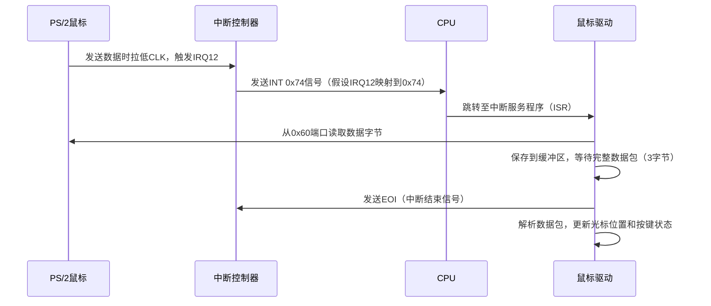

以下是关于鼠标中断中PS/2协议的详细说明：

---

### **1. PS/2协议基础**
#### **物理接口**
- **引脚定义**：
  - **CLK**（时钟线）：由设备（鼠标）控制，频率约10-20kHz。
  - **DATA**（数据线）：双向传输数据。
  - **VCC**（+5V电源）和 **GND**（地线）。

#### **通信模式**
- **同步串行通信**：设备（鼠标）通过CLK信号同步发送数据。
- **主机（计算机）和设备角色**：
  - 主机可发送命令（如重置鼠标）。
  - 设备主动上报数据（如移动或点击事件）。

---

### **2. 数据帧格式**
每个数据帧包含以下部分：
```
[起始位(0)] [8位数据] [奇偶校验位] [停止位(1)]
```
- **数据方向**：设备→主机（鼠标发送数据）。
- **传输顺序**：LSB（最低有效位）优先。

---

### **3. 鼠标数据包格式**
标准PS/2鼠标发送的**3字节数据包**：
```
Byte1 | Byte2 | Byte3
----------------------
Y溢出 | X溢出 | Y符号 | X符号 | 1 | Middle | Right | Left | X移动量（补码） | Y移动量（补码）
```
#### **字节详解**
| 字段        | 位       | 说明                                       |
| ----------- | -------- | ------------------------------------------ |
| **Left**    | Byte1[0] | 左键状态（1=按下）                         |
| **Right**   | Byte1[1] | 右键状态（1=按下）                         |
| **Middle**  | Byte1[2] | 中键状态（1=按下，仅支持三键鼠标）         |
| **固定位**  | Byte1[3] | 必须为1，标识有效数据包                    |
| **X符号**   | Byte1[4] | X移动方向符号（1=负数，即向左移动）        |
| **Y符号**   | Byte1[5] | Y移动方向符号（1=负数，即向下移动）        |
| **X溢出**   | Byte1[6] | X移动量溢出（1=移动量超过255/-256）        |
| **Y溢出**   | Byte1[7] | Y移动量溢出（1=移动量超过255/-256）        |
| **X移动量** | Byte2    | X轴移动量（8位补码，范围-127~127）         |
| **Y移动量** | Byte3    | Y轴移动量（8位补码，范围-127~127，需取反） |

---

### **4. 中断触发与处理流程**


---

### **5. 关键操作详解**
#### **(1) 初始化鼠标**
```c
// 发送初始化命令序列
outb(0x64, 0xD4); // 告诉控制器：下一字节发送给鼠标
outb(0x60, 0xF4); // 启用数据报告（0xF4）
```
- 鼠标响应0xFA（ACK）后开始发送数据。

#### **(2) 读取数据包**
```c
// 中断服务程序示例
void mouse_isr() {
    uint8_t data = inb(0x60); // 从数据端口读取字节
    static uint8_t buffer[3];
    static int phase = 0;
    
    switch(phase) {
        case 0:
            if ((data & 0xC8) == 0x08) { // 校验Byte1
                buffer[0] = data;
                phase = 1;
            }
            break;
        case 1:
            buffer[1] = data;
            phase = 2;
            break;
        case 2:
            buffer[2] = data;
            phase = 0;
            parse_packet(buffer); // 解析完整数据包
            break;
    }
    outb(0x20, 0x20); // 发送EOI到主PIC
    outb(0xA0, 0x20); // 发送EOI到从PIC（若使用IRQ12）
}
```

#### **(3) 解析数据包**
```c
void parse_packet(uint8_t *buf) {
    int dx = buf[1]; // X移动量（补码）
    int dy = -buf[2]; // Y移动量取反（鼠标坐标系↑=屏幕↓）
    
    // 符号扩展（8位→32位）
    if (buf[0] & 0x10) dx |= 0xFFFFFF00;
    if (buf[0] & 0x20) dy |= 0xFFFFFF00;
    
    // 更新光标位置
    mouse_x += dx;
    mouse_y += dy;
    
    // 边界检查
    if (mouse_x < 0) mouse_x = 0;
    if (mouse_y < 0) mouse_y = 0;
    if (mouse_x > screen_width) mouse_x = screen_width;
    if (mouse_y > screen_height) mouse_y = screen_height;
    
    // 更新按键状态
    left_button = buf[0] & 0x01;
    right_button = (buf[0] >> 1) & 0x01;
    middle_button = (buf[0] >> 2) & 0x01;
}
```

---

### **6. 异常处理**
#### **(1) 数据包不完整**
- **现象**：未收到完整3字节即超时（约100ms）。
- **处理**：重置`phase=0`，丢弃当前数据包。

#### **(2) 奇偶校验错误**
- **现象**：接收数据帧的奇偶校验位错误。
- **处理**：忽略当前字节，等待重传。

#### **(3) 溢出处理**
- **X/Y溢出标志**（Byte1[6-7]=1）：
  - **累计溢出量**：每溢出一次增加256（需驱动记录溢出次数）。
  - **立即处理**：某些驱动直接忽略溢出数据包，等待后续正常数据。

---

### **7. 协议扩展（可选）**
#### **4字节数据包（滚轮鼠标）**
```
Byte1 | Byte2 | Byte3 | Byte4
------------------------------
Y溢出 | X溢出 | Y符号 | X符号 | 1 | Middle | Right | Left | X移动量 | Y移动量 | 滚轮移动量
```
- **Byte4**：滚轮移动量（补码，范围-8~7）。

#### **初始化命令扩展**
```c
outb(0x64, 0xD4);
outb(0x60, 0xF3); // 设置采样率
outb(0x60, 200);  // 200次/秒
outb(0x60, 0xF3);
outb(0x60, 100);
outb(0x60, 0xF3);
outb(0x60, 80);   // 触发滚轮模式
```

---

### **总结**
- **核心流程**：数据包接收→完整性校验→解析→坐标更新。
- **关键设计**：
  - 通过硬件中断实现实时响应。
  - 状态机管理确保数据包完整性。
  - 符号扩展和方向调整匹配屏幕坐标系。
- **应用场景**：适用于需要低延迟输入的嵌入式系统或传统PC架构。