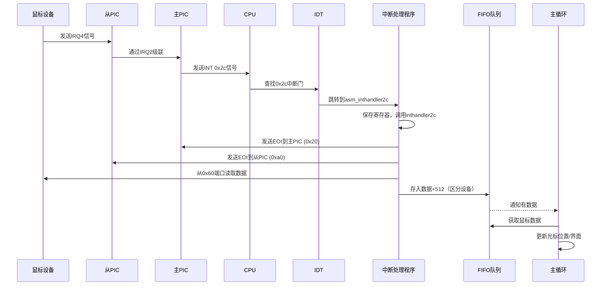
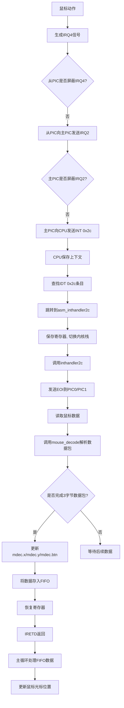
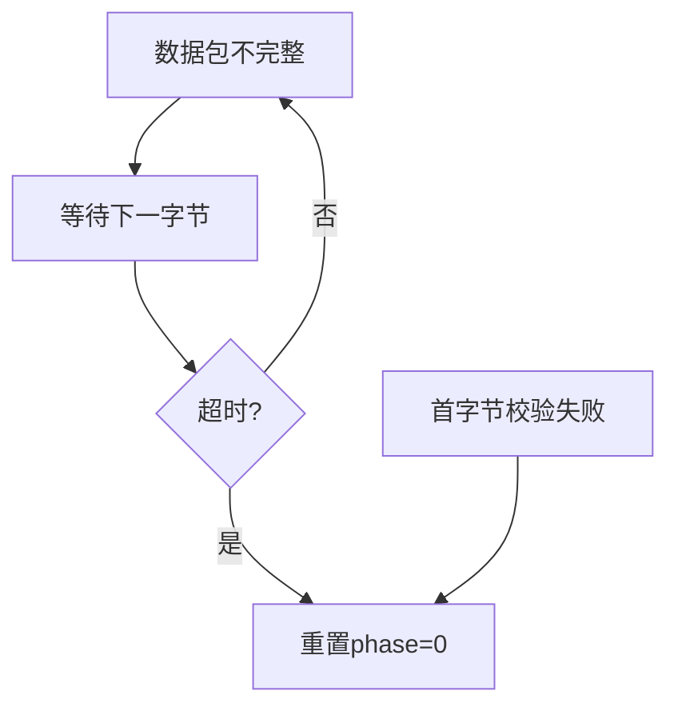

以下是鼠标中断的完整流程分析，结合代码用Mermaid绘制时序图和流程图：

---

### **鼠标中断时序图**


---

### **鼠标中断流程图**


---

### **代码关键环节解析**
#### **1. 中断注册（dsctbl.c）**
```c
// 设置鼠标中断门（IRQ12 → INT 0x2c）
set_gatedesc(idt + 0x2c, (int)asm_inthandler2c, 2 * 8, AR_INTGATE32);
```

#### **2. 中断处理（naskfunc.nas）**
```nasm
_asm_inthandler2c:
    PUSH    ES,DS,EAX,ECX,EDX,EBX,ESP,EBP,ESI,EDI
    MOV     AX,SS
    MOV     DS,AX
    MOV     ES,AX
    CALL    _inthandler2c
    POP     EDI,ESI,EBP,ESP,EBX,EDX,ECX,EAX
    POP     DS,ES
    IRETD
```

#### **3. C语言处理程序（mouse.c）**
```c
void inthandler2c(int *esp) {
    unsigned char data;
    io_out8(PIC1_OCW2, 0x64); // 通知从PIC
    io_out8(PIC0_OCW2, 0x62); // 通知主PIC
    data = io_in8(PORT_KEYDAT);
    fifo32_put(&fifo, data + 512); // 512是鼠标数据基值
}
```

#### **4. 数据解析（mouse.c）**
```c
int mouse_decode(struct MOUSE_DEC *mdec, unsigned char dat) {
    switch(mdec->phase) {
        case 0: // 等待首字节
            if ((dat & 0xc8) == 0x08) { // 校验首字节
                mdec->buf[0] = dat;
                mdec->phase = 1;
            }
            return 0;
        case 1: // 接收第二字节
            mdec->buf[1] = dat;
            mdec->phase = 2;
            return 0;
        case 2: // 接收第三字节
            mdec->buf[2] = dat;
            mdec->phase = 0;
            // 解析坐标和按键状态
            mdec->btn = mdec->buf[0] & 0x07;
            mdec->x = mdec->buf[1];
            mdec->y = mdec->buf[2];
            if ((mdec->buf[0] & 0x10) mdec->x |= 0xffffff00;
            if ((mdec->buf[0] & 0x20) mdec->y |= 0xffffff00;
            mdec->y = -mdec->y; // 鼠标Y轴方向与屏幕相反
            return 1;
    }
    return -1;
}
```

#### **5. 主循环处理（bootpack.c）**
```c
for (;;) {
    if (fifo32_status(&fifo) != 0) {
        int i = fifo32_get(&fifo);
        if (512 <= i && i <= 767) { // 鼠标数据范围
            if (mouse_decode(&mdec, i - 512) { // 减去基值512
                // 更新鼠标坐标
                mx += mdec.x;
                my += mdec.y;
                // 边界检查
                if (mx < 0) mx = 0;
                if (my < 0) my = 0;
                if (mx > binfo->scrnx - 16) mx = binfo->scrnx - 16;
                if (my > binfo->scrny - 16) my = binfo->scrny - 16;
                // 移动鼠标光标
                sheet_slide(sht_mouse, mx, my);
            }
        }
    } else {
        io_hlt();
    }
}
```

---

### **关键数据结构**
```c
// bootpack.h
struct MOUSE_DEC {
    unsigned char buf[3], phase;
    int x, y, btn;
};
```

---

### **流程细节说明**
1. **中断触发**  
   - 鼠标每次移动或点击会发送3字节数据包，触发IRQ12中断。

2. **数据包结构**  
   - **Byte1**：Y溢出 | X溢出 | Y符号 | X符号 | 1 | Middle | Right | Left  
   - **Byte2**：X移动量（补码）  
   - **Byte3**：Y移动量（补码）

3. **坐标计算**  
   - 将补码转换为有符号整数，并反转Y轴方向。

4. **FIFO设计**  
   - 鼠标数据范围：512-767（键盘为256-511），通过基值区分设备。

---

### **异常处理场景**


---

通过上述流程，系统实现了从硬件中断到用户界面交互的完整鼠标事件处理链路。