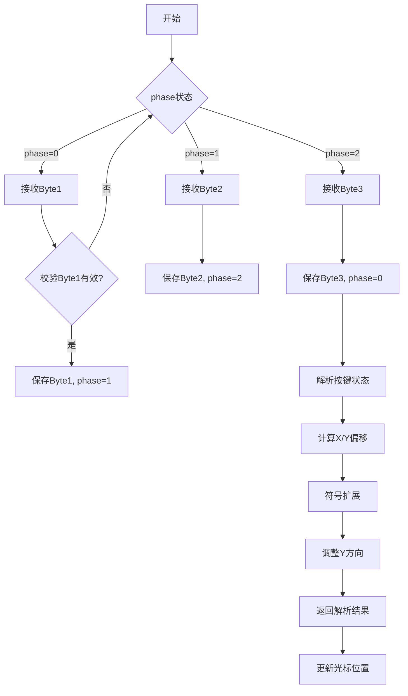

以下是鼠标数据解析的详细流程：

---

### **鼠标数据解析流程图**


---

### **详细解析步骤**

#### **1. 数据包结构**
鼠标每次发送 **3字节** 数据包：
```
Byte1: Y溢出 | X溢出 | Y符号 | X符号 | 1 | Middle | Right | Left
Byte2: X移动量（补码，-127~127）
Byte3: Y移动量（补码，-127~127）
```

#### **2. 字段定义**
| 字段       | 位       | 说明                                        |
| ---------- | -------- | ------------------------------------------- |
| **Left**   | Byte1[0] | 左键状态（1=按下）                          |
| **Right**  | Byte1[1] | 右键状态（1=按下）                          |
| **Middle** | Byte1[2] | 中键状态（1=按下）                          |
| **固定1**  | Byte1[3] | 必须为1，用于标识有效数据包                 |
| **X符号**  | Byte1[4] | X移动方向符号（1=负数，即向左移动）         |
| **Y符号**  | Byte1[5] | Y移动方向符号（1=负数，即向下移动，需反转） |
| **X溢出**  | Byte1[6] | X移动量溢出（1=移动量超过255/-256）         |
| **Y溢出**  | Byte1[7] | Y移动量溢出（1=移动量超过255/-256）         |
| **X移动**  | Byte2    | X轴实际移动量（补码，需符号扩展）           |
| **Y移动**  | Byte3    | Y轴实际移动量（补码，需符号扩展并取反）     |

---

### **3. 解析代码分析（mouse.c）**
```c
int mouse_decode(struct MOUSE_DEC *mdec, unsigned char dat) {
    switch(mdec->phase) {
        case 0: // 等待Byte1
            if ((dat & 0xc8) == 0x08) { // 检查Bit3=1且Bit6-7=0
                mdec->buf[0] = dat;
                mdec->phase = 1;
            }
            return 0;
        case 1: // 等待Byte2
            mdec->buf[1] = dat;
            mdec->phase = 2;
            return 0;
        case 2: // 等待Byte3
            mdec->buf[2] = dat;
            mdec->phase = 0;
            
            // 解析按键状态
            mdec->btn = mdec->buf[0] & 0x07; // 取低3位
            
            // 解析X/Y坐标（补码→有符号整数）
            mdec->x = mdec->buf[1];
            mdec->y = mdec->buf[2];
            
            // 符号扩展（8位→32位）
            if (mdec->buf[0] & 0x10) mdec->x |= 0xffffff00;
            if (mdec->buf[0] & 0x20) mdec->y |= 0xffffff00;
            
            // Y轴方向调整（鼠标Y↑=屏幕Y↓）
            mdec->y = -mdec->y; 
            
            return 1; // 解析完成
    }
    return -1; // 异常状态
}
```

---

### **4. 关键操作说明**
#### **(1) Byte1有效性校验**
```c
if ((dat & 0xc8) == 0x08)
```
- **掩码0xc8**（二进制 `11001000`）：
  - Bit7和Bit6必须为0（无溢出）
  - Bit3必须为1（标志位）
- **有效条件**：`dat & 11001000 == 00001000`

#### **(2) 符号扩展**
```c
// X符号扩展
if (mdec->buf[0] & 0x10) 
    mdec->x |= 0xffffff00; // 负数则填充高位1

// Y符号扩展
if (mdec->buf[0] & 0x20) 
    mdec->y |= 0xffffff00;
```
- **原理**：8位补码转换为32位有符号整数。例如：
  - 原值：`0x80`（-128）
  - 扩展后：`0xffffff80`（-128）

#### **(3) Y轴方向调整**
```c
mdec->y = -mdec->y; 
```
- **原因**：鼠标的Y轴移动方向与屏幕坐标系相反：
  - 鼠标向上移动 → Y值增加 → 屏幕光标应向上（Y坐标减少）

#### **(4) 溢出处理**
- **代码中未处理溢出**：当检测到X/Y溢出（Byte1[6]或[7]=1）时，当前实现未特殊处理，实际可能需要：
  - 忽略当前数据包
  - 累计溢出量（例如：每溢出一次增加256）

---

### **5. 数据流示例**
**示例数据包**：
```
Byte1: 0x18 (二进制 00011000)
Byte2: 0x20 (十进制 +32)
Byte3: 0xff (十进制 -1)
```

**解析过程**：
1. **Byte1**：
   - `00011000`
   - Left=0, Right=0, Middle=0
   - X符号=1（向左）, Y符号=0（向下）
   - 无溢出

2. **X移动量**：
   - Byte2=0x20 → 32（正数）
   - X符号=1 → 实际为-32（向左移动32像素）

3. **Y移动量**：
   - Byte3=0xff → -1（补码）
   - Y符号=0 → 实际为+1（向下移动1像素）
   - 调整方向后：-1（屏幕向上移动1像素）

**最终结果**：
- `btn=0`, `x=-32`, `y=-1`

---

### **6. 异常处理**
#### **(1) 数据包不完整**
- **现象**：未连续收到三个字节
- **处理**：通过`phase`状态机重置解析过程

#### **(2) 无效Byte1**
- **现象**：Byte1的Bit3≠1或Bit6-7≠0
- **处理**：丢弃当前数据包，重置`phase=0`

---

### **总结**
鼠标数据解析的核心步骤包括：
1. **三字节接收**：通过状态机（phase）管理数据包分段接收
2. **数据校验**：验证Byte1的标志位和溢出位
3. **符号扩展**：将8位补码转换为32位有符号整数
4. **坐标调整**：反转Y轴方向以匹配屏幕坐标系
5. **溢出处理**（可选）：根据需求处理溢出情况

此机制确保了鼠标移动和点击的精确捕获，为图形界面的交互提供了基础支持。